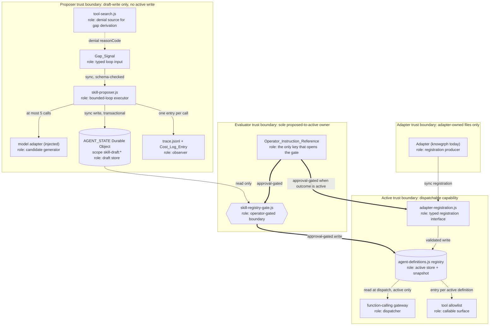

# Design Document

## Overview

This feature adds three native harness modules to `agent-api/src/` plus one schema extension to the
existing Agent Definition registry:

| Module | Interface | Authority |
|---|---|---|
| `skill-proposer.js` (new) | `propose(gap_signal) -> { draft_agent_definition, rationale, confidence }` | Writes `status: proposed` drafts. No active-registry write capability. |
| `skill-registry-gate.js` (new) | `promote(draft_id, operator_instruction_ref) -> promotion_record` | Sole owner of the `proposed -> active` transition. Closed by default. |
| `adapter-registration.js` (new) | `register(agent_definition, tool_allowlist_entry) -> registration_record` | Emits typed registration records or typed findings. No shared-entrypoint change per adapter. |
| `agent-definitions.js` (extended) | `status: proposed \| active \| deprecated`, plus `snapshot()` | Holds the lifecycle field and the deterministic snapshot. |

The design is written against the approved requirements document in this directory. Every design
decision below is traced to the acceptance criterion it satisfies.

### Evidence Discipline

This document distinguishes three claim classes and uses them consistently.

- **Verified**: read directly from this repository during design. Carried forward from the
  requirements document's Verified Repository Facts table, or newly confirmed here.
- **Design choice**: a decision this document makes, with a stated tradeoff. Not a fact.
- **Assumed**: an unproven input, named as such.

Newly verified facts confirmed during design, beyond the requirements table:

| Fact | Evidence |
|---|---|
| `worker/agent-state.js` is record-kind agnostic. It stores exactly one record per Durable Object identity under the keys `active` and `claim`, and exposes `put`, `take`, `peek`, `claim`, `commit`, `release`, `replace`, each wrapped in a `transact` block with `reconcileState`. Adding a new record kind requires no change to the Durable Object class. | Read directly. |
| `worker/agent-state.js` caps record lifetime at `MAX_RECORD_TTL_MS = 30 * 24 * 60 * 60 * 1000` and claim lifetime at `MAX_CLAIM_TTL_MS = 60 * 60 * 1000`, and rejects a record whose `expiresAt` is not a finite future value inside those caps. | Read directly. |
| `agent-api/src/durable-object-state-store.js` already contains six store factories over the single `AGENT_STATE` namespace, each deriving its Durable Object identity from a prefixed scope string: `paused-turn:{conversationId}`, `swarm-run:{runId}`, `agent-toolkit:{recordId}`, and siblings. Key namespacing by string prefix is the established convention, not a new mechanism. | Read directly. |
| `worker/index.js` constructs each runtime once per `env` in a module-level `WeakMap`, then passes them all into `createAgentApiApp`. `app.js` accepts each as an optional injected dependency with a local `create...()` fallback, and surfaces `stats()` per subsystem inside `readiness()`. | Read directly. |
| `agent-api/src/tool-search.js` emits no gap signal today. Its closest observable denial surface is `authorize()` returning `{ authorized: false, reasonCode }` with `reasonCode` in `{ tool_not_granted, tool_not_loaded, caller_not_allowed }`. | Read directly. |
| `package.json` declares 100-plus `*:check` scripts following the pattern `node --test __tests__/<name>.test.mjs`, sometimes chained with a `scripts/<name>.mjs` audit and `npm run docs:check`. `npm test` is `node --test __tests__/*.test.mjs`. | Read directly. |

Assumed inputs, named:

- The PRD's topology row naming "Draft Registry Store - Existing KV/D1 namespace" is **wrong**, not
  merely unverified. `wrangler.jsonc` declares `durable_objects`, `ratelimits`, `assets`, `vars`,
  `secrets`, and one `services` binding under `env.dev`. There is no `kv_namespaces` key and no
  `d1_databases` key. This document does not treat that row as correct anywhere.
- No Evidence Reference exists for any component in this feature. This document invents none.
- No model provider is configured in this repository's shipped default. The proposer's model call is
  therefore an injected adapter, and the loop cannot be proven end to end without provider setup.

### Scope Tiers

Must tier is designed in full below. Should tier (Requirement 20, the Refinement Loop) and Could tier
(Requirement 21, cross-adapter suggestion) appear only in the clearly marked
"Should and Could Tier Surface" section, and add no Must-tier component, binding, or readiness key.

---

## Design Decisions

Six decisions the requirements deliberately deferred. Each states the choice, the tradeoff, and the
criterion it satisfies.

### Decision 1: Draft_Registry_Store binds to the existing `AGENT_STATE` Durable Object

**Choice**: reuse the existing `AGENT_STATE` Durable Object binding, with a documented key namespace
of `skill-draft:{draft_id}` for draft records and `skill-draft-index:{adapter_id}` for the per-adapter
draft index. Implemented as one new factory,
`createDurableObjectSkillDraftStore({ namespace })`, added to the existing
`agent-api/src/durable-object-state-store.js`. No new module. No new binding. No `wrangler.jsonc`
change.

**Satisfies**: Requirement 7 criteria 1, 2, 4; Requirement 19 criteria 1, 2, 3 (bindings added = 0);
Requirement 6 criteria 1 and 3 (all-or-nothing write).

**Why this over the alternatives**:

| Option | New binding | Transactional write | Incremental TCO | Verdict |
|---|---|---|---|---|
| New KV namespace | yes | no (KV is eventually consistent, last-write-wins) | non-zero binding count, near-zero dollars | rejected: cannot express the all-or-nothing postcondition without a second mechanism |
| New D1 database | yes | yes | non-zero binding count, near-zero dollars | rejected: adds a datastore and a migration surface for a record set measured in tens |
| New Durable Object class | yes | yes | non-zero binding count | rejected for Must tier; see the migration tag below if revisited |
| Reuse `AGENT_STATE` (chosen) | no | yes, inherited | zero | chosen |

Reuse is the only option that keeps the recorded binding count at zero, which is what makes
Requirement 19 criterion 3 answerable with the number `0` rather than with a cost estimate. It also
inherits a write path that is already atomic: `worker/agent-state.js` performs every mutation inside
`transact`, and `put` refuses when an `active` record or a live `claim` already exists. A partially
written draft is therefore not reachable through this store, which is the postcondition Requirement 6
criterion 3 demands, rather than something this feature has to build.

**The cost, stated plainly**:

1. **Lifetime coupling.** `worker/agent-state.js` caps `expiresAt` at 30 days
   (`MAX_RECORD_TTL_MS`). A draft awaiting operator review therefore expires after at most 30 days
   unless it is rewritten. The object was designed for per-conversation and per-review state, where a
   30-day ceiling is generous; for a draft registry it is a real constraint. Design response: the
   draft store sets `expiresAt` to `now + 30 days`, records that value in the draft record as
   `expires_at_ms`, and the Promotion Gate returns a typed `draft_not_found` outcome for an expired
   draft rather than silently promoting stale content. An operator who wants a longer review window
   re-proposes; the design does not add a refresh path in Must tier.
2. **Key namespace discipline.** Collision safety rests entirely on the `skill-draft:` prefix being
   unique among the existing prefixes. Verified: the existing prefixes are `paused-turn:`,
   `swarm-run:`, `agent-toolkit:`, and the human-review, function-continuation, and
   function-receipt scopes. `skill-draft:` and `skill-draft-index:` collide with none of them. A
   repository check asserts prefix uniqueness across all store factories so a future factory cannot
   silently reuse the namespace.
3. **Single-record-per-identity shape.** Each identity holds one record. Listing drafts therefore
   requires an index record, which is why `skill-draft-index:{adapter_id}` exists. The index is a
   bounded array of draft ids, and the store rejects an index write beyond a declared maximum
   (default 64, matching the registry's `maxAgents` default) rather than growing without bound.
4. **Semantic drift.** `AGENT_STATE` becomes a store for two conceptually different things:
   in-flight conversation state and durable review-pending artifacts. That is a readability cost and
   a future refactor hazard, not a correctness one.

**If a new Durable Object class is chosen instead** (Requirement 7 criterion 5): the migration tag
following `v2-agent-state` is `v3-skill-draft-store`, declared as
`{ "tag": "v3-skill-draft-store", "new_sqlite_classes": ["SkillDraftStore"] }`, added to both the
top-level `migrations` array and the `env.dev.migrations` array, with a matching
`{ "name": "SKILL_DRAFT_STORE", "class_name": "SkillDraftStore" }` entry in both
`durable_objects.bindings` arrays. Requirement 7 criterion 3 then applies: the recorded TCO statement
reports one added binding, and an operator instruction accepting that resource is required before the
change lands. This document does not take that path.

### Decision 2: Promotion_Record carries a fifth field, by nesting rather than widening

**Choice**: `Promotion_Record` carries the four Deploy_Boundary_Contract fields **verbatim, nested
under a `boundary` key**, plus one sibling field `proposing_mechanism` naming the proposing mechanism
identity. The shared four-field shape is not widened.

```
Promotion_Record = {
  boundary: { name, evidence_reference, operator_instruction_reference, rollback_statement },
  proposing_mechanism: { module, identity }
}
```

**Satisfies**: Requirement 10 criteria 1, 2, 3, 4.

**What including the field buys**:

1. A promotion record cannot be forged to look operator-originated. Without the field, the only
   record of who proposed a definition is the trace log, which is an observation stream, not a
   contract artifact. With the field, the promotion artifact itself names the proposer.
2. ADR-1 claims evaluator independence holds "by construction". A construction claim should be
   machine-checkable. With this field, the gate asserts
   `promotion_record.proposing_mechanism.identity !== gate_identity` before emitting, and a property
   test can check the assertion for all inputs. Without it, independence rests on the import-graph
   check alone, which proves the modules do not reference each other but proves nothing about the
   artifact.

**The cost, and how nesting pays it**: the Deploy_Boundary_Contract four-field shape is used by other
boundaries (Authoring to Mirror, Mirror to Delivery). Adding a fifth field to that shape would make
every other boundary record either carry a meaningless field or become invalid under strict-key
validation. Nesting confines the change: the four-field object is unchanged and still validates
against the shared shape, and `proposing_mechanism` exists only on the promotion record type. The
residual cost is one extra level of nesting in this record and a slightly less flat read.

### Decision 3: `/skill.propose` and `/propose-skill` both survive, with distinct owners and distinct argument types

**The conflict, verified**: `/skill.propose` already exists. It is declared once in
`docs/DICTIONARY-COMMAND.md` with bindings `@experience`, `@skill-catalog`, `@operator` and semantics
`#skill-evolution`, `#harness`, `#vcc`; `docs/MCP-GATEWAY.md` declares its tool identity as
`knowgrph.skill.propose`; `docs/FACTS.md` describes it under "Skill creation - new skills start as
proposals"; `docs/DICTIONARY-BINDING.md` records the invocation
`/skill.propose #skill-evolution @skill-catalog`. `/propose-skill`, `#skill-candidate`, and
`@skill-registry` appear in no repository document.

**Choice**: retire neither. Keep both, with the observable difference stated in the register.

| | `/skill.propose` (existing) | `/propose-skill` (new) |
|---|---|---|
| Owner | knowgrph skill catalog | ACOS Skill_Proposer harness |
| Tool identity | `knowgrph.skill.propose` | `acos.skill_proposer.propose` |
| Typed arguments | `{ experience_refs, skill_id }` | `{ gap_signal }` |
| Artifact produced | skill text contract proposal | Agent Definition draft, `status: proposed` |
| Promotion owner | `/skill.manage` | Promotion_Gate |
| Trust boundary | approval-gated | approval-gated |

**Satisfies**: Requirement 15 criteria 1, 4, 5, 6, 8.

**Why coexistence rather than retirement**: Requirement 15 criterion 1 requires the register to
declare `/propose-skill` with owner Skill_Proposer and typed arguments `{ gap_signal }`. Retiring
`/propose-skill` would violate it. Retiring `/skill.propose` would delete a declared command from a
canonical register that four documents already reference, which is a larger change than this feature
needs and which touches the knowgrph MCP tool surface this repository does not own.

**The material difference that makes coexistence legitimate**: `knowgrph.skill.propose` is a
**knowgrph** MCP tool identity; `acos.skill_proposer.propose` is an **ACOS-owned** tool identity.
They live in different ownership columns, take different argument types, and produce different
artifact types. The Invocation Surface Contract's exactly-one-register rule is a rule about token
declaration, not about purpose-space disjointness: each of the six tokens in Requirement 15 is
declared in exactly one register file, and a repository check reports a declaration count of exactly
1 per token (criterion 5). That rule holds under coexistence.

**The honest residual**: `/skill.propose` and `/propose-skill` are near-homographs with different
owners. That is a usability defect, not a contract violation. Recommended follow-up, outside this
increment and requiring an operator instruction because it edits a canonical register: rename
`/propose-skill` to `/skill.draft-definition`, which reads as the sibling of `/skill.evolve` and
`/skill.manage` and removes the homograph. This design keeps the literal token
`/propose-skill` because Requirement 15 criterion 1 names it, and records the rename as an open
question.

**Binding reconciliation** (Requirement 15 criterion 7): `@skill-catalog` and `@skill-registry`
remain distinct. `@skill-catalog` resolves to the reusable skill **text** contract catalog rooted in
`docs/SKILLS.md`, per its existing `docs/DICTIONARY-BINDING.md` row. `@skill-registry` resolves to
the in-Worker **Agent Definition** registry created by `createAgentDefinitionRegistry`, plus its
`Active_Registry_Snapshot` projection. Different artifact type, different owner, different store.

### Decision 4: Promotion_Gate and `/skill.manage` are distinct owners, keyed by artifact type

**Choice**: distinct owners, keyed by the artifact type each governs.

| Artifact type | Proposal owner | Promotion / persistence owner | Store |
|---|---|---|---|
| `skill-text` | Skill Evolution contract (`/skill.evolve`, `knowgrph.skill.evolve`), terminating in a `review_pending` proposal | `/skill.manage` | knowgrph skill catalog |
| `agent-definition` | Skill_Proposer (`/propose-skill`, `acos.skill_proposer.propose`) | Promotion_Gate (`acos.skill_registry.promote`) | Draft_Registry_Store, then Active_Registry |

**Satisfies**: Requirement 16 criteria 1, 2, 3, 6.

**Why distinct**: the two pipelines optimize different things against different frozen references.
Skill Evolution optimizes skill **text** against a frozen executor and a frozen model, and its
terminal artifact is a text diff with hard `applied: false`, `modelWeightsMutated: false`,
`deploymentAttempted: false` flags. This feature **creates** a new Agent Definition record from a
capability gap, and its terminal artifact is a registry entry plus a tool allowlist entry. Making one
module the promotion owner for both would force it to validate two unrelated artifact schemas and to
hold write capability into two unrelated stores. That is a wider blast radius than either pipeline
needs, and it would put Agent-Definition write authority inside the module that owns skill-text
persistence.

**How the repository check counts "exactly one promotion gate per proposal artifact type"**
(Requirement 16 criterion 3): each promotion owner declares a literal `artifactType` string
constant, exported from its module. `scripts/native-skill-harness-ownership.mjs` scans the declared
owner set, groups by `artifactType`, and asserts:

- the set of artifact types is exactly `{ "skill-text", "agent-definition" }`;
- each artifact type maps to exactly one promotion owner module path;
- each artifact type maps to exactly one proposal owner module path;
- no module declares two artifact types.

The check fails with the offending artifact type and the competing module paths named. This makes
"single owner per contract" a counted property rather than a prose claim.

**What stays untouched** (Requirement 16 criterion 5): this feature reads
`docs/SKILL-EVOLUTION.md` and changes nothing in it. The `applied`, `modelWeightsMutated`, and
`deploymentAttempted` flag semantics are unchanged, and no module in this feature sets, reads, or
reinterprets them.

### Decision 5: p95 gap-to-draft latency threshold is 12000 ms

**Choice**: p95 gap-to-draft latency threshold of **12000 ms** for a full bounded loop, with a
declared per-iteration sub-threshold of **2500 ms**.

**Satisfies**: Requirement 18 criteria 1, 2.

**Derivation from the loop shape**: the loop runs at most 5 iterations (Requirement 4 criterion 1).
Each iteration is one model call with a declared budget of at most 800 prompt tokens and at most 400
completion tokens (Requirement 5 criterion 2). A 400-completion-token call to a small instruct model
on Workers AI or a registered provider settles in roughly 1.5 to 2.5 seconds under normal load.
Taking the pessimistic end and the worst-case iteration count: `5 x 2500 ms = 12500 ms` of model
time, plus one Durable Object write. Rounding to 12000 ms sets the threshold marginally **below** the
naive worst case, which is deliberate: a run that needs all five iterations at the slow end of the
per-call range should register as a p95 breach and prompt investigation, not pass silently.

**Assumptions behind the number, stated**: one provider round trip per iteration with no retry; no
provider queueing; the 40 percent cache-hit target from Requirement 5 criterion 2 reduces mean prompt
processing but is not credited in the worst case; the Durable Object write completes under 50 ms;
Cloudflare Workers CPU time is not the binding constraint because the loop is I/O bound on the
provider call. The PRD states no latency value, so this number is not derived from an authoritative
source.

**Status**: design choice, to be revised against the first measurement. The timed test records the
observed p95 alongside the threshold so the gap between them is visible, and the threshold constant
lives in one place (`SKILL_PROPOSER_DEFAULTS.p95GapToDraftMs`) so revising it is a one-line change
with a test that reports both numbers.

### Decision 6: Prerequisite_Gate is both a tracked record and a check script

**Choice**: both.

- **Record**: `scripts/native-skill-harness/prerequisite-gate.json`, tracked in Git, holding the
  prerequisite list, each prerequisite's readiness pointer, the observed value, the Evidence
  Reference, the computed state, and the Operator_Instruction_Reference when the state is `waived`.
- **Check**: `scripts/native-skill-harness-prerequisite-gate.mjs`, which reads the record, resolves
  each readiness pointer against a `GET /api/ready` response body (supplied as a file for offline
  runs, or fetched when a URL is given), recomputes the state, and fails when the recorded state does
  not match the computed state.

**Satisfies**: Requirement 1 criteria 1, 2, 4, 5.

**How the three states are computed from observable fields, not prose**: each prerequisite is a
triple of `{ name, readiness_pointer, expected }`, where `readiness_pointer` is a JSON pointer into
the `readiness()` body returned by `GET /api/ready`.

| Prerequisite | Readiness pointer | Expected |
|---|---|---|
| Gateway federation: function calling | `/functionCalling/configured` | `true` |
| Gateway federation: function calling provider execution | `/functionCalling/providerExecutionStatus` | not `"unverified"` |
| Gateway federation: tool search | `/toolSearch/configured` | `true` |
| Gateway federation: agent definitions | `/agentDefinitions/configured` | `true` |
| Agent definitions provider execution | `/agentDefinitions/providerExecutionStatus` | not `"unverified"` |
| Spend safety: provider registration | `/modelProviders/configured` | `true` |
| Spend safety: provider execution | `/modelProviders/providerExecutionStatus` | not `"unverified"` |

State computation:

- `satisfied` iff every pointer resolves and every observed value equals its expected value.
- `blocked` otherwise. The record names each unmet prerequisite by `name`, with the observed value
  and the pointer that produced it.
- `waived` iff the computed state is `blocked`, an `operator_instruction_reference` is present, and
  the record's `accepted_unmet` array equals the computed unmet set exactly. A waiver that lists a
  different set than the one actually unmet fails the check rather than passing, so a stale waiver
  cannot silently cover a new failure.

**Observation gap, recorded honestly**: there is no dedicated spend-safety block in the readiness
body. The two spend-safety pointers above are the closest observable proxies, and the record carries
`"observation_gap": "no dedicated spendSafety readiness key exists; modelProviders fields are used as
a proxy"`. That gap is part of the record, not hidden by it.

**What is permitted to be built while `blocked`** (Requirement 1 criterion 3): contract-and-test-only
surface. Specifically permitted:

- the three module files exporting their factories, strict validators, typed error classes, and
  frozen result shapes;
- the `status` field, the `snapshot()` projection, and their validators in `agent-definitions.js`;
- the `createDurableObjectSkillDraftStore` factory;
- the unit tests, property tests, and audit scripts;
- readiness keys that report `configured: false`;
- the prerequisite gate record and its check script.

Specifically forbidden while `blocked`:

- any `wrangler.jsonc` change;
- constructing a Skill_Proposer in `worker/index.js` with a live model adapter attached;
- any code path that reaches `promote` with a resolvable operator instruction reference;
- any non-`configured: false` readiness claim for the three new keys.

**The honest signal**: building contract-and-test-only surface while blocked is exactly the existing
pattern in this repository. `README.md` marks Agent Swarm, Agent Toolkit, Agent Orchestration, Agent
Runtime Composition, Progressive Agents, Tool Search, Programmatic Tool Calling, Sandbox Agents,
Agent Definitions, Autonomous Runtime, and Application Composition as `configured: false` with
provider execution `unverified`. The word `unverified` appears 15 times. So this feature is
consistent with the repository's conventions. It would also be the **twelfth** such subsystem. That
count is itself a signal worth the operator's attention: a repository whose twelfth consecutive
subsystem ships contract-ready and unconfigured is accumulating contract surface faster than it is
accumulating proof. This design does not resolve that; it names it, and Requirement 17's module
budget accounting is the place where the operator has to decide.

---

## Architecture

### Topology

Corrected against the PRD's topology table. The Draft Registry Store node is the existing
`AGENT_STATE` Durable Object, not a KV or D1 namespace.



Edge legend: thin solid edges are unapproved-safe calls. Thick double edges (`==>`) are
approval-gated and require a resolvable Operator_Instruction_Reference. The dotted edge from
`tool-search.js` marks a derivation that exists in this design but has no emitter in the repository
today.

### Corrections to the PRD topology table

| PRD row | Correction |
|---|---|
| "Draft Registry Store - Existing KV/D1 namespace - Cloudflare (existing KV/D1)" | Existing `AGENT_STATE` Durable Object, scope prefix `skill-draft:`. No KV namespace and no D1 database exist in `wrangler.jsonc`. |
| "Skill Registry Promotion Gate - Existing Deploy-Boundary-pattern check" | New module `skill-registry-gate.js` implementing the existing Deploy-Boundary-pattern **shape**. The shape is existing; the check is new code. |
| "Adapter -> Active Registry - Sync registration call" | Adapter -> `adapter-registration.js` -> registry. The adapter never holds a registry reference, which is what keeps the shared entrypoint free of adapter names. |
| "Tool-Search -> Skill-Proposer - Sync call" | Correct as a design target. No gap-signal emitter exists in `tool-search.js` today; the derivation helper is pure and lives inside `skill-proposer.js`. |

### Trust boundaries

Four boundaries, in order of increasing authority:

1. **Adapter boundary.** An adapter supplies data. It holds no registry reference, no draft-store
   reference, and no gate reference. Its only reachable surface is
   `adapter-registration.js#register`.
2. **Proposer boundary.** Holds a write capability to the draft store and a call capability to the
   injected model adapter. Holds **no** reference to the registry and **no** reference to the gate.
   Enforced structurally: `skill-proposer.js` does not import `agent-definitions.js` or
   `skill-registry-gate.js`.
3. **Evaluator boundary.** Holds a read capability to the draft store, a mark-consumed capability on
   a single draft, and a write capability to the registry. Holds **no** model-call capability and
   **no** reference to the proposer.
4. **Active boundary.** Dispatchable. Entered only through the gate, or through
   `adapter-registration.js` with an operator instruction reference for an `active` outcome.

### Injection and readiness

Following the verified pattern in `worker/index.js` and `app.js`:

1. `worker/index.js` adds three module-level `WeakMap` caches (`SKILL_PROPOSER_BY_ENV`,
   `SKILL_REGISTRY_GATE_BY_ENV`, `ADAPTER_REGISTRATION_BY_ENV`), constructs each runtime once per
   `env`, and passes them into `createAgentApiApp` alongside the existing arguments. The draft store
   is constructed from `env.AGENT_STATE` under the same `durableStateConfigured` guard that already
   gates the six existing stores.
2. `app.js` accepts `skillProposer`, `skillRegistryGate`, `adapterRegistration` as optional injected
   dependencies, each with a local `create...()` fallback, exactly as `toolSearch` is handled today.
3. `readiness()` gains three blocks. New readiness keys and their `configured` predicates:

| Readiness key | `configured` predicate | Always-present fields |
|---|---|---|
| `skillProposer` | `stats().draftStoreConfigured && stats().modelAdapterConfigured` | `contractReady: true`, `proposalOwner: "acos-skill-proposer"`, `registryWriteCapability: false`, `iterationBound`, `circuitBreakerConsecutiveNoCandidate`, `p95GapToDraftMs`, `providerExecutionStatus: "unverified"` |
| `skillRegistryGate` | `stats().draftStoreConfigured && stats().operatorInstructionResolverConfigured` | `contractReady: true`, `boundaryState: "closed"`, `promotionOwner: "acos-skill-registry-gate"`, `artifactType: "agent-definition"`, `modelCallCapability: false` |
| `adapterRegistration` | `stats().registryConfigured && stats().operatorInstructionResolverConfigured` | `contractReady: true`, `registrationOwner: "acos-adapter-registration"`, `sharedEntrypointAdapterNames: 0`, `requestScopedState: false` |

The existing `agentDefinitions` block gains `statusCounts` and `snapshotDigestAlgorithm: "sha-256"`.
All three new blocks report `configured: false` in the shipped default, because no model adapter and
no operator instruction resolver are configured. That is honest reporting, not a defect, and it is
the state Requirement 1 criterion 3 requires while the Prerequisite_Gate is `blocked`.

---

## Components and Interfaces

Style matched to the existing codebase: factory functions named `create...` returning
`Object.freeze({...})`, typed error classes extending `Error` with a `reasonCode` and a `details`
bag, strict-key validation through `assertExactKeys`, and frozen result records. No class-based
components. No shared mutable module state.

### `agent-api/src/agent-definitions.js` (extended)

**Responsibility**: hold the lifecycle status field, exclude non-active definitions from dispatch,
and produce the deterministic snapshot.

**Additions**:

```js
export const AGENT_DEFINITION_STATUSES = Object.freeze(["proposed", "active", "deprecated"]);
export const ACTIVE_REGISTRY_SNAPSHOT_SCHEMA = "acos-active-registry-snapshot/v1";

// createAgentDefinitionRegistry(...) returns, additionally:
// snapshot(): Active_Registry_Snapshot   // active definitions only, canonical serialization
// stats(): ...existing, plus statusCounts: { proposed, active, deprecated }
```

Behavioral changes inside the existing functions:

- `normalizeDefinition` adds `"status"` to its `assertExactKeys` allow list and normalizes the value
  through `normalizeStatus(value.status)`, which returns `"active"` when the input is `undefined` and
  throws a `TypeError` for any value outside `AGENT_DEFINITION_STATUSES`.
- `register` is unchanged in signature and unchanged in its revision-conflict semantics. A definition
  whose `status` is `proposed` is stored in the `Map` but excluded from `snapshot()` and refused by
  `prepare()`.
- `prepare` gains one early check: a record whose `status` is not `"active"` returns the existing
  `blocked(...)` shape with `reasonCode: "agent_not_active"`. This is what keeps a proposed
  definition out of the dispatch set without changing the gateway.

**Forbidden**: `agent-definitions.js` must not import `skill-proposer.js`,
`skill-registry-gate.js`, or `adapter-registration.js`. The dependency direction is one way, into the
registry.

### `agent-api/src/skill-proposer.js` (new)

**Responsibility**: run a bounded loop over an injected model adapter and write at most one
`status: proposed` draft per call.

```js
export class SkillProposalBlock extends Error {
  // name = "SkillProposalBlock"; reasonCode; details
}

export const SKILL_PROPOSER_DEFAULTS = Object.freeze({
  iterationBound: 5,
  circuitBreakerConsecutiveNoCandidate: 2,
  maxPromptTokens: 800,
  maxCompletionTokens: 400,
  cacheHitTarget: 0.4,
  p95GapToDraftMs: 12000,
  perIterationMs: 2500,
  draftTtlMs: 30 * 24 * 60 * 60 * 1000,
});

export function gapSignalFromToolSearchDenial(denial, context);
// pure: { authorized: false, reasonCode } + context -> Gap_Signal, or throws TypeError

export function createSkillProposerRuntime({
  draftStore,              // required for a configured runtime; { put, peek, indexAppend }
  proposeCandidate,        // injected model adapter: (prompt_context) -> candidate
  emitCostLog,             // injected observer; failure is tolerated
  emitTrace,               // injected observer; failure is tolerated
  now = () => Date.now(),
  iterationBound = SKILL_PROPOSER_DEFAULTS.iterationBound,
  circuitBreakerConsecutiveNoCandidate = SKILL_PROPOSER_DEFAULTS.circuitBreakerConsecutiveNoCandidate,
  maxPromptTokens = SKILL_PROPOSER_DEFAULTS.maxPromptTokens,
  maxCompletionTokens = SKILL_PROPOSER_DEFAULTS.maxCompletionTokens,
  draftTtlMs = SKILL_PROPOSER_DEFAULTS.draftTtlMs,
} = {});
// returns Object.freeze({ propose, stats })

// propose(gap_signal) -> Promise<Proposal_Result>
```

**Dependencies**: the draft store factory, an injected model adapter, two injected observers, and an
injected clock. Nothing else. No registry, no gate, no `fetch`.

**Configuration**: iteration bound, circuit-breaker threshold, token budgets, draft TTL, clock.

**Forbidden**:

- importing `agent-definitions.js`, `skill-registry-gate.js`, or `adapter-registration.js`;
- exposing any function that writes to the active registry (Requirement 3 criterion 6);
- calling a provider directly. The provider call is the injected `proposeCandidate` adapter, which
  keeps every test network-free and keeps provider credentials outside this module;
- persisting a draft when the candidate fails its output schema (Requirement 3 criterion 5) or when
  the token budget would be exceeded (Requirement 5 criterion 3).

### `agent-api/src/skill-registry-gate.js` (new)

**Responsibility**: be the single owner of the `proposed -> active` transition, closed by default.

```js
export class PromotionBlock extends Error {
  // name = "PromotionBlock"; reasonCode; details
}

export const PROMOTION_ARTIFACT_TYPE = "agent-definition";
export const PROMOTION_BOUNDARY_NAME = "skill-registry-promotion";
export const PROMOTION_GATE_IDENTITY = "acos-skill-registry-gate";

export function createSkillRegistryGate({
  draftStore,                    // { peek, markConsumed } only
  agentDefinitionRegistry,       // { register, snapshot, stats }
  toolAllowlist,                 // { add, has, snapshot }
  resolveOperatorInstruction,    // injected: (ref) -> { resolved: true, ... } | { resolved: false }
  emitTrace,
  now = () => Date.now(),
} = {});
// returns Object.freeze({ promote, boundaryState, stats })

// promote(draft_id, operator_instruction_ref) -> Promise<Promotion_Outcome>
// boundaryState(draft_id) -> "closed" | "open"   // "open" requires a resolved instruction
```

**Dependencies**: draft store (read plus mark-consumed only), registry, tool allowlist, operator
instruction resolver, trace observer, clock.

**Configuration**: none beyond the Deploy Boundary Contract fields, per the PRD.

**Forbidden**:

- importing `skill-proposer.js` (Requirement 11 criterion 2);
- making any model provider call. The module has no adapter parameter and no `fetch` parameter, so
  the capability is absent rather than merely unused (Requirement 11 criterion 4);
- deriving any part of the decision from a value supplied by a proposer call frame. `promote` takes
  only a `draft_id` string and an instruction reference; the draft content is read from the store
  (Requirement 11 criterion 3);
- writing to the draft store beyond `markConsumed` on the single promoted draft (Requirement 11
  criterion 5);
- opening the boundary from any configuration value, environment variable, or flag. There is no such
  parameter (Requirement 22 criterion 2).

### `agent-api/src/adapter-registration.js` (new)

**Responsibility**: give any adapter one stable registration surface, and turn every malformed
registration into a typed finding.

```js
export const REGISTRATION_FINDING_TYPES = Object.freeze(["unfederated-tool", "uncatalogued-tool"]);

export class RegistrationBlock extends Error {
  // name = "RegistrationBlock"; reasonCode; details
}

export function createAdapterRegistrationInterface({
  agentDefinitionRegistry,
  toolAllowlist,
  invocationRegister,            // { declares(token) -> boolean }
  resolveOperatorInstruction,
  emitTrace,
  now = () => Date.now(),
} = {});
// returns Object.freeze({ register, stats })

// register(agent_definition, tool_allowlist_entry, invocation_register_entry, operator_instruction_ref?)
//   -> Promise<Registration_Outcome>
```

Note the signature carries the Invocation_Register entry explicitly. Requirement 14 criterion 1
requires all three parts, and a two-argument signature would have to smuggle the third inside one of
the first two, which makes the `uncatalogued-tool` finding harder to produce cleanly. The PRD's
`register(agent_definition, tool_allowlist_entry)` shape is preserved as the first two positional
parameters, so the PRD's stated interface is a prefix of this one.

**Dependencies**: registry, tool allowlist, invocation register reader, operator instruction
resolver, trace observer, clock.

**Configuration**: adapter identity and owning namespace arrive per call inside the records, not as
factory configuration. This is what makes the module hold no request-scoped state (Requirement 18
criterion 4).

**Forbidden**:

- holding any state between `register` calls other than monotonic counters used only by `stats()`.
  No adapter map, no in-flight set, no cache;
- registering an `active` definition without a resolved operator instruction reference (Requirement
  13 criterion 6);
- throwing an untyped error. Every rejection path returns a frozen finding (Requirement 14
  criterion 5);
- appearing by name in `worker/index.js` for any specific adapter. The entrypoint constructs the
  interface; it never names knowgrph or any successor (Requirement 13 criterion 4).

### Injection summary

```js
// worker/index.js, inside createWorkerApp(env), following the existing WeakMap pattern
const skillDraftStore = durableStateConfigured
  ? createDurableObjectSkillDraftStore({ namespace: env.AGENT_STATE })
  : undefined;
// ...
const app = createAgentApiApp({
  env,
  /* ...existing arguments unchanged... */
  skillDraftStore,
  skillProposer,
  skillRegistryGate,
  adapterRegistration,
  fetchImpl: createWorkerFetch(env),
});
```

No adapter name, no adapter-specific route, and no adapter-specific branch is introduced anywhere in
`worker/index.js`. The four added lines are generic.

---

## Data Models

TypeScript-style shapes. Every shape is validated with `assertExactKeys`, so an unknown field is a
rejection, not a silent pass.

### Extended Agent Definition record

```ts
type AgentDefinitionStatus = "proposed" | "active" | "deprecated";

interface AgentDefinition {
  id: string;                 // <= 256 chars, non-empty
  revision: string;
  name: string;
  source: { uri: string; digest: string };        // digest is lowercase sha-256, 64 hex
  model: { providerId: string; modelId: string };
  instructions: Array<{ name: string; content: string }>;   // non-empty
  tools: Array<{ name: string; loading: "direct" | "deferred" }>;
  guardrails: Array<{ name: string; stage: "input" | "output" | "tool-input" | "tool-output" }>;
  mcpServers: Array<{ name: string }>;
  handoffs: Array<{ targetAgentId: string; summary: string }>;
  output: { mode: "text" } | { mode: "structured"; schemaId: string };
  status?: AgentDefinitionStatus;                  // absent means "active"
}
```

### `Active_Registry_Snapshot`

The snapshot exists because the active registry is an in-memory `Map` inside a closure with no
serialized form, and every "diff is empty" verification condition in the PRD depends on a
deterministic byte-comparable serialization existing.

```ts
interface ActiveRegistrySnapshot {
  schema: "acos-active-registry-snapshot/v1";
  agents: number;               // count of status === "active" definitions
  serialization: string;        // canonical, byte-comparable
}
```

**Canonical serialization, specified precisely:**

1. **Membership.** Exactly those definitions whose normalized `status` equals `"active"`. A
   `proposed` or `deprecated` definition contributes nothing, not even a placeholder.
2. **Entry ordering.** Ascending by `id`, compared as UTF-16 code-unit sequences, which is
   `Array.prototype.sort()` default behavior on strings. `localeCompare` is forbidden: it is
   locale-dependent and would make the serialization host-dependent.
3. **Field ordering.** Fields are written by explicit projection in this fixed order, never by
   relying on object insertion order: `id`, `revision`, `name`, `source`, `model`, `instructions`,
   `tools`, `guardrails`, `mcpServers`, `handoffs`, `output`, `status`. Nested objects use the fixed
   order shown in the shape above. `output` writes `mode` then, only for `structured`, `schemaId`.
4. **Array ordering.** `instructions`, `tools`, `guardrails`, `mcpServers`, `handoffs` preserve their
   registered order. Order inside these arrays is semantically meaningful (instruction order in
   particular), so sorting them would lose information. Two registrations that differ only in tool
   order therefore produce different serializations, which is correct: they are different
   definitions.
5. **Encoding.** UTF-8. `JSON.stringify` with no `space` argument, so no whitespace anywhere. Exactly
   one line, no trailing newline. Non-ASCII characters inside definition content are emitted as
   `JSON.stringify` emits them, which is deterministic for a fixed input.
6. **Exclusions.** No timestamp, no counter, no `stats()` value, no iteration count, no host
   identifier, and no digest of itself. Anything that varies between two calls with identical
   registry contents is excluded by construction. This is the property that makes criterion 2.6
   testable.
7. **Top-level form.**
   `{"schema":"acos-active-registry-snapshot/v1","agents":<n>,"definitions":[<entry>,...]}`
   where `<entry>` is the projected definition object.

The `serialization` string is the diff subject. Comparing two snapshots is a string equality check.
An optional sha-256 digest helper is available for logging, but equality is never decided by digest,
because a digest comparison hides which bytes differed.

### `Draft_Definition`

```ts
interface DraftDefinition {
  schema: "acos-skill-draft/v1";
  draft_id: string;                        // opaque, caller-supplied or derived from gap_signal.signal_id
  status: "proposed";                      // literal; any other value is a rejection
  adapter_id: string;
  gap_signal_id: string;
  agent_definition: AgentDefinition;       // with status === "proposed"
  rationale: string;
  confidence: number;                      // finite, 0 <= confidence <= 1
  proposing_mechanism: { module: string; identity: string };
  created_at_ms: number;                   // finite integer
  expires_at_ms: number;                   // created_at_ms + draftTtlMs, within MAX_RECORD_TTL_MS
  consumed: boolean;                       // set true only by the gate's markConsumed
}
```

### `Promotion_Record`

Five fields under Decision 2, expressed as four nested plus one sibling.

```ts
interface DeployBoundaryContract {
  name: string;
  evidence_reference: string | null;                 // null means none exists yet
  operator_instruction_reference: string;            // non-empty; absence is the closed state
  rollback_statement: string;
}

interface PromotionRecord {
  boundary: DeployBoundaryContract;
  proposing_mechanism: { module: string; identity: string };
}

interface PromotionOutcome {
  status: "promoted" | "blocked";
  draft_id: string;
  agent_definition_id: string | null;
  tool_allowlist_entry_id: string | null;
  promotion_record: PromotionRecord | null;          // non-null only when status === "promoted"
  reason_code: string | null;                        // non-null only when status === "blocked"
}
```

Gate invariant, asserted before emission:
`promotion_record.proposing_mechanism.identity !== PROMOTION_GATE_IDENTITY`.

### `Registration_Record` and findings

```ts
interface RegistrationRecord {
  schema: "acos-adapter-registration/v1";
  adapter_identity: string;
  agent_definition_id: string;
  tool_allowlist_entry_id: string;
  invocation_register_tokens: string[];              // route, tag, binding, tool identity
  resulting_status: AgentDefinitionStatus;
  operator_instruction_reference: string | null;     // required when resulting_status === "active"
  registered_at_ms: number;
}

interface RegistrationFinding {
  schema: "acos-adapter-registration-finding/v1";
  type: "unfederated-tool" | "uncatalogued-tool";
  adapter_identity: string | null;
  reason_code: string;
  message: string;
  details: Record<string, unknown>;
}

type RegistrationOutcome =
  | { status: "registered"; record: RegistrationRecord; finding: null }
  | { status: "rejected"; record: null; finding: RegistrationFinding };
```

Exactly two finding types exist. `REGISTRATION_FINDING_TYPES` is the closed set, and a property test
asserts every rejection carries a `type` drawn from it.

### `Cost_Log_Entry`

Exactly the five fields from the universal harness shape in `docs/HARNESS-CONTRACTS.md`. No sixth
field, no omission.

```ts
interface CostLogEntry {
  model: string;
  prompt_tokens: number | null;        // null only when the adapter reports no usage
  completion_tokens: number | null;
  cache_hits: number | null;
  estimated_cost_usd: number | null;
}
```

Following the existing `tool-search.js` convention, an unreported-usage entry uses
`model: "unreported"` with null numerics, and a not-run entry uses `model: "not-run"` with zeros.

### `Trace_Log` entry

```ts
interface SkillProposerTraceEntry {
  schema: "acos-skill-proposer-trace/v1";
  gap_signal_id: string;
  draft_id: string | null;
  iteration_count: number;                     // 0 <= iteration_count <= iterationBound
  iteration_bound: number;                     // the configured bound, so the log is self-describing
  circuit_breaker: "not_tripped" | "tripped";
  stop_reason: "candidate_accepted"
             | "iteration_bound_reached"
             | "circuit_breaker_tripped"
             | "budget_breach"
             | "provider_unreachable"
             | "gap_signal_invalid";
  approval_status: "skill-creation: unapproved";   // literal; the proposer never approves
  elapsed_ms: number;                              // gap receipt to draft write or terminal result
  cost_log_emitted: boolean;
  observation_gap: string | null;                  // set when cost log emission failed
}
```

`approval_status` is a literal because the proposer has no approval capability. Requirement 9
criterion 2 asks for the `skill-creation: unapproved` status entry; making it a constant rather than
a computed value means it cannot accidentally read otherwise.

### `Gap_Signal`

```ts
interface GapSignal {
  schema: "acos-gap-signal/v1";
  signal_id: string;
  adapter_id: string;
  capability: string;                    // the capability the caller wanted
  missing_tool_names: string[];          // non-empty, unique
  denial_reason_code: string | null;     // e.g. "tool_not_granted" from tool-search authorize()
  observed_at_ms: number;
  evidence_reference: string | null;
}
```

Honest note: `tool-search.js` emits no `Gap_Signal` today. `gapSignalFromToolSearchDenial` is a pure
helper that maps an observed `{ authorized: false, reasonCode }` result plus caller context into this
shape. Whether anything calls it is a wiring question this feature leaves to the caller, and the
readiness block does not claim a gap detector exists.

### `Prerequisite_Gate` record

```ts
interface PrerequisiteGateRecord {
  schema: "acos-prerequisite-gate/v1";
  feature: "native-skill-creation-harness";
  state: "blocked" | "waived" | "satisfied";
  prerequisites: Array<{
    name: string;
    readiness_pointer: string;           // JSON pointer into the GET /api/ready body
    expected: string;                    // "true", or "not:unverified"
    observed: string | null;             // null when the pointer does not resolve
    evidence_reference: string;          // the surfaced field or the document that reports it
    met: boolean;
  }>;
  unmet: string[];                       // prerequisite names where met === false
  accepted_unmet: string[];              // non-empty only when state === "waived"
  operator_instruction_reference: string | null;   // required when state === "waived"
  observation_gap: string | null;
  recorded_at_ms: number;
}
```

### Tool allowlist entry

```ts
interface ToolAllowlistEntry {
  entry_id: string;
  agent_definition_id: string;           // must equal the promoted definition's id
  adapter_identity: string;
  tool_names: string[];                  // non-empty, unique
  review_required: boolean;
}
```

---

## Schema Extension Migration

`normalizeDefinition` currently calls:

```js
assertExactKeys(
  value,
  ["id", "revision", "name", "source", "model", "instructions", "tools",
   "guardrails", "mcpServers", "handoffs", "output"],
  "definition",
);
```

`assertExactKeys` throws a `TypeError` for any key outside the list. Adding `status` is therefore a
strict-validation change in both directions: without the list entry, every definition carrying
`status` is rejected; with the entry but without a default, every definition omitting `status` gets
`status: undefined` flowing into the record and the snapshot.

**The change, in three parts:**

1. Add `"status"` to the `assertExactKeys` allow list.
2. Add a normalizer that defaults:

```js
function normalizeStatus(value) {
  if (value === undefined) return "active";
  if (!AGENT_DEFINITION_STATUSES.includes(value)) {
    throw new TypeError("definition.status is unsupported.");
  }
  return value;
}
```

3. Include `status: normalizeStatus(value.status)` in the object passed to `normalizeJson`, written
   last so the projected field order matches the snapshot's declared order.

**Why the default is load-bearing.** Every existing caller registers definitions without a `status`
field: the test suites, the autonomous runtime registry
(`createAutonomousAgentDefinitionRegistry`), and any adapter fixture. Requirement 2 criterion 3
requires those callers to keep working unchanged.

**What breaks if the default is not applied**, concretely:

- `status` becomes `undefined` on every pre-feature definition. `normalizeJson` either drops the key
  or rejects the value, so the record shape diverges from the declared shape depending on which.
- `snapshot()` filters on `status === "active"`, so **every pre-feature definition disappears from
  the snapshot**. The snapshot reports `agents: 0` for a registry holding definitions, and every
  "diff is empty" check passes trivially and meaninglessly.
- `prepare()` gains its `agent_not_active` early return, so **every pre-feature definition becomes
  undispatchable**. This is the sharpest break: the function-calling gateway path that has a recorded
  live proof in `docs/LIVE-REVIEWED-FUNCTION-PROOF.md` would start blocking, and the failure would
  present as a routing bug rather than as a schema-default omission.
- `stats().statusCounts` reports zeros across the board while `stats().agents` is non-zero, an
  internally inconsistent readiness body.

A single unit test pins the default: register a definition with no `status` key, assert the stored
record's `status` equals `"active"`, assert it appears in `snapshot()`, and assert `prepare()` does
not return `agent_not_active`. A property test generalizes it (Property 2 below).

**Revision-conflict interaction.** `register` compares `JSON.stringify(existing)` against
`JSON.stringify(definition)` when the revision matches, and throws
`agent_revision_conflict` on a mismatch. Because `status` is now part of the record, re-registering
the same definition at the same revision with a different `status` is a revision conflict rather than
a silent status change. That is the correct behavior and it is worth stating: it means `register` is
**not** a status-transition path. The only status transition is the gate's, which registers the draft
content at a new revision. Requirement 8 criterion 7 depends on this.

---

## Correctness Properties

*A property is a characteristic or behavior that should hold true across all valid executions of a
system, essentially a formal statement about what the system should do. Properties serve as the bridge
between human-readable specifications and machine-verifiable correctness guarantees.*

PBT applies here. The three modules are pure-logic harnesses over injected
dependencies: no direct provider call, no direct storage call, no UI. Every input space is large
(arbitrary definitions, arbitrary candidate sequences, arbitrary malformed registrations), and every
property below is a "for all inputs" statement with a cheap in-memory generator. `fast-check 3.23.2`
is already a devDependency, so no new dependency is needed.

Fifteen properties survive the reflection pass. Fifty-seven acceptance criteria were classified;
forty-two collapsed into these fifteen because they shared a generator and a failure mode. The
criteria that did not become properties became smoke checks, integration diff checks, or example unit
tests, listed under Testing Strategy.

### Property 1: Snapshot canonicality and insertion-order independence

*For any* set of valid Agent Definitions with distinct ids and *for any* permutation of that set,
registering the set in the original order into one registry and in the permuted order into a second
registry produces two `Active_Registry_Snapshot` values whose `serialization` strings are byte-equal,
and two consecutive `snapshot()` calls on either registry return byte-equal `serialization` strings.

Generator: an array of distinct valid definitions plus a permutation index array.

**Validates: Requirements 2.6**

### Property 2: Status round trip with default-to-active

*For any* valid Agent Definition and *for any* status value drawn from
`{ proposed, active, deprecated, undefined }`, registering the definition and reading the stored
record yields a `status` equal to the supplied value, or equal to `"active"` when the supplied value
was `undefined`.

Generator: a valid definition plus an optional status from the three-value enum.

**Validates: Requirements 2.1, 2.3**

### Property 3: Invalid status is rejected inertly

*For any* value outside the set `{ "proposed", "active", "deprecated", undefined }`, including
non-strings, near-miss casings, and padded strings, registering a definition carrying that value as
`status` rejects with a typed `AgentDefinitionBlock` or `TypeError`, and the
`Active_Registry_Snapshot` `serialization` string after the attempt is byte-equal to the string
before it.

Generator: `fc.anything()` filtered to exclude the four accepted values, plus a pre-populated registry
of arbitrary size.

**Validates: Requirements 2.2**

### Property 4: Non-active definitions are invisible to snapshot, dispatch, and counts

*For any* set of valid Agent Definitions each carrying an arbitrary status, the resulting
`Active_Registry_Snapshot` contains exactly the ids whose status is `"active"` and no others;
`prepare()` returns a blocked result with `reasonCode: "agent_not_active"` for every id whose status
is not `"active"`; and `stats().statusCounts` values sum to `stats().agents` with each per-status count
equal to the generated distribution.

Generator: an array of `{ definition, status }` pairs with statuses drawn from the full enum.

**Validates: Requirements 2.4, 2.5**

### Property 5: Proposer inertness and observable unapproved terminal outcome

*For any* Gap_Signal and *for any* candidate sequence, including sequences containing malformed
candidates, adapter throws, and emitter throws, a completed `propose` call leaves the
`Active_Registry_Snapshot` `serialization` string and the tool allowlist snapshot byte-identical to
their pre-call values, appends exactly one trace entry whose `approval_status` equals
`"skill-creation: unapproved"` and whose `iteration_count` is present, and returns a typed result
rather than rejecting with an untyped error.

Generator: a valid Gap_Signal plus an array of candidate outcome markers drawn from
`{ valid, malformed, throws }`, plus a boolean for emitter failure, plus a pre-populated registry and
allowlist.

**Validates: Requirements 1.3, 3.2, 9.1, 9.2, 9.3, 9.4**

### Property 6: Bounded termination with observable stop state

*For any* candidate sequence of arbitrary length, a `propose` call terminates with a recorded
`iteration_count` at most the configured `iterationBound` of 5; records
`circuit_breaker: "tripped"` exactly when the sequence contains two consecutive no-candidate results
before any valid candidate; records `stop_reason: "iteration_bound_reached"` exactly when the bound is
reached with no valid candidate and the breaker did not trip first; appends exactly one trace entry
per call carrying `iteration_count`, `iteration_bound`, `circuit_breaker`, `stop_reason`, and a finite
non-negative `elapsed_ms`.

Generator: an array of candidate outcome markers of length 0 to 20, so sequences both shorter and
longer than the bound are exercised.

**Validates: Requirements 3.3, 4.1, 4.2, 4.3, 4.4, 18.1**

### Property 7: Result and cost log field exactness

*For any* terminal outcome of a `propose` call, a success result has a key set exactly equal to
`{ draft_agent_definition, rationale, confidence }`, and every emitted `Cost_Log_Entry` has a key set
exactly equal to `{ model, prompt_tokens, completion_tokens, cache_hits, estimated_cost_usd }`,
including the unreported-usage and not-run paths.

Generator: a Gap_Signal plus an adapter usage report drawn from
`{ complete, missing_fields, extra_fields, non_numeric, absent }`.

**Validates: Requirements 3.4, 5.1**

### Property 8: Fail before spend

*For any* value that fails the Gap_Signal schema, `propose` returns a typed error, performs zero model
adapter calls, and emits zero Cost_Log_Entry values. *For any* estimated prompt token count above 800
or completion token count above 400, `propose` returns a typed budget-breach result, performs zero
model adapter calls for that iteration, and leaves the draft store unchanged.

Generator: `fc.anything()` for the invalid-signal branch; integer pairs spanning 0 to 2000 for the
budget branch, so the boundaries at exactly 800 and exactly 400 are hit.

**Validates: Requirements 4.5, 5.3**

### Property 9: All-or-nothing draft persistence

*For any* Gap_Signal, candidate sequence, adapter failure mode, cost-log emitter failure mode, and
token budget state, a terminated `propose` call satisfies exactly one of two end states, never both
and never neither: either one Draft_Definition with `status: "proposed"` exists in the draft store
together with one emitted Cost_Log_Entry, or the draft store and the `Active_Registry_Snapshot`
`serialization` are both byte-identical to their pre-call values. In the first end state a
cost-log emitter failure yields a non-null `observation_gap` on the trace entry without changing the
end state. The draft store receives at most one `put` per call.

Generator: the product of the Gap_Signal generator, the candidate sequence generator, the adapter
failure generator, the emitter failure generator, and the budget state generator.

**Validates: Requirements 3.1, 3.5, 5.4, 6.1, 6.2, 6.3**

### Property 10: Promotion closed by default

*For any* draft id and *for any* operator instruction reference value that the resolver does not
resolve, including `undefined`, the empty string, whitespace-only strings, and references the resolver
reports as unresolved, `promote` returns a blocked outcome with a typed reason code, leaves the
`Active_Registry_Snapshot` `serialization` byte-identical, and leaves the tool allowlist snapshot
byte-identical. *For any* option bag supplied to `createSkillRegistryGate`, including bags carrying
arbitrary extra keys, the constructed gate either rejects the unknown option or reports
`boundaryState(draft_id) === "closed"` for every draft id.

Generator: arbitrary non-resolvable reference values plus a populated draft store; arbitrary extra
option keys and values for the construction branch.

**Validates: Requirements 8.1, 8.2, 8.3, 22.1, 22.2**

### Property 11: Promotion record completeness and provenance invariance

*For any* valid Draft_Definition and *for any* resolvable operator instruction reference, a successful
`promote` sets the definition's `status` to `"active"` in the registry so that its id appears in the
`Active_Registry_Snapshot`; adds exactly one tool allowlist entry whose `agent_definition_id` equals
the promoted definition's `id`; emits exactly one Promotion_Record whose `boundary` key set equals
`{ name, evidence_reference, operator_instruction_reference, rollback_statement }` and whose
`proposing_mechanism.identity` differs from `PROMOTION_GATE_IDENTITY`; and produces an outcome
identical whether the draft was written to the store directly or written by a `propose` call.

Generator: a valid draft plus a resolvable reference plus a boolean choosing the draft's write
provenance.

**Validates: Requirements 8.4, 8.5, 8.6, 10.1, 10.4, 11.3**

### Property 12: Promotion is the sole proposed-to-active transition

*For any* interleaving of `propose` and `register` calls containing no `promote` call, no id
originating from a Draft_Definition appears in the `Active_Registry_Snapshot`. *For any* definition
registered with `status: "proposed"`, re-registering the same id at the same revision with
`status: "active"` rejects with `agent_revision_conflict` and leaves the snapshot `serialization`
byte-identical.

Generator: an array of operation markers drawn from `{ propose, register }` with arbitrary payloads;
plus a definition and a status pair for the conflict branch.

**Validates: Requirements 6.4, 8.7**

### Property 13: Registration outcome totality and typed findings

*For any* triple of an Agent Definition record, a tool allowlist entry, and an Invocation_Register
entry, where each part may be absent, malformed, a non-object, or valid, `register` produces exactly
one terminal outcome and never throws an untyped error. When the allowlist part is absent or malformed
the outcome is a finding whose `type` equals `"unfederated-tool"`. When the Invocation_Register part is
absent or malformed the outcome is a finding whose `type` equals `"uncatalogued-tool"`. Every finding
`type` is drawn from `REGISTRATION_FINDING_TYPES`. Every rejected registration leaves the
`Active_Registry_Snapshot` `serialization` byte-identical. A registration whose
`resulting_status` is `"active"` without a resolvable operator instruction reference is rejected. For
any array of N triples awaited together, exactly N terminal outcomes are produced; and for any
permutation of that array, each triple's outcome is identical under both orders.

Generator: an array of triples where each part is drawn from
`{ valid, missing, malformed, fc.anything() }`, plus a permutation index array, plus a resolvable-flag
per triple.

**Validates: Requirements 13.1, 13.5, 13.6, 14.1, 14.2, 14.3, 14.4, 14.5, 18.3, 18.4**

### Property 14: Evaluator independence as a structural invariant

*For any* pair drawn from `{ skill-proposer.js, skill-registry-gate.js }`, the transitive local
import graph rooted at one member contains zero edges reaching the other member. The proposer's frozen
exported runtime surface key set equals exactly `{ propose, stats }` and contains no registry-write
function. The gate factory accepts no model-adapter-shaped and no `fetch`-shaped parameter, and the
gate module's import list contains no provider adapter module. *For any* sequence of `promote` calls
against a recording fake draft store, the set of store methods the gate invokes is a subset of
`{ peek, markConsumed }`.

Generator: the parsed import specifier lists of the local module graph; plus an arbitrary sequence of
promote inputs for the called-method-subset branch.

**Validates: Requirements 3.6, 11.1, 11.2, 11.4, 11.5**

### Property 15: Prerequisite gate state computation

*For any* assignment of met and unmet flags across the declared prerequisite list and *for any*
`accepted_unmet` set, the computed state equals `"satisfied"` exactly when every flag is met;
`"waived"` exactly when at least one flag is unmet, an `operator_instruction_reference` is present,
and `accepted_unmet` equals the computed unmet set exactly; and `"blocked"` in every other case. The
`unmet` array always equals exactly the names of the unmet prerequisites.

Generator: a boolean array over the seven prerequisites, an arbitrary subset of prerequisite names as
`accepted_unmet`, and an optional reference string.

**Validates: Requirements 1.2, 1.4**

---

## Error Handling

Every rejection is typed. No module throws a bare `Error`, and no rejection path leaves a store
partially mutated.

| Condition | Detection | Action | Requirement |
|---|---|---|---|
| Gap_Signal fails its input schema | `assertExactKeys` plus field validators, before the loop starts | Throw `SkillProposalBlock("gap_signal_invalid")`. Zero iterations, zero adapter calls, zero Cost_Log_Entry. One trace entry with `stop_reason: "gap_signal_invalid"`, `iteration_count: 0`. | 4.5 |
| Candidate fails the output schema | Candidate normalizer inside the iteration, before any store call | Discard the candidate, count the iteration as no-candidate, continue the loop within the bound. No draft store write. | 3.5 |
| Two consecutive no-candidate iterations | Consecutive counter compared against `circuitBreakerConsecutiveNoCandidate` | Stop the loop. Trace entry carries `circuit_breaker: "tripped"`, `stop_reason: "circuit_breaker_tripped"`. Return a typed no-draft result. | 4.2 |
| Iteration bound reached with no candidate | Loop counter compared against `iterationBound` | Stop the loop. Trace entry carries `stop_reason: "iteration_bound_reached"`. Return a typed no-draft result. | 4.3 |
| Model provider unreachable, or the injected adapter throws | `try`/`catch` around the `proposeCandidate` call | Return a typed `no-draft` result with `reasonCode: "provider_unreachable"`. Persist no Draft_Definition. Trace entry carries `stop_reason: "provider_unreachable"`. | 6.2 |
| Token budget would be breached | Pre-call estimate compared against `maxPromptTokens` and `maxCompletionTokens` | Stop **before** the adapter call. Return a typed budget-breach result. Draft store unchanged. Trace entry carries `stop_reason: "budget_breach"`. | 5.3 |
| Cost_Log_Entry emission fails | `try`/`catch` around `emitCostLog` | Continue the pipeline. Set `observation_gap` on the trace entry to a non-null string. The draft outcome is unchanged. | 5.4 |
| Trace emission fails | `try`/`catch` around `emitTrace` | Continue and return the terminal result. The observation is lost; the result is not. Observers are never allowed to change an outcome. | 5.4 by analogy |
| Draft store write interrupted | The store performs one `put` inside the Durable Object `transact` boundary | No partial Draft_Definition is retained: `worker/agent-state.js` writes one record atomically and refuses when an `active` record or a live `claim` already exists. Our code guarantees at most one `put` per call; physical atomicity is the Durable Object's. | 6.3 |
| Draft expired past its 30-day TTL | The store's `peek` returns null for a record past `expiresAt` | `promote` returns a blocked outcome with `reasonCode: "draft_not_found"`. Snapshot unchanged. | 7.1 consequence |
| `promote` called with no resolvable Operator_Instruction_Reference | `resolveOperatorInstruction(ref)` returns `{ resolved: false }`, or the value is absent, empty, or whitespace | Return a blocked outcome with `reasonCode: "operator_instruction_unresolved"`. Snapshot byte-identical. Allowlist unchanged. Boundary state stays `closed`. | 8.3, 22.1 |
| `promote` called for an unknown `draft_id` | Store `peek` returns null | Blocked outcome, `reasonCode: "draft_not_found"`. Snapshot unchanged. | 8.3 by extension |
| `promote` called for an already-consumed draft | The draft record's `consumed` flag is true | Blocked outcome, `reasonCode: "draft_already_consumed"`. Snapshot unchanged. Prevents double promotion under retry. | 8.7 |
| `promote` would emit a record whose `proposing_mechanism.identity` equals the gate identity | Pre-emission assertion | Throw `PromotionBlock("proposer_identity_collision")`. No registry write. This is the machine-checkable half of ADR-1's by-construction claim. | 10.4 |
| Registration omits or malforms the tool allowlist entry | Strict-key plus field validation on the allowlist part | Return `{ status: "rejected", finding: { type: "unfederated-tool", ... } }`. Snapshot byte-identical. No untyped throw. | 14.2, 14.4, 14.5 |
| Registration omits or malforms the Invocation_Register entry | Strict-key validation plus `invocationRegister.declares(token)` for each of route, tag, binding, tool identity | Return `{ status: "rejected", finding: { type: "uncatalogued-tool", ... } }`. Snapshot byte-identical. | 14.3, 14.4, 14.5 |
| Registration would produce an `active` definition without a resolvable operator instruction reference | Resolver consulted before the registry write | Return `{ status: "rejected", finding: { type: "unfederated-tool", reason_code: "operator_instruction_required" } }`. Snapshot unchanged. | 13.6 |
| Registration's Agent Definition itself is invalid | The registry's own `normalizeDefinition` throws | Catch and convert to `{ status: "rejected", finding: { type: "unfederated-tool", reason_code: "agent_definition_invalid" } }`, preserving the registry's message in `details`. Never propagate the raw `TypeError` to the adapter. | 14.5 |
| Concurrent `register` calls for the same Agent Definition id | The registry's existing revision-conflict check inside `register` | The first call wins; each subsequent call returns either `already_registered` (identical content) or a typed finding carrying `agent_revision_conflict`. Exactly one terminal outcome per call, no partially written Registration_Record, because the record is constructed and frozen only after the registry write returns. | 13.5, 18.3 |
| Concurrent `register` calls for distinct ids | No shared mutable state exists to contend on | All calls settle independently. The module holds only monotonic counters for `stats()`. | 18.4 |
| Prerequisite_Gate state is `blocked` | The check script recomputes the state from the readiness body | Fail `native-skill-harness:check`, name each unmet prerequisite with its pointer and observed value. No Must-tier wiring, no `wrangler.jsonc` change, no promotion path is permitted to land. | 1.2, 1.3 |
| Prerequisite_Gate waiver lists a stale `accepted_unmet` set | Computed unmet set compared against the recorded set | Fail the check. A waiver cannot cover a prerequisite that became unmet after the waiver was written. | 1.4 |
| Forbidden dependency detected | Dependency audit over `package.json` fields, source imports across `worker/`, `src/`, `agent-api/src/`, `adapters/`, and outbound call targets | Fail the audit, naming the offending file and identifier. | 12.4 |

---

## Testing Strategy

### Conventions followed

Verified from `package.json`: tests are `node --test __tests__/<name>.test.mjs`; `npm test` globs
`__tests__/*.test.mjs`; each subsystem has a `npm run <name>:check` script, sometimes chained with a
`scripts/<name>.mjs` audit and `npm run docs:check`. Tests are deterministic and network-free. This
feature adds no runtime and no dev dependency: Node 22 built-ins, plus the existing `ajv 8.20.0` and
`fast-check 3.23.2`.

### Check script this feature adds

```
"native-skill-harness:check": "node --test __tests__/native-skill-harness.test.mjs __tests__/agent-definitions.test.mjs && node ./scripts/native-skill-harness-prerequisite-gate.mjs && node ./scripts/native-skill-harness-ownership.mjs && node ./scripts/native-skill-harness-dependency-audit.mjs && node ./scripts/native-skill-harness-module-budget.mjs && npm run docs:check"
```

The existing `agent-definitions.test.mjs` is included because the schema extension changes that
module, and a green new-module suite over a broken registry would be a false pass.

### Unit tests (examples and edge cases)

Kept deliberately few. Property tests cover input breadth; unit tests pin specific constants,
integration points, and single-value defaults.

| Test | Asserts | Criterion |
|---|---|---|
| Status default pin | A definition registered with no `status` key stores `"active"`, appears in `snapshot()`, and does not trigger `agent_not_active` in `prepare()` | 2.3 |
| Declared budget constants | `SKILL_PROPOSER_DEFAULTS` holds `maxPromptTokens: 800`, `maxCompletionTokens: 400`, `cacheHitTarget: 0.4` | 5.2 |
| Declared latency threshold | `SKILL_PROPOSER_DEFAULTS.p95GapToDraftMs === 12000` | 18.2 |
| Fresh gate boundary state | `boundaryState()` on a newly constructed gate returns `"closed"` | 8.1 |
| p95 cost decision function | The percentile computation and breach boolean over a fixed series | 5.5 |
| Prerequisite record emission | One `waived` and one `satisfied` record carry exactly the declared field set | 1.5 |
| Typed error classes | `SkillProposalBlock`, `PromotionBlock`, `RegistrationBlock` each set `name`, `reasonCode`, and `details`, and each extends `Error` | 14.5 |
| Strict validators | Each of the eight strict-key validators rejects one unknown field with a message naming that field | 2.2, 14.1 |

### Property-based tests

One property-based test per property in the Correctness Properties section. Fifteen tests, fifteen
generators, no shared generator between two tests.

Configuration, per the harness requirements:

- `fast-check` with `{ numRuns: 100 }` minimum on every property.
- A fixed seed recorded in each test so a failure reproduces.
- Each test carries a tag comment in the declared format:
  `// Feature: native-skill-creation-harness, Property <n>: <property text>`
- One property equals one test. No property is split across two tests, and no test asserts two
  properties.
- Every dependency is a fake: an in-memory draft store recording its called methods, a scripted
  candidate adapter driven by the generated marker sequence, and recording observers. Zero network
  calls, zero provider calls, zero Durable Object calls.

### Verification condition checks (diff-based)

The PRD's verification conditions are diff-based and need a harness, because the active registry has
no file to diff and the shared entrypoint diff must be observed rather than asserted in prose.

**Active registry snapshot harness.** A helper captures `registry.snapshot().serialization` before an
operation and after it, and asserts string equality. Used by Properties 3, 5, 9, 10, 12, 13, and by
the AC-1 and AC-3 checks. This is the mechanism that turns "diff of the active registry file is empty"
into an executable assertion: the registry has no file, so the byte-comparable serialization is the
diff subject.

**Shared entrypoint diff harness** (AC-5, criteria 13.2 and 13.3). A check script:

1. reads `worker/index.js` bytes and records a sha-256 digest;
2. runs a simulated adapter registration through `adapter-registration.js` with a fixture adapter
   whose files live under a temporary `adapters/<fixture>/` path;
3. re-reads `worker/index.js` and asserts the digest is unchanged;
4. asserts the set of changed paths under the working tree is a subset of the fixture adapter's own
   prefix;
5. asserts `worker/index.js` contains no occurrence of the fixture adapter's identity string, and no
   occurrence of any known adapter identity (`knowgrph` included) introduced by this feature.

Step 5 is the one that keeps criterion 13.4 honest: an empty diff proves nothing if the adapter name
was already hardcoded.

### Integration and smoke checks

| Check | Kind | Runs | Criterion |
|---|---|---|---|
| Prerequisite gate recompute | smoke | once, against a fixture readiness body and, when a URL is supplied, against a live `GET /api/ready` | 1.1, 1.2, 1.4, 1.5 |
| Draft store prefix uniqueness | smoke | once, across all store factories in `durable-object-state-store.js` | 7.1 |
| Binding decision recorded | smoke, docs | once | 7.1, 7.2, 7.4, 7.5 |
| Token declaration counts | smoke | once, six tokens across four register files, count must be exactly 1 each | 15.1 through 15.5 |
| Token reconciliation recorded | smoke, docs | once | 15.6, 15.7, 15.8 |
| Ownership audit | smoke | once, groups declared owners by `artifactType` and asserts one proposal owner and one promotion owner per type | 16.1, 16.2, 16.3, 16.6 |
| Skill Evolution flags untouched | smoke | once, asserts `docs/SKILL-EVOLUTION.md` digest is unchanged by this feature | 16.5 |
| Dependency audit | smoke | once, over `package.json` fields, source imports across four trees, outbound call targets | 12.1 through 12.5, 22.3 |
| Module budget audit | smoke | once, reports the module count and line total against the recorded baseline and projection | 17.1, 17.2 |
| Sequencing decision recorded | smoke, docs | once | 17.3, 17.4, 17.5 |
| Binding count in `wrangler.jsonc` | smoke | once, asserts the count is unchanged from the pre-feature value | 19.1, 19.2, 19.3 |
| Shared entrypoint diff | integration | once per registration fixture | 13.2, 13.3, 13.4 |
| Timed p95 gap-to-draft | integration | one timed run over a fixed number of fake-adapter iterations, reporting observed p95 next to the declared 12000 ms threshold | 18.2 |

### What is deliberately not tested here

- Physical Durable Object write atomicity under connectivity loss. That is Cloudflare storage
  behavior wrapped by `worker/agent-state.js`, not this feature's code. What is tested is that the
  proposer performs at most one `put` per call and never a multi-step write.
- Live provider behavior. No model provider is configured, so the loop's end-to-end behavior cannot
  be proven. The readiness block reports `configured: false` accordingly, and the design does not
  claim otherwise.
- Requirement 12 criterion 6 ("reuse existing primitives rather than a second orchestration model").
  This is an architectural claim with no mechanical definition of "second orchestration model". What
  the import-graph check does show is that the new modules depend on the existing registry and the
  existing draft store rather than constructing parallel ones.
- Requirement 20 and Requirement 21 (Should and Could tier).
- Requirement 22 criterion 4 (scope statement, not a behavior).

---

## Readiness and Deploy Boundary

### Component Inventory

Corrected against the PRD's inventory: file paths are made concrete, and the knowgrph adapter row
carries its honest dependency.

| Layer | Component | File / Module | Local rung | Delivered rung | Evidence Reference | Operator instruction |
|---|---|---|---|---|---|---|
| Harness | Skill-Proposer | `agent-api/src/skill-proposer.js` (new) | `spec-complete` | `undocumented` | none yet | `none` |
| Harness | Skill Registry Promotion Gate | `agent-api/src/skill-registry-gate.js` (new) | `spec-complete` | `undocumented` | none yet | `none` |
| Harness | Adapter Registration Interface | `agent-api/src/adapter-registration.js` (new) | `spec-complete` | `undocumented` | none yet | `none` |
| Registry | Agent Definition status extension plus snapshot | `agent-api/src/agent-definitions.js` (extended) | `spec-complete` | `undocumented` | none yet | `none` |
| Store | Skill draft store factory | `agent-api/src/durable-object-state-store.js` (extended) | `spec-complete` | `undocumented` | none yet | `none` |
| Adapter | knowgrph adapter migration | `adapters/knowgrph/*` (pending the prior extraction plan) | `spec-complete` | `undocumented` | none yet | `none` |

No Evidence Reference exists for any row. This document invents none.

### Deploy Boundary Register

| Boundary | From lane | To lane | Evidence Reference | Operator instruction | Rollback statement | State |
|---|---|---|---|---|---|---|
| Skill Registry Promotion (Deploy-Boundary-pattern gate governing Draft to Active inside the Authoring lane) | Draft | Active | none yet, capability unbuilt | `none` | Re-register the affected definition at its prior revision with `status: proposed`, remove the added tool allowlist entry, and assert the `Active_Registry_Snapshot` `serialization` equals the recorded pre-promotion value. Schema additions are additive, so no data migration is required. | `closed` |
| Adapter Registration (governing an adapter-originated Draft or Active registration) | Adapter | Active | none yet | `none` | Remove the registered definition by id and revision through the registry's existing `remove`, drop the added allowlist entry, and assert the snapshot `serialization` matches the recorded pre-registration value. | `closed` |
| Authoring to Mirror (reaffirmed, unchanged by this feature) | Authoring | Mirror | Per the existing release workflow | Per the existing release workflow | Per the existing release workflow | `closed` |
| Mirror to Delivery (reaffirmed, unchanged by this feature) | Mirror | Delivery | Per the existing release workflow | Per the existing release workflow | Per the existing release workflow | `closed` |

### Rung honesty

This feature ships at **`spec-complete`** local rung and `undocumented` delivered rung.

Per `docs/RUNTIME-READINESS.md`, raising a component to `runtime-ready` requires cited passing test
commands surfaced as evidence, not narrative. For this feature that means, at minimum, a recorded
passing run of `npm run native-skill-harness:check` at a named repository revision, plus the shared
entrypoint diff check and the timed p95 check with their observed values recorded. `runtime-ready`
additionally requires the Prerequisite_Gate state to be `satisfied` or `waived` with a named operator
instruction, because a `blocked` gate means the PRD's own entry condition was never met.

`production-verified` is further away still: it requires a configured model provider, a real gap
signal producing a real draft, and a real operator-instructed promotion. None of those exists.

### TCO statement

| Item | Value |
|---|---|
| Cloudflare bindings added to `wrangler.jsonc` by this feature | **0** |
| New vendor | none |
| New external service boundary | none |
| Projected incremental monthly infrastructure cost | **USD 0.00** |
| Projected token cost | per the PRD's harness budget, roughly USD 0.002 to 0.004 per proposal call at 800 prompt plus 400 completion tokens with a 40 percent cache-hit target. Zero while no provider is configured. |
| Operator instruction required for a non-zero cost | not applicable; the projected incremental infrastructure cost is zero |
| Rollback | The draft record schema and the `status` field are additive. Rolling back to the pre-feature Worker build requires no data migration. Draft records expire on their own within 30 days under the inherited `MAX_RECORD_TTL_MS` cap. |

Satisfies Requirement 19 criteria 1, 2, 3, 4, 5.

### Module budget accounting

| Measure | Pre-feature (verified) | Projected after this feature |
|---|---|---|
| `agent-api/src/` module count | 59 | 63 (+4: the three harness modules plus the env-aware Tool Search config owner) |
| Lines across `worker/`, `src/`, `agent-api/src/` | 19,834 | roughly 21,100 (+1,200 to +1,300 estimated across four modules, the registry extension, the store factory, and the `worker/index.js` wiring) |
| `scripts/` files | not re-counted here | +4 (prerequisite gate, ownership audit, dependency audit, module budget) |
| `__tests__/` files | not re-counted here | +1 (`native-skill-harness.test.mjs`) |
| `wrangler.jsonc` bindings | Durable Objects 2, rate limiters 2, assets 1, services 1 under `env.dev` | unchanged |

Against the `repository-teardown` spec's budget (at most 20 `agent-api/src/` modules, at most 8,000
lines across the three trees), the pre-feature state is already 59 modules and 19,834 lines. The
teardown targets are missed by a factor of roughly 3 and 2.5 respectively **before** this feature.
This feature moves them further away by 3 modules and roughly 1,100 lines, which is about 5 percent of
the existing overshoot. That is the honest framing: this feature is not the cause of the budget
problem and is not the fix for it.

Mitigating fact, per Requirement 17 criterion 5: `tool-search.js` and the Agent Definition registry
are statically imported by `worker/index.js` and reported at `GET /api/ready`, which classifies them as
Proven_Path under the teardown's own rules. They survive the teardown, so this feature's dependency
base is not at risk from it. What is at risk is only the module budget and the sequencing.

Sequencing decision (Requirement 17 criteria 3 and 4): this feature should ship **after** the teardown
effort, and the sequencing decision is made against the **task-branch** version of the
`repository-teardown` spec at
`$GITHUB_ROOT/.worktrees/agentic-canvas-os/repository-teardown-20260816/.kiro/specs/repository-teardown/`,
not against a merged version, because that spec is not on `main`. The operator instruction accepting
this order does not exist yet and is required before Must-tier implementation starts. Rationale for
ordering after rather than before: adding three modules to a tree that a teardown is about to
restructure guarantees a second round of rework on the new modules. Rationale someone could
reasonably prefer the other order: the teardown's targets are so far from current state that waiting
for it may mean waiting indefinitely, in which case a concurrent order with an explicit operator
instruction is the honest alternative. This design recommends "after" and flags that the
recommendation depends on the teardown actually landing.

---

## Should and Could Tier Surface

Kept separate from Must tier. Neither adds a Must-tier component, binding, or readiness key. Neither
is designed in implementation detail here.

### Should tier: Refinement Loop (Requirement 20)

Shape only. The Refinement_Loop re-evaluates an active definition's verification conditions on a
bounded schedule and re-derives its Readiness_Rung from the observed Evidence_Reference set. Two
design constraints follow directly from Requirement 20:

- The rung field must be a **computed projection** of the Evidence_Reference set, never a stored
  editable value. That is what makes criterion 20.2's "zero rung diffs without a corresponding
  evidence diff" checkable rather than aspirational.
- The loop must not change `status`. A failing verification condition produces a flag, not a
  demotion (criterion 20.4). Demotion, if it is ever wanted, is a gate operation with an operator
  instruction, exactly like promotion.

Not designed here: the schedule mechanism, the invocation count bound, the flag record shape.

### Could tier: cross-adapter skill suggestion (Requirement 21)

Shape only. A Gap_Signal for adapter A is derived from a capability pattern already promoted for
adapter B, and the resulting candidate is written as a Draft_Definition with `status: proposed`. It
reuses the Must-tier proposer unchanged, so Property 5's inertness invariant covers it for free. The
only new surface is the derivation function. Not designed here.

---

## Risks and Open Questions

### Risks

**R1. The prerequisite gate is unmet, and this becomes the twelfth `configured: false` subsystem.**
Verified: `README.md` marks eleven subsystems as `configured: false` with provider execution
`unverified`, and `unverified` appears 15 times. Shipping this feature at `spec-complete` with three
new `configured: false` readiness keys is consistent with the repository's pattern and inconsistent
with the PRD's own dependency clause, which says this feature "must not start before" Gateway
federation and spend safety are `runtime-ready`. Requirement 1 forces the choice into the open: a
`blocked` record or a named waiver. The design does not resolve it, because it is an operator
decision. The observation worth carrying: a repository accumulating its twelfth contract-ready,
unconfigured subsystem is accumulating contract surface faster than proof, and that ratio is itself
information.

**R2. The `/skill.propose` versus `/propose-skill` collision, if the reconciliation is deferred.**
Decision 3 resolves it by coexistence with distinct owners and distinct argument types, which
satisfies the exactly-one-register rule. The residual risk is human: two near-homograph commands with
different owners, different argument types, and different artifact types will be confused, and a
caller who invokes the wrong one gets a skill-text proposal when they wanted an Agent Definition draft
or the reverse. Mitigation: the recommended rename to `/skill.draft-definition`, which is outside this
increment and needs an operator instruction because it edits a canonical register.

**R3. Module budget conflict with the teardown spec on its task branch.** Verified: the teardown spec
exists at a task-branch worktree path with a budget of at most 20 `agent-api/src/` modules and at most
8,000 lines; current state is 59 modules and 19,834 lines. The two efforts pull in opposite
directions. Requirement 17 forces the accounting; the sequencing decision above recommends "after"
and names the risk that "after" may mean "indefinitely".

**R4. No model provider is configured, so the proposer loop cannot be proven end to end.** Verified:
the shipped default has no provider; `env.dev` declares
`OPENAI_FUNCTION_CALLING_ENDPOINT` and an API key env name for the **function calling** path only.
Every property test in this design runs against a scripted fake adapter, which proves the loop's
control flow, bounds, breaker, cost-log shape, and postconditions, and proves nothing about provider
behavior. The `providerExecutionStatus: "unverified"` field in the new readiness block is the honest
report. Reaching `runtime-ready` requires provider setup that this feature does not include.

**R5. The PRD's Success Metrics table targets rungs no component in this repository currently holds.**
The table sets `runtime-ready` / `production-verified` as its readiness target. Reading
`docs/RUNTIME-READINESS.md`, the components that come closest carry qualified statuses like
"Runtime-ready in Dev; live provider hit gated" and "Verified bounded live in Dev; Prod remains
gated". No component holds an unqualified `production-verified`. The target is therefore not a stretch
goal for this feature; it is a rung the repository has not yet demonstrated for anything. Treating
that target as achievable within this increment would be a planning error.

**R6. `AGENT_STATE` reuse couples draft lifetime to a 30-day ceiling.** Verified from
`worker/agent-state.js`. A draft awaiting a slow review expires. The design chooses to fail closed
(`draft_not_found`) rather than to promote stale content, and it does not add a refresh path in Must
tier. If review latency turns out to exceed 30 days in practice, the binding decision should be
revisited, and Decision 1 names the migration tag for the alternative.

**R7. The snapshot's array-order sensitivity is a correctness feature and a usability hazard.** Two
registrations differing only in tool array order produce different serializations, so a "diff is
empty" check will report a difference for a reordering that a human would call equivalent. That is the
correct behavior for a byte-comparable snapshot, and it will surprise someone at least once.

### Open Questions

**Q1. Should `/propose-skill` be renamed to `/skill.draft-definition`?** Decision 3 keeps the literal
token because Requirement 15 criterion 1 names it. The rename removes the homograph and reads as a
sibling of `/skill.evolve` and `/skill.manage`. It edits a canonical register, so it needs an operator
instruction. Recommended, outside this increment.

**Q2. Who emits the Gap_Signal?** `tool-search.js` emits none today.
`gapSignalFromToolSearchDenial` is a pure helper, but nothing calls it. Whether the caller is the
function-calling gateway path, a scheduled audit, or an explicit operator invocation is unresolved,
and the readiness block does not claim a gap detector exists.

**Q3. Does the tool allowlist have an owner module, or is it the `KNOWGRPH_FUNCTION_TOOL_ALLOWLIST`
environment variable?** Verified: `env.dev.vars` declares
`KNOWGRPH_FUNCTION_TOOL_ALLOWLIST: "update_agent_run_note"` and
`KNOWGRPH_FUNCTION_REVIEW_REQUIRED: "update_agent_run_note"`, both comma-separable strings. If the
allowlist is ultimately an environment variable, then "the gate adds its tool allowlist entry"
(criterion 8.4) is a deploy-time change, not a runtime one, and the gate can only stage the entry
rather than apply it. This design treats the allowlist as an injected `toolAllowlist` object with
`add`, `has`, `snapshot`, which is testable either way, but the question of what backs it in production
is unresolved and it materially affects whether promotion is a runtime operation or a deploy operation.

**Q4. Should the p95 latency threshold be 12000 ms?** Decision 5 picks it from the loop shape with
stated assumptions and no authoritative source. It should be revised against the first measurement,
and the timed test reports the observed value next to it so the gap is visible.

**Q5. Does the `deprecated` status need a transition owner?** Requirement 2 introduces the value;
nothing in the requirements says who sets it or what it means for dispatch. This design excludes
`deprecated` from the snapshot and from dispatch, treating it as "registered but not callable". If
`deprecated` should instead remain callable with a warning, that is a different design and the
snapshot membership rule changes with it.
