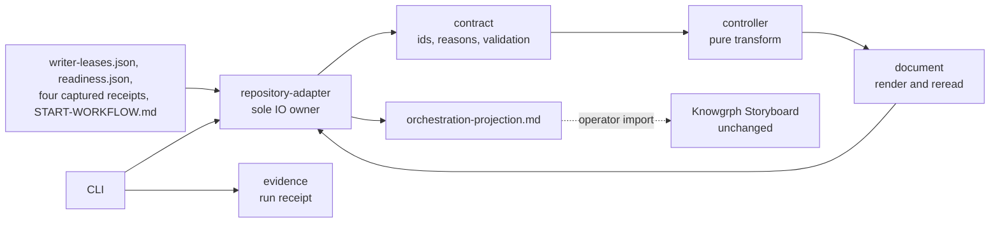

# Design Document

## Overview

One ACOS-owned projector reads receipts ACOS already emits and writes one
markdown-with-frontmatter Projection_Document outside the working tree. Knowgrph
renders it through the existing Storyboard surface. No renderer mode is added.

The approved requirements document in this directory is the authority. Every
component traces to a numbered criterion. Where the requirements left an
implementation-level choice open, the choice is stated with its reason and cost.

| Increment | Requirements | Adds |
|---|---|---|
| 1 - Min_Viable_Scope | 1, 2, 3, 4, 5, 8, 9, 10, 11, 12, 13, 14 | Six projector modules, one gate runner, one authored contract doc, four npm scripts, two Knowgrph defect fixes |
| 2 | 6 | One module emitting the raw receipt projection |
| 3 | 7 | Documentation only: Dashboard metric semantics |

### Newly verified during design

Beyond the requirements document's table. Each was read or executed directly.

| Fact | Evidence |
|---|---|
| `auditTrackedPathPortability` over the ACOS tracked inventory returns `status: incomplete` today: 340 scanned, 644 violations, 704 unscanned. `status` is `incomplete` whenever any file is unscannable, whatever the violation count. | Executed the export against the repository. |
| `node ./scripts/state-path-check.mjs` exits 1 on a clean checkout on `.githooks/git-guarded:22`, target `/dev/null`. The operand comes from `command -v -a git 2>/dev/null`; two further `>/dev/null` redirects at lines 33 and 40 would surface next. | Executed the script. |
| ACOS tracks zero `.jsx`, `.tsx`, or `.swift` files, so the auditor's unsupported-format branch is not the cause of the incomplete ACOS scope. | `git ls-files` count 0. |
| `state-path-check.mjs` scans only tracked files under `scripts` and `.githooks`. Tests and fixtures are outside its scope. | `trackedFiles`. |
| Three of six inputs carry no observation timestamp. `agentic-coordination-scheduler-report/v1` sets `additionalProperties: false` and declares none; the worktree lifecycle report and the collaboration gate result declare none. The parallelism report carries `generatedAt`, readiness carries `startedAt` and `verifiedAt`, and lease records carry `acquiredAt`, `heartbeatAt`, `expiresAt`. | Both JSON Schemas plus the three emitters. |
| `agentic-collaboration-gate-result/v2` carries `knowgrphRoot`, `artifactRoot`, and `ports`: absolute machine paths and runtime ports. | `scripts/collaboration-gate.mjs:120-155`. |
| Lane records carry `repository`, `worktree` (absolute path), `branch`, `session`, `scope`, digests. `laneKey` is `repository::worktree`. `CURRENT_CLAIM_STATES` holds the six claim states and is **not exported**. | `scripts/workspace-parallelism-lib.mjs:15-24,81-108`. |
| Frontmatter flow nodes are read from `meta.nodes` as `{ id, label, type, properties }`, and `normalizeNodes` copies a node's `category` field into `properties.category`. `category` is a Lane_Property_Key_List member. | `markdownFrontmatterFlowGraph.nodes.ts:349-420`. |
| `resolveStoryboardCardLaneLabel` returns the explicit lane label whenever present, except when the node type equals `FLOW_TEXT_GENERATION_NODE_TYPE_ID`. `compareCards` orders by `order`, then input index, then title. `selectRenderableStoryboardCards` is identity. | `storyboardCardIdentity.ts:22-28`; `storyboardModel.ts:525-528`; `storyboardCardVisibility.ts`. |
| The auditor's `unrooted-repository-reference` fires only when a slash-bearing literal resolves to a tracked path or a prefix of one. | `path-portability-auditor.mjs:331-341,505-508`. |
| `path-portability-auditor.mjs` has no CLI entry point. `state-path-check.mjs` has a main-module guard and sets `process.exitCode = 1` on the first offender. | Read directly. |

Assumed, named: the operator supplies the four stdout-emitted receipts, and no
formal JSON Schema exists for four of the six inputs and none is added.

## Design Decisions

Five pinned by the requirements, restated for traceability; two genuine choices.

| Pinned | Substance | Satisfies |
|---|---|---|
| Output location | Projection_Output_Root is `<Workspace_Root>/.runtime-state/agentic-canvas-os/orchestration-projection/`; Workspace_Root is the repository root's parent at runtime; single override `AGENTIC_ORCHESTRATION_PROJECTION_STATE_ROOT`. Precedents `local-runtime-lib.mjs:755-769`, `collaboration-gate-sandbox.mjs:31-38`. | 2.9, 2.11-2.16 |
| Card properties | `lane` only from Lane_Property_Key_List; `claimState`, `order`, `step`; `index` forbidden as a member of both `ORDER_PROPERTY_KEYS` and `INDEX_PROPERTY_KEYS`. | 4.10-4.17 |
| Staleness | Derived from `coordination.writer_lease_ttl_seconds` in `docs/START-WORKFLOW.md`, compared against Newest_Observation_Timestamp. | 2.6, 2.17-2.20, 10.6 |
| Digest | Existing `digestValue` (`cloud-collaboration-primitives.mjs:102-105`), lowercase hex SHA-256. No new digest or canonical-serialization helper. | 10.7-10.9 |
| Validation | Ajv 2020 via `ajv/dist/2020.js` per `agentic-sdlc/schema-validation.mjs:38-52` for the two formal members; Structural_Validation for the four others; nothing added under `docs/schemas/`. | 2.7, 2.21-2.23 |

One consequence of the pinned card-property decision the requirements did not
need to state: the frontmatter node record must carry no `category` field, because
`normalizeNodes` copies it into `properties.category` and `category` is
Lane_Property_Key_List member 10, lifting the criterion 4.11 cardinality to 2
without the projector writing the property directly. The record therefore carries
exactly `id`, `label`, `type`, `properties`.

The document renderer below is presentation only. The digest subject is always the
in-memory Projection_Value handed to `digestValue`, whose canonical form is
`canonicalJson`. The renderer never feeds the digest.

### Decision 1: Portability_Gate audits this feature's authored file set

**Choice.** The gate resolves the full tracked inventory through the existing
`collectTrackedAuthoredFiles`, keeps `repositoryPaths` and `accountNames` whole
so cross-repository resolution stays accurate, filters `files` to a declared
Gate_Scope (projector modules, their tests, their fixtures, and one
Projection_Document generated into a temporary directory), calls
`auditPathPortability`, and exits non-zero on `failed` or `incomplete`.

**Why not repository-wide.** Verified above: repository-wide returns `incomplete`
with 644 violations today. Criterion 3 makes `incomplete` non-zero and criterion 5
puts the gate in `check`, so a repository-wide default breaks `npm run check` on a
clean checkout for reasons that predate this feature and belong to other owners.
Criterion 6 states the obligation this feature carries: projector source, tests,
fixtures, and emitted document each pass. Scoping to that set is the only reading
that makes criteria 3, 5, and 6 hold together and the VCC's exits-zero claim true.
The cost: the gate does not improve the 644 pre-existing violations, it prevents
this feature adding any. The receipt records the Gate_Scope path list and the
omitted-file count so the narrowing is visible rather than implied.

### Decision 2: State_Path_Gate needs one narrow fix to `state-path-check.mjs`

**Choice.** Add a discard-sink predicate so `/dev/null`, `/dev/stdout`,
`/dev/stderr`, and `/dev/fd/<n>` are not treated as repository write targets.
The gate is then the plain script `node ./scripts/state-path-check.mjs`, since
the file already has a main-module guard and already sets a non-zero exit code.

**Why.** Verified: the script exits 1 on a clean checkout on a stderr discard.
That is a false positive; the character devices are not repository state.
Without the fix, criteria 2, 4, and 5 cannot hold together.

**Alternative rejected.** Rewriting the three `>/dev/null` redirects in
`.githooks/git-guarded`. That edits a hook wrapper guarding destructive
operations to work around a classifier defect, and must be repeated for every
future redirect. `state-path-check.mjs` is not a receipt emitter, so Requirement
11 criterion 5 is not engaged.

**Honest scope note.** Even after the fix, the checker only detects *statically
resolvable* write targets: `resolveExpression` returns null for anything that is
not a literal, a module-scope literal constant, `os.homedir()`, or a
`path.join`/`path.resolve` whose every argument resolves. The projector writes to
`path.join(<runtime-resolved root>, <fixed segments>)` where the root is a
function parameter, so nothing is reported. The gate passes the projector **by
construction, not by luck**, and would equally miss a runtime-resolved escape.
It guards authored absolute literals; the Portability_Gate covers the rest.

## Architecture



The dashed edge is the only coupling to Knowgrph and it is a file. No ACOS
schema identifier enters Knowgrph source; the projection id lives inside the
document's `schema` value, which Knowgrph reads as opaque frontmatter text
(Requirement 12 criterion 8).

**Purity boundary.** `repository-adapter.mjs` is the only module importing
`node:fs` or resolving against the real filesystem. `controller.mjs`,
`contract.mjs`, and `document.mjs` take plain values and return plain values,
which is what makes the correctness properties testable with zero filesystem
access.

**Receipt resolution.** Two inputs are files at established locations, read in
place: readiness from `Runtime_State_Root/knowgrph-local-runtime/readiness.json`
and the lease registry from
`<git-common-dir>/agentic-canvas-os/writer-leases.json`. Four are stdout `--json`
emissions with no canonical file, resolved from
`Projection_Output_Root/receipts/<schema-slug>.json` with a per-schema CLI
override.

*Design choice: the projector does not run the emitters.* `collaboration:gate`
allocates ports and spawns two runtimes; `coordination:schedule` carries a
`mutation` field; subprocess execution would make the transform non-deterministic
and hand a read-only projector an execution surface no criterion asks for.
Requirement 2 criterion 1 asks the projector to derive from receipts, not produce
them, and criterion 4 covers the absent case. Capture is an operator step, with
the exact redirect for each of the four recorded in the authored contract doc.

**Lane progress without stage-name literals.** Requirement 3 criterion 3 forbids
any stage name as an authored literal and criterion 5 requires axis changes to
take effect with no source edit. Together these rule out per-stage predicates
keyed by stage name. Lane_Progress_Rule is therefore an ordered list of
Lane_Evidence_Predicates named after the evidence that satisfies them, one per
Receipt_Input_Set member, in a fixed evidence order; a lane's attained stage
count is the number of leading satisfied predicates, clamped to
`stageAxis.length`. Cards are emitted for indices `0 .. attained - 1`, taking
`step` from `stageAxis[i]` and `order` from `i`.

The rule is monotone and name-free, so the axis can grow, shrink, or be reordered
with no source change. The cost is that the evidence-to-stage mapping is
positional, not semantic: inserting a stage mid-list shifts labels by one relative
to the evidence that produced them. That is a real limitation of deriving from an
authored list the projector may not mirror, recorded rather than hidden; the
semantic alternative needs stage literals and is forbidden. At most six cards per
lane follow, bounding the document; criterion 1.7 handles overflow.

## Components and Interfaces

Each module carries a one-line responsibility header on line 1 or 2, matching
`state-path-check.mjs:2`, `audit/path-portability-auditor.mjs:1`,
`audit/frontmatter-validator.mjs:1`, `invocation-resolve.mjs:1`, and stays under
600 lines (11.1, 11.2). The decomposition follows the ACOS convention across
`scripts/`: CLI, contract, controller, repository adapter, evidence.

| Module | Responsibility | Est. lines | IO |
|---|---|---|---|
| `scripts/orchestration-projection.mjs` | CLI entry: parse argv, wire adapter and controller, print the run receipt, set the exit code. | 120 | via adapter |
| `scripts/orchestration-projection-contract.mjs` | Own the projection schema id, the Typed_Failure_Reason enum, the six input descriptors, Structural_Validation, the claim-state vocabulary. | 240 | none |
| `scripts/orchestration-projection-controller.mjs` | Pure transform from validated inputs plus Stage_Axis to Projection_Value, lane cards, and Projection_Digest. | 260 | none |
| `scripts/orchestration-projection-repository-adapter.mjs` | Sole filesystem and Git owner: resolve roots, read receipts and authored frontmatter, compile Ajv validators, create the output root, write the document. | 280 | yes |
| `scripts/orchestration-projection-document.mjs` | Render a Projection_Value as frontmatter plus body; read the canonical value back out of an emitted document. | 200 | none |
| `scripts/orchestration-projection-evidence.mjs` | Build the run receipt envelope `agentic-orchestration-projection-receipt/v1`. | 90 | none |
| `scripts/audit/path-portability-gate.mjs` | Portability_Gate runner over the declared Gate_Scope. | 110 | yes |
| `scripts/orchestration-projection-receipt-table.mjs` (Increment 2) | Emit the raw receipt projection as JSON text. | 120 | none |

Plus one authored document, `docs/ORCHESTRATION-PROJECTION.md`, carrying capture
instructions, the Deferred_Increment_Set names with sources (14.2), the
deferred-formal-schema non-goal (14.5), the Dev-only publish policy (13.5), and in
Increment 3 the five Dashboard metric meanings (7.2, 7.3).

```
// contract.mjs      PROJECTION_SCHEMA, FAILURE_REASONS (six), LANE_CLAIM_STATES (six),
//                   RECEIPT_INPUTS = [{ schemaId, formal, timestampPath|null, consumedFields } x6]
validateStructural(schemaId, value) -> null | { reason, detail }
// controller.mjs    (pure)
buildProjection({ receipts, stageAxis, stalenessBoundSeconds })
  -> { ok: true, value, digest, lineCount } | { ok: false, reason, detail }
// document.mjs      (pure)
renderProjectionDocument(value, digest) -> string
readProjectionCanonicalValue(text)      -> object   // digest key excluded
// repository-adapter.mjs   (only IO)
resolveRoots({ env, repositoryRoot })
  -> { workspaceRoot, runtimeStateRoot, projectionOutputRoot, gitCommonDir }
readReceiptInputs({ roots, overrides }) -> { records } | { reason, detail }
readAuthoredAxis({ repositoryRoot })    -> { stageAxis, stalenessBoundSeconds }
writeProjection({ projectionOutputRoot, text }) -> { path }
```

`buildProjection` returns a tagged result rather than throwing, so failure-reason
tests assert an exact string with no exception plumbing and the controller never
formats a resolved path.

**Claim-state vocabulary.** `CURRENT_CLAIM_STATES` is not exported and 11.5
forbids modifying receipt emitters, so the vocabulary is declared in
`contract.mjs` and a drift guard test reads the emitter's source, extracts the set
literal, and asserts set equality. Criterion 3.3's no-authored-literal rule covers
stage names only, so this is permitted, and drift is caught by a test rather than
trusted to convention.

### Knowgrph change set (Requirement 12)

Exactly two edits, both root-owned defects.

**Defect A**, `canvas/src/lib/config-copy/uiCopy.ts`. Line 21 sets
`CANVAS_VIEW_RENDERER_ANIMATIC_TITLE` to the Gantt string; correct it to name
Animatic. Lines 25-26 set the toggle tooltip, which omits Gallery, Media, and
Animatic while the toggle offers all 12 renderers through
`CANVAS_VIEW_RENDERER_OPTION_TITLE` (`canvasViewMenu.ts:96-109`), so the tooltip
must name all 12. Both are `const` declarations re-exported through `UI_COPY` at
lines 200-213, so the per-renderer map picks up the corrected values with no
further edit. Satisfies 12.4, 12.5.

**Defect B**, remove the orphan `canvas/src/components/StoryboardCanvas.tsx`. No
module imports `@/components/StoryboardCanvas`; only modules inside the
`StoryboardCanvas/` directory are live. Satisfies 12.6, 12.7. No renderer id
changes, so the registry still declares 12 (12.2);
`rendererPipelineNeutrality.test.ts` must keep passing (12.3); no ACOS schema id
enters Knowgrph source (12.8).

### npm surface (Requirement 8)

```
"orchestration:projection":       "node ./scripts/orchestration-projection.mjs",
"orchestration:projection:check": "node --test __tests__/orchestration-projection-*.test.mjs && npm run docs:check",
"paths:portability:check":        "node ./scripts/audit/path-portability-gate.mjs",
"paths:state:check":              "node ./scripts/state-path-check.mjs",
"check": "npm test && npm run paths:portability:check && npm run paths:state:check && npm run web:build && npm run docs:check"
```

`paths:portability:check` needs the thin runner because the auditor exports
`auditPathPortability`, `auditTrackedPathPortability`, and
`collectTrackedAuthoredFiles` but has no CLI of its own; `paths:state:check` needs
no runner. Satisfies 8.1-8.5.

## Data Models

### Projection_Value

The single in-memory value that is both digest subject and render source.
JSON-safe throughout, so `JSON.parse(JSON.stringify(v))` is identity.

```
{ schema, title, graphId, doc_type, lang, date, frontmatter_contract, status,
  publish_policy, canvas2dRenderer: "storyboard",
  observedAt,               // Newest_Observation_Timestamp, or null
  stalenessBoundSeconds,    // derived
  stageAxis: [ ... ],       // derived, authored order preserved
  inputs: [ { schema, observedAt } ],          // 6, sorted by schema
  lanes:  [ { lane, claimState, attained } ],  // sorted by lane
  nodes:  [ CardNode ] }                       // sorted by (lane, order)
```

`date` and `observedAt` both derive from Newest_Observation_Timestamp (10.6).
All three collections sort by value-derived keys, never directory enumeration
(10.5).

### CardNode

```
{ id: "<Lane_Identity>::<order>", label: "<stage label>",
  type: "OrchestrationStage",
  properties: { lane: "<Lane_Identity>", claimState: "<Lane_Claim_State>",
                order: <zero-based Stage_Axis index>, step: "<Stage_Axis member>" } }
```

- `properties` intersected with Lane_Property_Key_List is exactly `{lane}` (4.3,
  4.10, 4.11): no `status`, `stage`, `column`, `phase`, `track`, `swimlane`,
  `group`, `bucket`, `category`, `columnKey`. No `category` field on the record
  itself either, per the pinned decision. No `index` property (4.15).
- `order` is drawn from `ORDER \ INDEX`, `step` from `INDEX \ ORDER` (4.16).
- `type` is `OrchestrationStage`: not `FLOW_TEXT_GENERATION_NODE_TYPE_ID`, so
  `resolveStoryboardCardLaneLabel` returns the explicit `lane`; and it does not
  match `STRUCTURAL_NODE_TYPE_RE`, so the card is not structural.
- `compareCards` orders by `order` ascending, so 4.6 follows from setting `order`
  and nothing else.

### Lane_Identity

`"<repository>::<semanticScope>"`, where `semanticScope` is the lane's `scope`,
falling back to the semantic-scope segment of `branch`, then to the empty-scope
marker. `worktree` and `session` are never emitted: one is an absolute machine
path, the other a session id, both forbidden by 4.9, 8.7, 8.8. `worktree` may
still serve as an internal sort tiebreak without being emitted, keeping 10.5
value-derived. The `::` separator follows the existing `laneKey` convention
(`workspace-parallelism-lib.mjs:106-108`). A `/` separator would let a scope
named like a tracked directory produce a literal that `resolvesKnownPath` matches,
raising an `unrooted-repository-reference` violation in the emitted document and
failing 8.6; `::` cannot match `REPOSITORY_PATH_PATTERN`.

### Observation timestamps

| Input | Timestamp | Staleness |
|---|---|---|
| `agentic-workspace-parallelism-report/v1` | `generatedAt` | compared |
| `agentic-local-runtime-readiness/v1` | `verifiedAt`, else `startedAt` | compared |
| `agentic-writer-lease-registry/v2` | newest lease `heartbeatAt` | compared |
| `agentic-worktree-lifecycle-report/v1` | none | exempt |
| `agentic-coordination-scheduler-report/v1` | none | exempt |
| `agentic-collaboration-gate-result/v2` | none | exempt |

Criterion 2.6 is a WHERE clause conditioned on the record carrying a timestamp, so
the three timestamp-less inputs are exempt by the criterion's own guard, not by an
exception this design invents; the scheduler report cannot be given one without
editing its schema, which 2.23 forbids. Newest_Observation_Timestamp is the maximum
over the three that carry one; when none is present it is null, staleness is
skipped, and `date` falls back to the authored document date.

### Document layout

Frontmatter fence, then the Projection_Value keys in deterministic order, then
`projection_digest`, then the `nodes` list with each entry's `id`, `label`,
`type`, and nested `properties`. Closing fence, one `# Orchestration Projection`
heading, one short prose block, then a fenced `json` block holding the
single-line canonical JSON of the Projection_Value with the digest key absent.

Two representations, one source value. The frontmatter is what Knowgrph's
frontmatter flow parser reads into card nodes with properties. The fenced JSON
block is the digest subject in re-readable form: `readProjectionCanonicalValue`
extracts it, `JSON.parse`s it, and `digestValue` recomputes, which verifies 10.10
without depending on a YAML reader round-tripping. One line keeps it out of the
600-line budget while staying far inside the 500000-byte cap.

The document contains no filesystem path, port, session id, or account name.
Input provenance is schema id plus observation timestamp only. That is what makes
8.6 achievable for the emitted document, and why the resolved-location detail
required by 2.4 lives in the run receipt instead.

### Run receipt

```
{ schema: "agentic-orchestration-projection-receipt/v1",
  status: "emitted" | "failed", reason: null | <Typed_Failure_Reason>,
  detail: null | { expected?, observed?, location?, value? },
  projectionSchema, projectionDigest, observedAt, laneCount, cardCount, lineCount }
```

`detail.location` is rendered relative to the literal token `<Workspace_Root>`, so
a failure names what was searched without emitting a machine path or account name.

## Correctness Properties

*A property is a characteristic or behavior that should hold true across all
valid executions of a system - essentially, a formal statement about what the
system should do. Properties serve as the bridge between human-readable
specifications and machine-verifiable correctness guarantees.*

PBT applies because the projector is a pure receipts-to-document transform over a
large input space, and the useful guarantees are round-trips, invariants, and
determinism. The prework classified 116 criteria into 36 candidates; consolidation
left 14 for Increment 1 with distinct oracles, plus one per later increment.

### Property 1: Determinism and input-order independence

*For any* valid Receipt_Input_Set and Stage_Axis_Source, projecting twice yields
byte-identical documents, and permuting every input collection first yields the
same bytes again.

**Validates: Requirements 10.1, 10.5**

### Property 2: Digest round-trip

*For any* emitted Projection_Document, rereading its canonical value and
recomputing with `digestValue` reproduces the declared digest, which matches
`^[0-9a-f]{64}$`.

**Validates: Requirements 10.2, 10.3, 10.7, 10.8, 10.10**

### Property 3: Digest sensitivity to any single-field mutation

*For any* valid Receipt_Input_Set and any single consumed field changed to a
different value, the Projection_Digest differs from the unmutated digest.

**Validates: Requirements 10.4**

### Property 4: Card property shape

*For any* emitted Projection_Document and every card node in it, the intersection
of that node's property-key set with the Lane_Property_Key_List literal read from
Knowgrph has cardinality exactly 1 and equals `{lane}`, and no card node carries
a property named `index`.

**Validates: Requirements 4.3, 4.10, 4.11, 4.15**

### Property 5: Stage position consistency

*For any* emitted card node, `stageAxis[node.properties.order]` equals
`node.properties.step`, with `order` a zero-based index inside Stage_Axis bounds.

**Validates: Requirements 4.5, 4.13, 4.14**

### Property 6: Ascending stage order within every lane

*For any* emitted Projection_Document passed to `buildStoryboardBoardModel`, the
cards of every lane appear in strictly ascending Stage_Axis index order.

**Validates: Requirements 4.6**

### Property 7: Lane-set fidelity and fallback unreachability

*For any* Lane_Axis, the board model built from the emitted document has exactly
one lane per Lane_Axis member, no lane labelled `Storyboard`, and reports `lane`
as the lane property key rather than the `'stage'` fallback.

**Validates: Requirements 1.8, 4.4, 4.17**

### Property 8: Projection shape

*For any* pair of lane-bearing receipts, the derived Lane_Axis equals the union of
the lanes they describe, the card count equals the sum of per-lane attained stage
counts, and every emitted `claimState` is in the Lane_Claim_State vocabulary.

**Validates: Requirements 4.1, 4.2, 4.7**

### Property 9: Stage axis fidelity

*For any* authored `stage_order` sequence, the derived Stage_Axis equals it
element for element in authored order, with no source modification between runs.

**Validates: Requirements 3.1, 3.2, 3.5**

### Property 10: Staleness bound derivation and wall-clock independence

*For any* authored `coordination.writer_lease_ttl_seconds` value, the effective
Staleness_Bound equals it; a timestamp-carrying record older than that bound
relative to Newest_Observation_Timestamp fails with `stale-observation`; and a
uniform offset applied to every input timestamp leaves the outcome unchanged.

**Validates: Requirements 2.6, 2.17, 2.19, 2.20**

### Property 11: One typed reason per perturbation

*For any* valid Receipt_Input_Set and any single perturbation from {wrong schema
id, removed record, removed required field of a formal member, absent or wrongly
typed consumed field of a structural member, out-of-vocabulary claim state,
unredacted value in a redacted-declared field}, the run fails with exactly the
Typed_Failure_Reason that perturbation maps to, and the detail names the offending
expected, observed, or located value.

**Validates: Requirements 2.3, 2.4, 2.21, 2.22, 4.8, 9.5**

### Property 12: Non-leakage of paths, sessions, and tokens

*For any* Receipt_Input_Set, no input `worktree`, `session`, `sessionId`, or
`ownershipTokenDigest` value appears anywhere in the emitted
Projection_Document or in the raw receipt projection.

**Validates: Requirements 4.9, 9.2, 9.3**

### Property 13: Document contract conformance

*For any* emitted Projection_Document, the frontmatter carries all eight
`REQUIRED_AUTHORED_KEYS`, every character is ASCII, no sibling asset is
referenced, no `ARTIFACT_PATTERNS` entry from `scripts/docs-contract.mjs` matches,
and every timestamp present is a member of the input observation-timestamp set.

**Validates: Requirements 1.3, 1.6, 5.3, 5.4, 10.6**

### Property 14: Emitted documents pass the Portability_Gate

*For any* Receipt_Input_Set, including sets whose field values carry absolute
paths, account-shaped segments, and ports, the Portability_Gate audit of the
emitted document returns `status: passed`.

**Validates: Requirements 8.6**

### Property 15: Raw receipt projection fidelity, Increment 2

*For any* Receipt_Input_Set, the emitted raw receipt projection parses as JSON,
holds exactly one record per Receipt_Input_Record carrying that record's schema id
and observation timestamp, and each record's field-name set equals its source
receipt's with no field added or renamed.

**Validates: Requirements 6.2, 6.3, 6.4**

### Property 16: Dashboard node metric tracks node count, Increment 3

*For any* emitted Projection_Document, the `nodes` metric produced by
`buildDashboardCanvasModel` equals the projected graph's node count.

**Validates: Requirements 7.4**

## Error Handling

Every failure is a value, not an exception. `buildProjection` and
`readReceiptInputs` return `{ ok: false, reason, detail }`; the CLI turns that into
a run receipt and a non-zero exit code. No partial document is written: the adapter
writes only after the controller returns `ok: true`, so criterion 1.7's "rather
than emit a truncated document" holds structurally, not by discipline.

| Reason | Raised when | Detail |
|---|---|---|
| `input-absent` | A required receipt is missing, or `stage_order` is absent or empty (3.4) | `location`, relative to the `<Workspace_Root>` token |
| `schema-id-mismatch` | An input's observed `schema` differs from its descriptor | `expected`, `observed` |
| `malformed-json` | An input is not parseable as JSON | `location` |
| `stale-observation` | A timestamp-carrying record is older than Staleness_Bound relative to Newest_Observation_Timestamp | `observed`, `bound` |
| `schema-validation-failed` | Ajv rejects a formal member; Structural_Validation rejects a structural member; a claim state is out of vocabulary; a redacted-declared field carries an unredacted value | `value` or `expected`/`observed` |
| `budget-exceeded` | The rendered document would exceed 600 lines | `lineCount` |

Failure detail never contains an absolute path prefix, an account name, a port,
or a session id, which keeps 8.7, 8.8, and Requirement 9 intact on the failure
path as well as the success path.

**Recorded consequence, Increment 2.** Requirement 6 criterion 3 forbids renaming
or dropping source fields in the raw receipt projection, and
`agentic-collaboration-gate-result/v2` carries `knowgrphRoot`, `artifactRoot`, and
`ports`, so those values flow through unchanged into that artifact. This is not a
defect against any criterion: the raw receipt projection is generated runtime
state under Projection_Output_Root, outside the working tree, and criterion 8.6
scopes the Portability_Gate to source, tests, fixtures, and the
Projection_Document. Recorded so the Increment 2 implementer does not read it as
an oversight. Requirement 9 still applies in full.

## Testing Strategy

`node --test __tests__/*.test.mjs` with `fast-check@3.23.2`, already an ACOS
devDependency. Node 22, zero runtime dependencies, no network. Tests live in
`__tests__/orchestration-projection-*.test.mjs` so the existing `npm test` glob
picks them up, and `orchestration:projection:check` gives the feature its own entry
point matching the repository's `*:check` convention.

**Property tests.** Each of the 16 properties above is one `fc.assert` with
`numRuns` at least 100 and a comment tag
`Feature: orchestration-projection-visualization, Property {number}: {property text}`.
Nothing is implemented from scratch. Generators produce lane sets, claim states, ISO
timestamps, stage sequences, and receipt field values, and deliberately include the
EDGE_CASE criteria: non-ASCII lane scopes, unparseable receipt text, absent and
empty `stage_order`, lane counts spanning the 600-line boundary, and unredacted
values in redacted fields. The transform is pure, so every property runs with zero
filesystem access.

**Unit tests, kept few.** One example each for the EXAMPLE criteria: the schema
id and its pattern (1.2); `canvas2dRenderer` equal to `storyboard` and a member
of Import_Target_Set (1.4, 5.2, 5.5); the resolved output root and its override
branch (2.9, 2.11-2.16); `claimState` absent from Lane_Property_Key_List plus the
two disjoint set differences (4.12, 4.16); the three gate status-to-exit mappings
(8.3, 8.4); pairwise distinctness of the 12 renderer titles with the Animatic
title naming Animatic (12.2, 12.4); the tooltip naming every toggle-offered
renderer (12.5).

**Integration tests, one to three examples each.** Knowgrph boundaries:
preset-parser acceptance (1.5), import target validity (5.1), the MultiDim table
JSON source path (6.1), the Dashboard model build (7.1). Plus a mock-filesystem
test asserting the adapter only reads the three state locations and performs
exactly one `mkdir` on Projection_Output_Root (2.8, 2.16), and a read-log test
asserting only the six schema ids are requested (14.3).

**Static and diff checks.** The SMOKE criteria run once: import-graph scans for
absent HTTP, fetch, provider-client, Cloudflare, Wrangler, and release-controller
imports and no Git write subcommand (2.10, 13.3, 13.4); source scans for no
absolute path literal (2.14), no TTL literal in seconds, milliseconds, or factor
form (2.18), no stage-name literal (3.3), and no self-declared `createHash` or
canonical serializer alongside a present `digestValue` import (10.9); module budget
and responsibility headers (11.1, 11.2); shared-helper reuse (11.3); Dev-only
policy and deferred-increment documentation (13.5, 14.2, 14.5, 7.2, 7.3); and diff
checks that nothing lands under `docs/schemas/` (2.23), no receipt emitter is
modified (11.5), the Knowgrph diff touches exactly the two defect paths (12.1),
neither MultiDim table module is touched (6.5), the orphan is gone and the build
resolves (12.6, 12.7), the neutrality test passes (12.3), and no ACOS schema id
appears in Knowgrph source (12.8). The duplicate-logic auditor runs over the module
set as an advisory check for 11.4.

**Not automated.** Criterion 2.1's whole-value provenance claim, 11.4's
no-duplication judgement, 13.1's Dev-only scope claim, and 14.4's future
schema-revision policy are covered indirectly or recorded as policy. The prework
names each; none is silently dropped.
