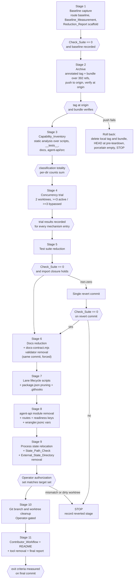

# Design Document

## Overview

This is a process design, not a runtime feature. Nothing here adds product
behavior. Every component described below exists to classify, archive, measure,
or verify, and the Worker request contract fixed by Requirement 4 is treated as
immutable throughout.

The Teardown_Process is modelled as an ordered pipeline of eleven
Teardown_Stage units. Each stage ends in exactly one commit, and each commit is
followed by one Check_Suite run that acts as the gate to the next stage. Failure
at a gate produces a single revert commit; failure on the revert commit stops the
process. No stage deletes a tracked path before the Capability_Inventory stage
and the Archive stage have both completed (Requirement 11 criterion 1).

### What is verified and what is assumed

Being precise about this matters more than usual here, because the whole spec is
built on the claim that a large body of code can be removed safely.

Verified by direct inspection during design:

- `worker/index.js` dispatches the routes named in Requirement 4 plus four route
  families that Requirement 4 does not preserve: `POST /api/agent/run`,
  `POST /api/agent-swarm/{start,work,settle,status,cancel}`,
  `POST /api/agent-toolkit/{...}` (10 actions), and
  `POST /api/upstream-dependency-admission/evaluate`.
- `agent-api/src/` holds 59 tracked `.js` files at one level.
- `scripts/docs-contract.mjs` imports 12 document validators from sibling
  `scripts/` files and calls each one, so docs removal and validator removal are
  coupled inside a single stage.
- `package.json` declares 116 scripts, `devDependencies` are exactly
  ajv 8.20.0, fast-check 3.23.2, wrangler 4.120.0, `engines.node` is `>=22`,
  `npm run check` is `npm test && npm run web:build && npm run docs:check`, and
  `npm test` is `node --test __tests__/*.test.mjs`.
- `wrangler.jsonc` declares the `CANVAS_ROOM` and `AGENT_STATE` Durable Object
  bindings, the `v1-canvas-room` and `v2-agent-state` migration tags, and
  `run_worker_first` entries in both the top-level block and the `dev` block,
  including entries for `/agent/run` that Requirement 4 criterion 16 requires to
  be removed with that route.
- `.githooks` holds 4 hook files: `git-guarded`, `pre-commit`, `pre-push`,
  `reference-transaction`. Requirement 6 criterion 9 caps the survivors at 2.
- `.github/workflows` holds 6 workflows. Requirement 6 criterion 8 requires
  exactly one to survive.
- The readiness payload assembled in `agent-api/src/app.js` today contains keys
  beyond the five named in Requirement 4 criterion 4, including
  `programmaticToolCalling` and per-subsystem stats blocks.

Assumed, and not verified:

- **The 223 lane-lifecycle scripts have not been read individually.** No claim in
  this design asserts what any specific one of them does. Requirement 1,
  Requirement 2, and the Capability_Inventory stage exist precisely to replace
  that assumption with recorded evidence, and the design deliberately places
  every deletion after that stage.
- The reduction targets in Requirement 5 criteria 5 and 7, Requirement 6
  criteria 6, 9, and 10, Requirement 8 criterion 1, Requirement 9 criterion 1,
  and Requirement 12 criterion 4 are assumptions about what the inventory will
  find. They are not predictions. If the inventory produces a large
  `constrained` set, the targets become unreachable and the correct outcome is an
  incomplete Reduction_Report, not a forced deletion. See Risks.
- Whether the sibling `knowgrph` repository reads the External_State_Directory is
  undetermined until the Requirement 2 criterion 7 check runs.

## Reconciled Requirement Conflicts

The requirements contain one direct internal inconsistency and two places where
limits are in tension. These are recorded here rather than papered over.

### Conflict 1: dirty worktree handling (authoritative rule)

Requirement 3 criterion 12 and Requirement 10 criteria 5 through 7 prescribe
different handling of the same observed condition.

| Source | Condition | Prescribed action |
|---|---|---|
| R3.12 | `git status --porcelain` reports >= 1 line in a worktree selected for removal | STOP before removal, record path and line count |
| R10.5 | reports tracked modifications or staged changes | PUSH branch to `origin`, then remove |
| R10.7 | reports untracked files | RETAIN worktree, record path and untracked count |

**Reconciled rule (authoritative for this design): fail closed. Requirement 3
criterion 12 governs.** When `git status --porcelain` in a worktree selected for
removal reports one or more lines of any kind, the Teardown_Process stops before
removing that worktree, records the worktree path and the reported line count in
the Reduction_Report, and requires an explicit Operator action to continue. The
worktree is retained and counts against the Requirement 10 criterion 9 allowance
for retained worktrees.

Requirement 10 criteria 5 and 6 are treated as **conditional and
Operator-initiated**, not automatic: if the Operator, having seen the recorded
report, chooses to preserve the branch by pushing it, the push-then-remove path
in R10.5 and its failure handling in R10.6 apply to that Operator-authorized
action. The process itself never pushes and removes unattended.

Tradeoff, stated plainly:

- Stopping is safer and keeps the Operator in the loop. It costs unattended
  progress: a single dirty worktree halts stage 10.
- Push-then-remove allows the pipeline to finish without human attention, but a
  push cannot preserve untracked files. `git push` moves commits, not working
  tree contents. Removing a worktree that holds untracked files destroys them
  with no archive coverage, which directly contradicts the premise of
  Requirement 3 that nothing becomes unrecoverable.

Because the untracked case cannot be made recoverable by pushing, and because a
`git status --porcelain` line does not by itself distinguish reliably enough to
justify an automated destructive branch, the design applies the same stop to all
dirty states rather than branching on porcelain status codes.

### Conflict 2: `agent-api/src/` module cap versus import closure

Requirement 5 criterion 5 caps surviving `agent-api/src/` modules at 20.
Requirement 4 criterion 11 retains anything reachable by static import from a
Preserved_Route_Set handler, Requirement 5 criterion 8 requires import closure,
and Proven_Path (Requirement 1 criterion 8) retains anything a Live_Proof_Record
names. A preliminary import-closure walk from the preserved handlers plus the
`worker/index.js` imports plus the two Live_Proof_Records reaches roughly 20 to
23 modules before any judgement is applied. The cap may therefore be
unreachable. The design does not resolve this by deleting a reachable module; it
resolves it by reporting the measured count and an incomplete status per
Requirement 5 criterion 6. See Risks.

### Conflict 3: `scripts/` file budget versus the process tooling

Requirement 6 criterion 10 caps surviving `scripts/` files at 15 and 3,000
lines. The five tools this design introduces live under `scripts/`. Their
survival is therefore a budget decision, resolved in Components and Interfaces:
only the State_Path_Check survives, because Requirement 7 criterion 6 wires it
into the Check_Suite. The other four are removed in the final stage and do not
consume the budget.

## Architecture

### Process shape

The unit of work is the Teardown_Stage. A stage is: do the work, stage every
change, produce exactly one commit with zero uncommitted tracked changes
(Requirement 11 criterion 2), run the Check_Suite against that commit
(Requirement 11 criterion 3), and only then start the next stage. A non-zero
Check_Suite exit produces one revert commit (Requirement 11 criterion 4), which
is itself gated by a Check_Suite run (Requirement 11 criterion 8); a non-zero
exit there stops the process (Requirement 11 criterion 9).

Every stage commit also updates the Reduction_Report with the four surface
measurements taken against that commit's tree (Requirement 11 criterion 6), so
the report is a running ledger rather than a final artifact.



The `GEN` gate applies identically at the end of stages 5 through 9; it is drawn
once to keep the diagram readable.

### Stage ordering and why

**Stage 1 baseline before everything.** Requirement 4 criterion 14 requires the
pre-teardown response baseline to be recorded before the first deletion commit.
It has to be first because it is the only artifact that cannot be reconstructed
after the fact: once a module is gone, the status code the old Worker returned is
unknowable.

**Stage 2 archive before any deletion.** Requirement 3 criteria 2 and 3. The tag
must be verified present at `origin` before the first deletion commit, because
the archive is worthless if it exists only on the machine performing the
teardown.

**Stage 3 inventory before every deletion.** Requirement 11 criterion 1. This is
the stage that converts the 223 unread scripts from an assumption into recorded
evidence. Nothing may be deleted before it because Requirement 1 criterion 9
retains anything without an inventory entry, which would make an early deletion
a spec violation by construction.

**Stage 4 concurrency trial before script removal.** Requirement 2 criterion 10.
The trial is the only mechanism in the spec that can promote a lifecycle entry to
`constrained` on concurrency grounds. It must run while the mechanisms still
exist and while there are still real worktrees to run them in.

**Stage 5 tests before source.** Three reasons. First, Requirement 11 criterion 5
forces source deletion and `scripts/` deletion into separate stages, and putting
tests first keeps each later stage's gate meaningful. Second, a test file that
imports only doomed modules (Requirement 9 criterion 7) can be removed while its
imports still resolve, so the stage-5 gate proves the reduction is clean before
any source moves. Third, if tests were removed after source, the intervening
gate would be running a suite that references deleted modules and would fail for
a reason unrelated to the deletion under review.

**Stage 6 docs and `docs-contract.mjs` in the same commit.** Forced, not chosen.
`scripts/docs-contract.mjs` imports 12 validators and calls each one against the
`documents` map. Requirement 8 criterion 11 makes a validator targeting an absent
`docs/` path a non-zero exit. So removing a document without removing its
validator in the same commit breaks `npm run docs:check`, which breaks
`npm run check`, which fails the stage gate (Requirement 8 criteria 8 and 12).

**Stage 7 lifecycle scripts with `package.json` pruning and `.githooks`.**
Requirement 11 criterion 7 requires references in files the Check_Suite executes
to be removed in the same commit as the path they resolve to. A `device:*` script
entry pointing at a deleted `scripts/device-branch.mjs` is exactly such a
reference. Requirement 6 criterion 5 keeps every `device:*` key intact with its
pre-teardown command string until this stage completes, so stages 1 through 6
must not touch them.

**Stage 8 source and route removal after scripts.** Requirement 11 criterion 5
mandates the separation. Doing source second means the surviving `scripts/`
set is already known, so a script that only existed to exercise a removed
subsystem has already gone and cannot mask an import-closure break.

**Stage 9 state relocation after source settles.** The Process_State_Directory
target and the State_Path_Check only make sense once the surviving script set is
fixed. Requirement 7 criterion 9 also requires any External_State_Directory
state read by a `retained` or `constrained` entry to be moved before removal, and
that set is not knowable until stages 7 and 8 have determined what survives.

**Stage 10 git ref cleanup last, and Operator-gated.** Branch deletion and
worktree removal are the only irreversible operations in the process once the
bundle exists, and `git worktree remove` can destroy untracked files that no
archive covers. Putting them last means every other stage has already passed its
gate, so if the Operator declines authorization the repository is still in a
finished, working state and only Requirement 10's counts are unmet.

**Stage 11 documentation and teardown of the teardown tooling.** The
Contributor_Workflow must describe the reduced-form replacement of every
`constrained` entry (Requirement 6 criterion 7), which is only fully known after
stage 10. The final Reduction_Report measurement must be taken on the final
commit with no uncommitted modifications (Requirement 12 criterion 8), so it has
to be the last thing that happens.

### Constraints the architecture inherits

- Node 22 built-ins only. No new runtime or dev dependency. Available tooling is
  the `node:` standard library, the `git` CLI, the `gh` CLI, `wrangler`, and the
  two existing dev dependencies ajv and fast-check.
- Every tool is a `.mjs` file under `scripts/`, invoked by `node`, consistent
  with the existing convention in `package.json`.
- The Check_Suite command string may change only to add the State_Path_Check
  (Requirement 7 criterion 6). Its four members after stage 9 are
  `npm test`, `npm run web:build`, `npm run docs:check`, and the State_Path_Check.

## Components and Interfaces

Five repository-owned tools. All are Node 22, zero new dependencies, and all are
scaffolding rather than product.

### Survival decisions

| Tool | Survives teardown | Reason |
|---|---|---|
| `scripts/state-path-check.mjs` | Yes | Requirement 7 criterion 6 wires it into the Check_Suite |
| `scripts/teardown-inventory.mjs` | No | Single-use; its output (the inventory) is the artifact, not the builder |
| `scripts/teardown-archive.mjs` | No | Single-use; the tag and bundle are the artifact |
| `scripts/teardown-route-baseline.mjs` | No | Replaced by the permanent route test required by Requirement 4 criterion 12 |
| `scripts/teardown-measure.mjs` | No | Single-use; the Reduction_Report is the artifact |

The four non-surviving tools are deleted in stage 11. Their removal is accounted
for in the Requirement 6 criterion 10 budget: the ceiling is 15 surviving
`scripts/` files, and only `state-path-check.mjs` of these five counts against it.
The four temporary tools must not be counted as headroom during stages 3 through
10, because they are present in those commits and the per-stage Reduction_Report
rows will include them. This is expected and is why the budget is only asserted
against the final commit (Requirement 12 criterion 8).

### 1. Capability inventory builder — `scripts/teardown-inventory.mjs`

Purpose: produce one Capability_Inventory entry for every tracked file under
`scripts/`, `__tests__/`, `docs/`, and `agent-api/src/` at the pre-teardown
commit (Requirement 1 criterion 1).

Interface:

```
node scripts/teardown-inventory.mjs --commit <sha> --out <path>
  exit 0  inventory written, totality check passed
  exit 1  totality or sum check failed; nothing written
```

Enumeration: `git ls-files -- scripts __tests__ docs agent-api/src` at the named
commit. Paths are Repository_Root-relative and used verbatim as inventory keys.

Reference resolution, producing the five evidence lists of Requirement 1
criterion 3. Every list is written explicitly, with `[]` where empty, because
Requirement 1 criterion 6 distinguishes `dead` from unknown by the presence of
explicit empty lists:

1. `packageScripts` — parse `package.json` `scripts` values, tokenize on
   whitespace, and match any token that resolves to a tracked path
   (`./scripts/x.mjs`, `scripts/x.mjs`, `__tests__/x.test.mjs`). Glob tokens such
   as `__tests__/*.test.mjs` and `__tests__/alignment-audit-*.test.mjs` are
   expanded against the tracked file list, so `npm test` alone makes every
   `__tests__/*.test.mjs` file referenced.
2. `staticImports` — for each `.js`/`.mjs` file, extract `import ... from "X"`,
   `export ... from "X"`, and `import("X")` where `X` is a string literal.
   Resolve relative specifiers against the importing file's directory and record
   the reverse edge on the target's entry. Bare specifiers are treated as
   external and ignored.
3. `workflowSteps` — scan `.github/workflows/*.yml` `run:` blocks for the same
   token match as (1), recording `<workflow file>:<job>:<step index>`.
4. `githooks` — scan every tracked file under `.githooks` for the same token
   match, recording the hook filename.
5. `markdownReferences` — scan tracked `*.md` for the path as inline code, as a
   link target, or as a bare token, recording the referencing `.md` path.

Resolution rules:

- **Unresolvable reference forces `retained`.** If a reference recorded in any of
  the five lists does not resolve to exactly one tracked file, the entry holding
  that reference is classified `retained` (Requirement 1 criterion 12). Zero
  matches and more than one match both count as unresolvable. This is the rule
  that makes dynamic and glob-constructed references safe: ambiguity retains.
- Dynamic imports with a non-literal specifier are recorded as an unresolvable
  reference on the importing entry, which retains the importer.
- `Proven_Path` detection runs before classification: an `agent-api/src/`, `src/`,
  or `worker/` module is a Proven_Path if a breadth-first walk of resolved static
  imports starting from the Preserved_Route_Set handlers in `worker/index.js`
  reaches it, or if `docs/LIVE-REVIEWED-FUNCTION-PROOF.md` or
  `docs/LIVE-AGENT-PROVIDER-PROOF.md` names it in `runtime_owner` or
  `runtime_proof` frontmatter.
- Lane_Lifecycle_Layer entries additionally get the Requirement 2 criteria 1
  through 3 fields: out-of-root read/write with file and line, `knowgrph`
  invocation with file and line, and the protected-resource record with acquire
  and release line numbers or an explicit "no mechanism" statement.

Out-of-root and mechanism detection is textual and line-accurate: it matches
`..` path segments, `os.homedir()`, absolute path literals, and
`path.resolve(..., "..")` forms in `node:fs` write calls, and matches
lock/lease/claim/park vocabulary against acquire and release call sites. Its
limits are the same as the State_Path_Check's and are stated there.

Totality gate: the builder recomputes per-directory Classification counts and
refuses to write output unless the four counts for each directory sum to that
directory's tracked file count (Requirement 1 criterion 13).

### 2. Archive tool — `scripts/teardown-archive.mjs`

Purpose: create and verify the Archive_Ref, and answer containment queries for
later stages.

Interface:

```
node scripts/teardown-archive.mjs create --tag <name> --bundle <path>
node scripts/teardown-archive.mjs verify --tag <name> --bundle <path>
node scripts/teardown-archive.mjs contains --bundle <path> --sha <sha>
node scripts/teardown-archive.mjs contains --bundle <path> --ref <refname>
  exit 0  contained / verified
  exit 1  not contained / verification failed
```

`create` enumerates refs with `git branch -a` and records each ref name with its
tip SHA, asserts the count equals 392 (Requirement 3 criterion 1), records each
worktree path with its HEAD SHA from `git worktree list --porcelain`
(Requirement 3 criterion 11), writes a bundle covering every enumerated ref,
creates the annotated tag on the pre-teardown commit, and pushes the tag to
`origin`.

`verify` runs `git bundle verify` on the bundle and `git ls-remote --tags origin`
and asserts the remote reports the tag at the local tag SHA (Requirement 3
criteria 3 and 5). Stages 9 and 10 re-run `verify` immediately before each
irreversible operation, because Requirement 3 criterion 5 treats the tag
disappearing from `origin` mid-process as a stop condition.

`contains` is the query that gates deletion: stage 10 calls it per ref before
`git branch -D` (Requirement 3 criterion 8, Requirement 10 criterion 2) and per
worktree before `git worktree remove` (Requirement 3 criterion 11), and stage 9
calls it for the External_State_Directory blob SHAs (Requirement 3 criterion 9).
It reads bundle refs with `git bundle list-heads` and checks reachability of the
queried SHA from those heads.

### 3. Route baseline harness — `scripts/teardown-route-baseline.mjs`

Purpose: record the pre-teardown response baseline and replay it post-teardown
(Requirement 4 criteria 2 and 14).

Interface:

```
node scripts/teardown-route-baseline.mjs record --env <name> --base <url> --out <path>
node scripts/teardown-route-baseline.mjs replay --env <name> --base <url> --in <path>
  exit 0  every replayed status equals the recorded status
  exit 1  at least one status differs; each difference printed
```

The request corpus is fixed and tracked: at least one request per
Preserved_Route_Set method-and-path pair, 17 in total, each with recorded headers
and body. The corpus deliberately includes requests that are expected to fail —
an unauthenticated `POST /api/run` returning 401, a `GET /api/canvas/room` with
no token returning 401, a malformed-JSON body returning 400 — because status
preservation is the contract, not success.

Operational notes that matter for reproducibility:

- It runs against a locally started `wrangler dev`, not a deployed environment.
  The Operator starts `wrangler dev` manually in a separate terminal; the harness
  does not spawn a long-running server.
- The environment name is recorded in the output file alongside the statuses
  (Requirement 4 criterion 14), because readiness-derived statuses depend on
  which bindings are present and a baseline is only meaningful against a named
  environment.
- Replay must use the same environment name. A replay against a different
  environment is rejected rather than compared.
- Websocket upgrade behavior on `GET /api/canvas/room` is exercised by status
  code only: the corpus records the non-upgrade path (426) and the unauthorized
  path (401), not a live socket session.

The harness itself does not survive. Requirement 4 criterion 12 requires a
permanent test in `__tests__/` asserting one request and one expected status per
preserved pair; that test is authored in stage 5 and is the lasting artifact.

### 4. State path check — `scripts/state-path-check.mjs`

Purpose: the surviving check required by Requirement 7 criteria 4 through 7.

Interface:

```
node scripts/state-path-check.mjs
  exit 0  no write target outside Repository_Root found
  exit 1  first offending file and resolved write target printed, immediate exit
```

Requirement 7 criterion 4 specifies first-failure semantics, so the check exits
on the first offending file rather than accumulating a report. This differs from
`docs-contract.mjs`, which accumulates; the difference is intentional and
specified.

Detection approach, over every tracked file under `scripts/` and `.githooks`:

1. Collect write-capable call sites: `node:fs` and `node:fs/promises` write,
   append, mkdir, rename, copy, and rm calls; shell redirections and `mkdir`,
   `cp`, `mv`, `tee` invocations in hook files.
2. For each call site, resolve the first argument if it is a string literal, a
   template literal with only literal spans, or a `path.join` / `path.resolve`
   expression whose arguments are all literals or already-resolved constants
   bound in the same file.
3. Resolve against Repository_Root and report if the resolved path is not a
   descendant of Repository_Root, including any path containing a `..` segment
   that escapes, `os.homedir()`, or an absolute literal outside the root.

What this does not cover, stated honestly:

- Dynamically constructed paths. A target built from an environment variable, a
  CLI argument, a function return value, or string concatenation across
  functions is not resolvable by static inspection and is not reported.
- Indirection through a helper module that receives the path as a parameter.
- Writes performed by a spawned child process whose argument vector is built at
  runtime.

The check is therefore a regression guard against the specific pattern this
teardown removes — scripts writing sibling `.agentic-*` directories via literal
`..` paths — not a proof of containment. Where a surviving script must build a
state path dynamically, the design's answer is convention plus review: all such
scripts resolve their base directory from one shared constant pointing at the
Process_State_Directory, and the check verifies that constant's literal value.
This limitation is recorded in the validation document required by Requirement 8
criterion 3 so it is not mistaken for a stronger guarantee.

### 5. Measurement and reporting tool — `scripts/teardown-measure.mjs`

Purpose: produce Reduction_Report rows (Requirement 11 criterion 6,
Requirement 12 criteria 1 through 8).

Interface:

```
node scripts/teardown-measure.mjs --commit <sha> --report <path> [--final]
  exit 0  report updated
  exit 1  --final passed and at least one exit threshold unmet; report records
          incomplete status with measured and required values
```

Counting method, fixed so that baseline and post-teardown numbers are
commensurable (Requirement 12 criterion 1):

- File counts come from `git ls-files` for the surface, so untracked and ignored
  files never appear.
- Line counts count every line of those tracked files, including blank and
  comment lines.
- `docs/*.md` means the top level of `docs/` only, matching the Baseline
  denominator of 100 files.
- `agent-api/src/` module count counts each tracked `.js` file at any depth
  (Requirement 5 criterion 5).
- Git counts come from `git worktree list`, `git branch`, and `git branch -r`
  excluding `origin/HEAD`.

With `--final` it additionally asserts every Requirement 12 threshold and the
Requirement 6 criterion 12 limits, records the final commit SHA, and reports
incomplete rather than passing when a threshold is unmet.

## Data Models

All artifacts are JSON except the Reduction_Report, which is Markdown with an
embedded JSON block so it is both reviewable in a pull request and machine
readable. Shapes are given in TypeScript notation for precision; the on-disk form
is JSON.

### Capability_Inventory

```typescript
type Classification = "redundant" | "constrained" | "dead" | "retained";

interface EvidenceLists {
  packageScripts: string[];        // npm script names
  staticImports: string[];         // "importing/path.js:12"
  workflowSteps: string[];         // "ci.yml:check:3"
  githooks: string[];              // "pre-push"
  markdownReferences: string[];    // "docs/SOME-DOC.md"
}

interface OutOfRootAccess {
  outsideRepositoryRoot: boolean;  // explicit, never omitted
  sites: Array<{ path: string; file: string; line: number; mode: "read" | "write" }>;
}

interface KnowgrphInvocation {
  invokesKnowgrph: boolean;        // explicit, never omitted
  sites: Array<{ target: string; file: string; line: number; kind: "repo" | "mcp" | "command" }>;
}

type ProtectedResource =
  | { operatesMechanism: false; statement: string }
  | {
      operatesMechanism: true;
      resource: string;
      mechanism: "lock" | "lease" | "claim" | "parking";
      acquires: Array<{ file: string; line: number }>;
      releases: Array<{ file: string; line: number }>;
      gitOrGithubEquivalent: string | null;
      concurrencyTrialId: string | null;   // links to ConcurrencyTrialResult
    };

interface InventoryEntry {
  path: string;                    // Repository_Root-relative, the entry key
  directory: "scripts/" | "__tests__/" | "docs/" | "agent-api/src/";
  classification: Classification;
  evidence: EvidenceLists;
  unresolvedReferences: string[];  // non-empty forces classification "retained"
  provenPath: {
    isProvenPath: boolean;
    routeHandlerPath: string | null;      // e.g. "POST /api/function-call"
    importChain: string[];                // handler -> ... -> this path
    liveProofRecord: string | null;       // docs/LIVE-*.md
    liveProofFrontmatterKey: "runtime_owner" | "runtime_proof" | null;
  };
  // present when classification === "redundant"
  gitOrGithubReplacement?: { gitCommand: string | null; githubFeature: string | null };
  // present when classification === "constrained"
  constraint?: {
    statement: string;
    kind: "concurrency" | "cross-repository" | "other";
    evidenceGitCannotExpress: string;
    observableFailureWhenUnenforced: string;
    reducedForm: {
      kind: "surviving-script" | "git-command" | "github-feature" | "workflow-procedure";
      value: string;               // never null; null forces retention
    } | null;
  };
  laneLifecycle?: {
    isLaneLifecycleLayer: boolean;
    outOfRoot: OutOfRootAccess;
    knowgrph: KnowgrphInvocation;
    protectedResource: ProtectedResource;
  };
  notes: string;
}

interface SiblingRepositoryCheck {
  checkedPath: string;
  repositoryPresent: boolean;
  readsExternalStateDirectory: boolean | null;   // null === undetermined
  determination: "determined" | "undetermined";
  readingFileCount: number;
  readingFiles: Array<{ path: string; externalStatePath: string; replacementSource: string | null }>;
}

interface CapabilityInventory {
  preTeardownCommit: string;
  generatedAt: string;                            // ISO 8601
  entries: InventoryEntry[];
  countsByDirectory: Record<
    "scripts/" | "__tests__/" | "docs/" | "agent-api/src/",
    { redundant: number; constrained: number; dead: number; retained: number; trackedFileCount: number }
  >;
  refs: Array<{
    name: string;
    tipSha: string;
    containedInOriginMain: boolean;
    checkedOutInWorktree: string | null;
  }>;                                             // Requirement 10 criterion 1
  siblingRepository: SiblingRepositoryCheck;
  agentRunRouteClassification: {                  // Requirement 4 criterion 13
    route: "POST /api/agent/run";
    classification: Classification;
    citation: string;
  };
}
```

The `countsByDirectory` block is the machine-checkable form of Requirement 1
criterion 13, and the property in the next section asserts the sum.

### Removal_Manifest

One tracked JSONL-style file, appended to in the same commit as each deletion
(Requirement 3 criteria 6 and 7).

```typescript
interface RemovalManifestEntry {
  path: string;              // Repository_Root-relative path deleted
  preTeardownBlobSha: string;
  stage: number;             // 1..11
  stageCommit: string | null;// filled by the commit that performs the deletion
  classification: Classification;
}
```

### Reduction_Report

```typescript
interface SurfaceRow {
  surface: "worker+src+agent-api/src" | "scripts/" | "__tests__/" | "docs/*.md";
  baselineFiles: number;
  baselineLines: number;
  currentFiles: number;
  currentLines: number;
  percentFileReduction: number;
  percentLineReduction: number;
}

interface CountRow {
  metric:
    | "packageJsonScripts" | "agentApiModules"
    | "worktrees" | "localBranches" | "remoteBranches";
  baseline: number;
  current: number;
}

interface ReductionReport {
  stagesCompleted: number;
  finalCommit: string | null;                 // set only by --final
  status: "in-progress" | "complete" | "incomplete";
  surfaces: SurfaceRow[];
  counts: CountRow[];
  classificationTotals: {
    redundant: number; constrained: number; dead: number; retained: number; total: number;
  };
  constrainedWithoutReducedForm: number;      // must be 0 to complete
  archive: { tagName: string; bundlePath: string; manifestPath: string; manifestEntryCount: number };
  servedRoutes: string[];                     // must have length 17
  readinessDifferences: Array<{ key: string; reason: string }>;
  warnings: string[];                         // sibling-repo undetermined, etc.
  unmetThresholds: Array<{ threshold: string; measured: number | string; required: number | string }>;
  retentions: Array<{
    kind: "ref" | "worktree" | "external-state";
    identifier: string;
    reason: string;
    detail: string;                           // line count, untracked count, exit status
  }>;
  revertedStages: Array<{ stage: number; commit: string; reason: string }>;
}
```

### Route baseline record

```typescript
interface RouteBaselineRequest {
  id: string;                        // stable corpus id
  method: string;
  path: string;
  headers: Record<string, string>;
  body: string | null;               // exact bytes sent
}

interface RouteBaselineRecord {
  environmentName: string;           // Requirement 4 criterion 14
  baseUrl: string;
  recordedAt: string;
  workerCommit: string;              // pre-teardown commit
  results: Array<{ id: string; status: number }>;
  readiness: {                       // Requirement 4 criteria 5 and 6
    configured: boolean; auth: boolean; controlPlane: boolean;
    modelProviders: boolean; functionCalling: boolean;
  };
}
```

### Concurrency trial result

```typescript
interface ConcurrencyTrialRun {
  runIndex: number;
  mechanism: "active" | "bypassed";
  worktreeA: string;
  worktreeB: string;
  startSkewMs: number;               // both writers start within a 5000 ms window
  exitStatusA: number;
  exitStatusB: number;
  protectedResourceState: string;    // canonical serialization of the resource
}

interface ConcurrencyTrialResult {
  trialId: string;
  entryPath: string;                 // inventory key of the mechanism owner
  resource: string;
  runs: ConcurrencyTrialRun[];       // >= 3 active, >= 3 bypassed
  activeStates: string[];
  bypassedStates: string[];
  differs: boolean;                  // true => classification "constrained"
  concurrencyGroundForConstrained: boolean;
}
```

## Classification Decision Procedure

Requirements 1, 2, and 5 each impose classification rules, and several overlap.
The following ordered procedure is the single authoritative resolution, so two
people running it on the same evidence produce the same answer. **Rules are
evaluated top to bottom and the first match wins.** Every rule is a "retain or
downgrade" step until the last, which is why ambiguity always resolves to
`retained`.

1. **No inventory entry → retain the file.** Requirement 1 criterion 9. Not a
   classification; a retention that bypasses the procedure entirely.
2. **Proven_Path → `retained`.** Requirement 1 criterion 8. Highest precedence of
   any classification rule. Reachability by static import from a
   Preserved_Route_Set handler, or a Live_Proof_Record naming the module, wins
   over every other signal, including a `configured: false` subsystem label in
   `README.md`.
3. **Reachable by static import from a preserved handler → `retained`.**
   Requirement 4 criterion 11. Overlaps rule 2 by design; stated separately
   because it also covers `scripts/` and `__tests__/` files pulled into the
   closure.
4. **Any unresolvable reference → `retained`.** Requirement 1 criterion 12. A
   reference that resolves to zero tracked files, or to more than one, retains
   the entry holding it. Glob and dynamic specifiers land here.
5. **A readiness key reports the subsystem → `retained`.** Requirement 4
   criterion 15, applied to `agent-api/src/` modules implementing `configured`,
   `auth`, `controlPlane`, `modelProviders`, or `functionCalling`.
6. **Concurrency trial shows a difference → `constrained`.** Requirement 2
   criterion 4. Differing protected-resource state or differing exit status
   between the mechanism-active and mechanism-bypassed runs.
7. **Recorded constraint of another kind → `constrained`.** Requirement 2
   criterion 5, with the constraint kind and the observable failure recorded.
8. **Invokes sibling `knowgrph` → `constrained` if any evidence list has a
   member, `dead` if all five are empty.** Requirement 2 criterion 6. This is the
   one rule that can produce `dead` for a file that touches another repository,
   and it does so only when nothing at all references it.
9. **`configured: false` subsystem module, no Live_Proof_Record, constraint
   statement recorded → `constrained`.** Requirement 5 criterion 2.
10. **`configured: false` subsystem module, no Live_Proof_Record, no constraint
    statement → `dead`.** Requirement 5 criterion 11.
11. **All five evidence lists empty and no constraint → `dead`.** Requirement 1
    criterion 6. The only path to `dead` for a non-subsystem file.
12. **Capability provided by a named Git command or GitHub feature, and the name
    is recorded → `redundant`.** Requirement 1 criterion 4. If no Git command and
    no GitHub feature is named, the file is retained instead (Requirement 1
    criterion 11).
13. **Otherwise → `retained`.** The default. Any entry that reaches this rule is
    ambiguous, and ambiguity retains.

Two guards apply after classification and can override the result upward:

- A `constrained` entry with no recorded reduced-form replacement is retained
  (Requirement 1 criterion 10). It keeps the `constrained` classification for
  counting, and Requirement 12 criterion 6 requires that count to reach zero
  before the process may report complete, which forces either a reduced form or
  an explicit incomplete report.
- A `redundant` entry naming neither a Git command nor a GitHub feature is
  retained (Requirement 1 criterion 11).

Consequences worth naming: `npm test` expands to `__tests__/*.test.mjs`, so under
rule 4 and the `packageScripts` list every test file has a referencing script.
Test files are therefore never `dead` on evidence grounds; they are removed under
Requirement 9 criterion 7 because their source imports all resolve to removed
modules, which is a different and narrower justification. The design relies on
that distinction rather than blurring it.

## Correctness Properties

*A property is a characteristic or behavior that should hold true across all
valid executions of a system-essentially, a formal statement about what the
system should do. Properties serve as the bridge between human-readable
specifications and machine-verifiable correctness guarantees.*

This kind of testing applies here because most of the spec's guarantees are
universally quantified statements over generated structures: inventories,
evidence lists, stage sequences, ref sets, porcelain outputs, and environment
binding sets. All are cheap to generate and check in memory with fast-check,
which is already a devDependency at 3.23.2. Each property below is implemented as
a single property test running at least 100 iterations, tagged with a comment
that names the feature, the property number, and the property text, following the
tag format required by the testing strategy.

Properties 1 through 20 are **process properties**: they test the teardown tools
and the recorded artifacts. Properties 21 and 22 are **surviving product
properties** required by Requirement 9 criteria 5 and 6; they test shipped code
and remain in the repository permanently, while the process properties are
removed with their tools in stage 11.

### Property 1: Classification totality and exclusivity

*For any* set of tracked paths in `scripts/`, `__tests__/`, `docs/`, and
`agent-api/src/` and any Capability_Inventory built over it, the inventory key set
equals the tracked path set exactly, every entry carries exactly one of the four
Classification values, and for each of the four directories the four
classification counts sum to that directory's tracked file count and to a recount
of the entries in that directory.

Generator: a set of unique path strings partitioned across the four directory
prefixes, plus a random classification assignment; the inventory is built from
them and the counts recomputed independently.

**Validates: Requirements 1.1, 1.2, 1.13, 12.3**

### Property 2: Evidence structure completeness and dead-emptiness equivalence

*For any* Capability_Inventory entry, all five evidence lists named in
Requirement 1 criterion 3 are present as arrays, an explicit boolean is present
for out-of-root access and for `knowgrph` invocation with a file-and-line site
recorded for each true value, the protected-resource record is either an explicit
no-mechanism statement or carries a resource with at least one acquire and one
release site, the sibling-repository record's file count equals its file list
length, and the entry's classification is `dead` if and only if all five evidence
lists are empty and no constraint is recorded.

Generator: entries with randomly empty and non-empty evidence lists, random
boolean fields, and both variants of the protected-resource union.

**Validates: Requirements 1.3, 1.6, 1.7, 2.1, 2.2, 2.3, 2.7**

### Property 3: Ambiguity and missing evidence force retention

*For any* Removal_Candidate, if it has no inventory entry, or holds an
unresolvable reference, or is a Proven_Path, or is reachable from a
Preserved_Route_Set handler through a chain of resolved static imports, or is
reported by one of the five readiness keys, or is classified `constrained` with
no recorded reduced-form replacement, or is classified `redundant` naming neither
a Git command nor a GitHub feature, then that candidate is retained, and the
count of `constrained` entries with no reduced-form replacement recorded in the
Reduction_Report equals a recount over the inventory.

Generator: candidate sets with deliberately omitted entries, reference strings
that resolve to zero or to more than one tracked file, random import graphs rooted
at the preserved handlers, random proof-record name lists, and constrained and
redundant entries with null replacement fields.

**Validates: Requirements 1.4, 1.5, 1.8, 1.9, 1.10, 1.11, 1.12, 4.11, 4.15, 12.6**

### Property 4: Classification decision procedure is deterministic and total

*For any* evidence record, the classification decision procedure returns exactly
one Classification, returns the same value for the same input on repeated
evaluation, and satisfies each precedence branch: a trial recording differing
protected-resource state or differing exit status between mechanism-active and
mechanism-bypassed runs yields `constrained`; identical observations yield no
concurrency ground for `constrained`; a `knowgrph`-invoking entry yields
`constrained` when any evidence list has a member and `dead` when all five are
empty; a `configured: false` subsystem module with no Live_Proof_Record yields
`constrained` when a constraint statement is recorded and `dead` when none is; and
Proven_Path status overrides every other branch.

Generator: evidence records with independently randomized trial runs, evidence
lists, `knowgrph` flags, subsystem labels, constraint statements, and Proven_Path
status, including combinations that trigger several branches at once so precedence
is exercised.

**Validates: Requirements 2.4, 2.5, 2.6, 2.11, 5.2, 5.11**

### Property 5: No deletion without archive coverage

*For any* ref, worktree, or External_State_Directory blob that the
Teardown_Process deletes, the Archive_Ref bundle lists its tip SHA, its recorded
worktree path and HEAD SHA, or its pre-removal blob SHA respectively, and that
containment check completed at a strictly earlier step than the deletion; and for
any deletion candidate whose SHA the bundle does not list, the candidate is
retained and a retention row naming it appears in the Reduction_Report.

Generator: ref-name and SHA sets, worktree path and HEAD sets, and blob SHA sets,
with a random subset deliberately excluded from the bundle; the deletion planner
runs over the full set.

**Validates: Requirements 3.1, 3.8, 3.9, 3.11, 10.2, 10.3**

### Property 6: Removal_Manifest completeness per commit

*For any* Teardown_Stage commit that deletes one or more tracked paths, the count
of Removal_Manifest entries added by that commit equals the count of tracked
paths that commit deletes, the added entry path set equals the deleted path set,
and every added entry records a well-formed pre-teardown blob SHA.

Generator: commit sequences with random deletion sets, including commits that
delete nothing and commits that delete overlapping paths across stages.

**Validates: Requirements 3.6, 3.7**

### Property 7: Import closure holds at every stage commit

*For any* Teardown_Stage commit, every relative static import appearing in a
tracked file under `worker/`, `src/`, `agent-api/src/`, or `__tests__/` at that
commit resolves to a file tracked at that same commit.

Generator: file sets with random relative import edges and a random deletion set
applied; the property runs both over generated graphs and, in the end-to-end
rehearsal, over each real stage commit.

**Validates: Requirements 5.8, 9.2**

### Property 8: Same-commit reference closure

*For any* Teardown_Stage commit and any tracked path that commit deletes, no file
that the Check_Suite executes at that commit holds a reference resolving to the
deleted path, counting static imports, `package.json` script entries, imported
validator registrations and their call sites, readiness keys, test imports and
their assertions, `docs/` and `README.md` passages, and `wrangler.jsonc` variable
declarations whose last reader the commit removed.

Generator: reference maps from deletable paths to referencing files of every kind
listed above, plus a random deletion set; the checker computes the surviving
reference set after the commit.

**Validates: Requirements 5.3, 5.9, 8.5, 8.8, 9.7, 9.10, 11.7**

### Property 9: Stage sequence discipline

*For any* Teardown_Process execution trace, the Capability_Inventory stage index
and the Archive stage index both precede the index of every stage that deletes a
tracked path; the route baseline record and the Archive_Ref push both precede the
first deletion commit; every stage produces exactly one commit with zero
uncommitted tracked changes before its gate run; no stage starts before the prior
gate run has exited; every non-zero gate is followed by exactly one revert commit
which is itself gated before the next stage starts; no single commit deletes paths
from both the `worker/`+`src/`+`agent-api/src/` set and the `scripts/` set; every
stage commit carries the four surface measurements taken on its own tree; and
every recorded External_State_Directory read by a `retained` or `constrained`
entry, and every recorded sibling-repository replacement source, is dated at a
strictly earlier stage index than the removal it guards.

Generator: stage sequences with random deletion sets per stage, random gate
outcomes, and random read/removal pairings, including sequences that violate each
clause so the checker is shown to reject them.

**Validates: Requirements 2.8, 3.2, 4.14, 7.9, 8.12, 11.1, 11.2, 11.3, 11.4, 11.5, 11.6, 11.8**

### Property 10: Dirty worktree fails closed

*For any* worktree selected for removal and any `git status --porcelain` output
for it, if the output holds one or more lines of any kind, whether tracked
modification, staged change, untracked file, or a mixture, then the worktree is
not removed, it appears in the Reduction_Report retention rows with its path and
the reported line count, and the Teardown_Process stops before that removal.

Generator: porcelain output strings assembled from random combinations of ` M`,
`M `, `MM`, `A `, `D `, `??`, and renamed-entry prefixes, including the empty
output as the only case permitting removal.

This is the reconciled rule stated in Reconciled Requirement Conflicts.
Requirement 10 criterion 5 is deliberately not asserted as automatic behavior.

**Validates: Requirements 3.12, 10.4, 10.7**

### Property 11: Route status preservation

*For any* request in the recorded baseline corpus, the status code returned by the
post-teardown Worker_Runtime in the recorded environment equals the status code
recorded for that identical request against the pre-teardown Worker_Runtime; and
for any preserved path paired with a method that criterion 1 does not pair with
it, the Worker_Runtime returns 405 and leaves stored state unchanged.

Generator: the fixed 17-pair corpus for the equality half; for the 405 half, a
generator over the cross product of preserved paths and HTTP methods, filtered to
exclude the paired methods.

**Validates: Requirements 4.2, 4.3**

### Property 12: Readiness is derived from bindings and reports only the five keys

*For any* environment binding set, the readiness payload contains exactly the keys
`configured`, `auth`, `controlPlane`, `modelProviders`, and `functionCalling` and
no others; each of `auth`, `controlPlane`, and `modelProviders` is false when its
backing binding is absent; and `configured` is true only when `auth`,
`controlPlane`, and `modelProviders` are all true.

Generator: environment objects with independently present or absent
`AGENT_API_JWT_SECRET`, `KNOWGRPH_MCP_ENDPOINT`, `KNOWGRPH_MCP_SERVICE`, model
provider variables, and function-calling variables, including the all-absent and
all-present extremes.

**Validates: Requirements 4.4, 4.5, 4.7**

### Property 13: Worker configuration invariants

*For any* block of the parsed `wrangler.jsonc` that declares Durable Object
bindings, migration tags, or required secrets, that block declares the
`CANVAS_ROOM` and `AGENT_STATE` bindings, the `v1-canvas-room` and
`v2-agent-state` tags, and the `AGENT_API_JWT_SECRET` and `AGENT_REVIEW_JWT_SECRET`
secrets respectively; and *for any* Preserved_Route_Set path other than `/`, some
`run_worker_first` entry matches it literally or by glob, while no
`run_worker_first` entry matches `/`.

Generator: for the matching half, the 17 fixed paths plus generated
`run_worker_first` entry lists including glob forms, so the matcher itself is
exercised; the real configuration is then checked with the same matcher.

**Validates: Requirements 4.8, 4.9, 4.10**

### Property 14: Surviving tests cover the surviving surface

*For any* Preserved_Route_Set method-and-path pair, the surviving `__tests__/`
files hold at least one assertion on the HTTP status code returned for a request
to that pair; and *for any* exported function of any surviving `agent-api/src/`
module, the surviving tests hold at least one assertion on its return value or on
the error it throws.

Generator: for the route half, the fixed 17-pair set checked against a parsed
coverage map; for the export half, generated export name sets and test-source
fixtures so the coverage extractor is exercised independently of the real suite.

**Validates: Requirements 4.12, 9.3, 9.4**

### Property 15: Threshold breaches report incomplete

*For any* set of post-teardown measurements, if any measurement fails an exit
threshold stated in Requirement 5 criterion 5, Requirement 6 criterion 3, 6, 9,
or 10, Requirement 8 criterion 1, Requirement 9 criterion 1 or 8, or Requirement
12, then the Reduction_Report status is `incomplete`, no completion is reported,
and one `unmetThresholds` row exists per breach recording the measured value and
the required value.

Generator: measurement sets with values randomly at, below, and above each
threshold, including simultaneous multi-threshold breaches.

**Validates: Requirements 5.6, 6.12, 9.9, 12.9**

### Property 16: State_Path_Check reports the first offender and nothing else

*For any* ordered set of script sources with statically resolvable write targets,
the State_Path_Check exits non-zero reporting the earliest source in inspection
order whose resolved write target is not a descendant of Repository_Root, and
exits zero reporting nothing when every resolvable write target is a descendant.

Generator: ordered lists of synthetic script sources, each with a write call whose
target is a literal, a template literal, or a `path.join`/`path.resolve` of
literals, randomly inside or outside the root, with the offender position
randomized including first, middle, last, and none.

**Validates: Requirements 7.3, 7.4, 7.5**

### Property 17: Retention monotonicity

*For any* file whose Capability_Inventory entry holds Classification `retained` at
the inventory stage, that file is tracked in the final Teardown_Stage commit.

Generator: inventories with a random `retained` subset, replayed against a
generated sequence of stage deletion sets; the checker asserts no stage deletes a
retained path.

**Validates: Requirements 1.8, 1.9, 1.10, 1.11, 1.12, 4.11, 4.15**

### Property 18: Reduction arithmetic and measurement integrity

*For any* set of Reduction_Report surface rows, each recorded percent reduction
equals the reduction computed from that row's own recorded baseline and
post-teardown counts within rounding tolerance; the recorded served-route set
equals the Preserved_Route_Set exactly; and every post-teardown measurement is
recorded against the commit SHA stored as `finalCommit`, taken with no
uncommitted tracked modifications present.

Generator: surface rows with random baseline and post counts including zero-post
and equal-count cases, plus recorded commit SHAs and porcelain states.

**Validates: Requirements 12.1, 12.5, 12.8**

### Property 19: Lifecycle script keys are absent at completion and intact before their stage

*For any* key in the final `package.json` scripts object, that key matches none of
the ten lifecycle patterns fixed by Requirement 6 criterion 4; and *for any*
Teardown_Stage commit strictly before the lifecycle-removal stage, every `device:*`
key present at the pre-teardown commit is present with the identical command
string.

Generator: generated script key sets checked against the pattern set for the first
half; recorded pre-teardown `device:*` entries replayed against each intermediate
commit's scripts object for the second half.

**Validates: Requirements 6.4, 6.5**

### Property 20: Surviving tests and documents are disjoint from the lifecycle layer

*For any* surviving `__tests__/` file, that file is not classified as
Lane_Lifecycle_Layer, and none of the 25 `alignment-audit-property-NN.test.mjs`
files is tracked; and *for any* surviving `docs/` file, it is not the case that
its classification is `redundant` or `dead` while its filename names an
individual lifecycle, claim, recovery, projection, or disposition episode.

Generator: surviving-set and lifecycle-set pairs with randomized overlap for the
disjointness half; generated filenames with and without episode-naming patterns
crossed against the four classifications for the docs half.

**Validates: Requirements 8.4, 9.11**

### Property 21: Session token round trip, a surviving product property

*For any* generated claim set, decoding an encoded session token yields claims
equal field-for-field to the claims that were encoded.

Generator: claim objects with randomized subject, room capability, issued-at and
expiry values, and optional fields present or absent, over at least 100
iterations. This test remains in `__tests__/` permanently.

**Validates: Requirements 9.5**

### Property 22: MCP request and response round trip, a surviving product property

*For any* generated valid MCP request or response value, parsing the serialized
form of that value yields a value equal field-for-field to the value before
serialization.

Generator: recursive generators over the MCP request and response shapes accepted
by `src/knowgrph-mcp-contract.js`, including nested structures, optional fields,
and non-ASCII string content, over at least 100 iterations. This test remains in
`__tests__/` permanently.

**Validates: Requirements 9.6**

## Error Handling

Every path below is a stop-or-revert path. The process has no "continue and hope"
branch except the one Requirement 2 criterion 9 explicitly permits.

| Condition | Detection | Action | Requirement |
|---|---|---|---|
| Archive tag push to `origin` returns non-zero | `git push` exit status | Delete the locally created tag and bundle, restore HEAD to the pre-teardown commit, confirm `git status --porcelain` reports zero lines, stop before the first deletion commit | 3.3, 3.4 |
| `git ls-remote --tags origin` does not report the tag at the local tag SHA | comparison at stage 2 and re-checked before each irreversible operation | Stop, record the detected condition in the Reduction_Report | 3.3, 3.5 |
| `git bundle verify` non-zero, or the bundle omits a ref or path about to be deleted | archive tool `verify` and `contains` | Stop, record the condition | 3.5 |
| Check_Suite non-zero at a stage boundary | gate run exit status | Produce exactly one revert commit of that stage commit, then gate the revert commit | 11.4, 11.8 |
| Check_Suite non-zero on a revert commit | gate run on the revert commit | Stop. Record the reverted stage in `revertedStages`. No further stage starts | 11.9 |
| Static import unresolved after a removal | import-closure scan in the gate | Revert the whole stage in one commit, record the unresolved import and the removed module | 5.12, 9.12 |
| Worktree selected for removal is dirty (any porcelain line) | `git status --porcelain` in the worktree | Retain the worktree, record path and line count, stop before the removal, require Operator action. This is the reconciled fail-closed rule | 3.12 (authoritative), 10.4, 10.7 |
| Operator-authorized branch push during worktree preservation returns non-zero | `git push` exit status | Retain the worktree and the branch, record both in the Reduction_Report, continue with the remaining worktrees | 10.6 |
| Move of External_State_Directory state under the Process_State_Directory returns non-zero | move exit status | Retain the External_State_Directory, stop before the removal, record the unmoved path | 7.10 |
| Sibling `knowgrph` repository absent from the checked path | directory existence check | Record `repositoryPresent: false`, the checked path, and `determination: undetermined`; add a Reduction_Report warning; continue | 2.9, 2.12 |
| Sibling-repository read whose replacement source cannot be determined | inventory field null after analysis | Record a warning naming the reading file; continue | 2.9 |
| Operator authorization set differs from the targeted ref and path set | set comparison immediately before the operation | Stop before the operation, record both the authorized set and the targeted set | 3.13 |
| Irreversible operation reached with no recorded Operator authorization | authorization record absent | Stop before the operation | 3.10 |
| Ref selected for deletion whose tip the bundle does not list | archive `contains` query | Retain the ref, record name and tip SHA | 10.3 |
| Validator in `docs-contract.mjs` targets an absent `docs/` path | `docs:check` run inside the gate | Non-zero exit naming the path, which fails the gate and reverts the stage | 8.11 |
| Check_Suite fails to start, or does not exit within 600 seconds | wall-clock timeout around the gate run | Report the process incomplete, record the start or timeout failure | 9.9 |
| A completion threshold is unmet at the final commit | `teardown-measure.mjs --final` | Report incomplete with measured and required values per breach. Do not delete anything further to meet the number | 5.6, 6.12, 12.9 |

Two deliberate non-behaviors:

- The process never force-pushes, never rewrites published history, and never
  deletes a remote ref. Remote cleanup, if any, is a separate Operator action
  outside this spec.
- The process never deletes a worktree to satisfy a count. Requirement 10
  criteria 9 and 10 both carry explicit allowances for retained entries, and
  retention is always the preferred outcome over an unrecoverable deletion.

## Testing Strategy

The hard part is testing a destructive process without being destroyed by it.
Three layers, in increasing cost and decreasing repeatability.

### Layer 1: unit tests for the tools

Example-based `node --test` tests for the pieces where specific inputs matter more
than universal statements:

- The reference tokenizer against fixture `package.json` script strings,
  including the glob forms `__tests__/*.test.mjs` and
  `__tests__/alignment-audit-*.test.mjs`, chained `&&` commands, and
  `node ./scripts/x.mjs arg` forms.
- The import extractor against fixtures covering static `import`, `export ... from`,
  literal `import()`, and non-literal `import(expr)` which must be recorded as
  unresolvable.
- The `run_worker_first` glob matcher against `/api/*` versus each preserved path,
  and the negative case that no entry matches `/`.
- `docs-contract.mjs` behavior after validator removal: all validators removed and
  all targets removed exits 0 (Requirement 8 criterion 7); one target removed
  without its validator exits non-zero naming the path (Requirement 8 criterion 11).
- The State_Path_Check against fixtures for each detection form and each stated
  blind spot, so the blind spots are documented by failing-to-detect tests rather
  than by prose alone.
- Error-path fixtures for each row of the Error Handling table that is classified
  as an edge case: corrupted bundle, vanished remote tag, non-zero move exit,
  absent sibling repository.

Keep this layer small. It exists for concrete shapes and error paths; the
universal statements belong to layer 2.

### Layer 2: property tests for the invariants

Properties 1 through 20 run with fast-check at 100 or more iterations each,
entirely in memory against generated inventories, stage sequences, ref sets,
porcelain strings, environment objects, and synthetic file graphs. No git, no
network, no filesystem mutation outside a temporary directory. These are fast
enough to run in the Check_Suite during stages 3 through 10 and are removed with
the tools in stage 11.

Properties 21 and 22 also run at 100 or more iterations but test shipped code and
survive permanently.

Property 11's status-equality half is the one property whose inputs come from a
recorded artifact rather than a generator: the corpus is fixed at 17 requests, so
it is a finite exhaustive check rather than a sampled one. It is stated as a
property because the quantification over the corpus is what matters, and because
the 405 half is genuinely generated.

### Layer 3: end-to-end rehearsal on a throwaway clone

The paths that cannot be tested any other way are archive push, branch deletion,
worktree removal, and the concurrency trial. All of them are exercised against a
disposable environment before the real repository is touched:

1. `git clone --mirror` the repository to a scratch bare repo that acts as
   `origin`. Clone from that into a scratch working clone. Recreate a
   representative subset of worktrees, including at least one clean, one with a
   tracked modification, and one with an untracked file.
2. Run the full eleven-stage pipeline against the scratch clone with the scratch
   bare repo as `origin`. This exercises the real `git push --tags`, real
   `git bundle create` and `verify`, real `git ls-remote`, real `git branch -D`,
   and real `git worktree remove`, with nothing valuable at risk.
3. Assert the rehearsal outcomes: the tag is present at the scratch origin; the
   bundle verifies; the dirty worktrees are retained with Reduction_Report rows;
   the clean worktree is removed; the Removal_Manifest path set equals the set of
   paths deleted across all stages; and Property 7 holds at every stage commit.
4. Rehearse the failure paths on the scratch environment by making the scratch
   origin reject pushes (Requirement 3 criterion 4), corrupting the bundle
   (criterion 5), and forcing a Check_Suite failure at a stage boundary
   (Requirement 11 criteria 4 and 8).
5. Rehearse the Requirement 6 criterion 11 behavior with one pull request on the
   scratch remote carrying a deliberately failing check.

Only after the rehearsal passes does the pipeline run against the real repository.
The rehearsal is the reason the archive tool and the route baseline harness are
worth building as tools rather than as ad-hoc commands: they need to be runnable
twice, identically.

### The concurrency trial cannot be faked

Requirement 2 criterion 10 requires two concurrent writers on one machine in two
Git worktrees within a 5-second window, at least 3 runs with the mechanism active
and at least 3 with it bypassed. Mocking this proves nothing: the whole question
is whether real filesystem and process interleaving produces a different
protected-resource state when the mechanism is absent. So the trial runs for real,
in two worktrees of the scratch clone, with real child processes started by
`node:child_process` and a recorded start skew. Only the record shape is validated
by a property; the observations themselves are integration evidence and are stored
in the inventory as `ConcurrencyTrialResult` values.

A caveat worth recording: a trial that shows no difference is weak evidence, not
proof. Concurrency bugs are timing-dependent, and 3 bypassed runs that happen to
interleave benignly do not establish that the mechanism is useless. Requirement 2
criterion 11 only permits the conclusion "no concurrency ground for
`constrained`", which leaves criterion 5's other-constraint route open. Where the
trial is inconclusive and the entry looks load-bearing, the decision procedure's
default applies and the entry is retained.

### What the Check_Suite runs at the end

After stage 9, `npm run check` is `npm test && npm run web:build &&
npm run docs:check && node scripts/state-path-check.mjs`. The surviving
`__tests__/` set contains the route status test required by Requirement 4
criterion 12, per-export assertions for the surviving `agent-api/src/` modules,
and Properties 21 and 22. Requirement 9 criterion 8 caps the whole suite at 600
seconds, which the two surviving property tests at 100 iterations each comfortably
fit within.

## Risks and Open Questions

### The 223 unread lifecycle scripts

This is the central risk and it is unresolved by design. No one has read those
scripts individually, and this document makes no claim about what they do. The
Capability_Inventory stage exists to replace the assumption with evidence, and
every deletion is placed after it for that reason.

The outcome that matters: **if the inventory produces a large `constrained` set,
the reduction targets become unreachable, and that is an acceptable result.** The
correct response is a Reduction_Report with `status: "incomplete"` and one
`unmetThresholds` row per missed target, not a deletion that the evidence does not
support. Requirement 5 criterion 6, Requirement 6 criterion 12, and Requirement 12
criterion 9 all encode this, and the design treats them as the primary exit path
rather than an exception. A teardown that removes 60 percent of the machinery with
recorded evidence is a better outcome than one that removes 85 percent by
overriding a `constrained` classification.

### The 85 percent reduction target is an assumption

Requirement 12 criterion 4 asks for at most 32,597 lines across `scripts/`,
`__tests__/`, and `docs/*.md`, down from 217,316. That number was derived from the
premise that the lifecycle layer is almost entirely ceremony. The inventory may
invalidate it. It is recorded as a target with a reporting obligation attached,
not as a promise.

### The `agent-api/src/` module cap may be unreachable

A preliminary import-closure walk, done by reading `worker/index.js` and
`agent-api/src/app.js` and following the imports that the preserved routes and the
five readiness keys require, reaches approximately 20 to 23 modules: the app and
handler core, `auth.js`, `json-contract.js`, the six function-calling modules, the
function gateway and its tools, the OpenAI function adapter, model providers and
model config, function execution receipts, guardrails human review, the durable
object state store, and the two isolate-scoped registries that `worker/index.js`
constructs. Add `live-agent-provider-proof.js` and the composed-agent adapter if
the Live_Proof_Record names them, and the Requirement 5 criterion 5 cap of 20 is
breached before any judgement is exercised.

This estimate is explicitly preliminary; it was produced by reading two files, not
by running the inventory. If it holds, the resolution is Requirement 5 criterion 6:
record the count and report incomplete. Deleting a module that a preserved route
imports is not an option, because Requirement 5 criterion 8 and Property 7 would
both fail at the stage gate.

### `POST /api/agent/run` and the composed-agent modules

Requirement 4 criterion 13 names the tension without resolving it:
`docs/LIVE-AGENT-PROVIDER-PROOF.md` proves the composed-agent path through a Node
harness, while `README.md` states the shipped Worker keeps autonomous execution
off, and Requirement 4 criterion 1 omits the route from the Preserved_Route_Set.
Under the decision procedure, if the Live_Proof_Record names those modules in
`runtime_owner` or `runtime_proof` frontmatter, Proven_Path applies and they are
`retained` regardless of the route's fate. That combination is legal and possibly
the correct answer: retain the modules, remove the route, keep the proof. But it
consumes module budget for a path the Worker does not expose, and it means
Requirement 4 criterion 16's route removal does not deliver the line reduction one
might expect from it. Flagged rather than decided; the inventory settles it.

### The sibling `knowgrph` monorepo coupling

Requirement 2 criteria 7 through 9 and 12 exist because this repository writes
into its parent directory and something else may read those writes. Three
outcomes are possible and all are handled: the sibling repository is absent
(record undetermined, warn, continue), present and reads nothing (proceed), or
present and reads the External_State_Directory (record a replacement source per
read before stage 9, or warn and continue if it cannot be determined). The third
outcome is the one that could leave the sibling repository broken by a change made
here, and the spec's answer is a recorded warning rather than a hard stop. That is
a deliberate weakening and it is worth the Operator's attention at stage 9.

### The State_Path_Check is a guard, not a proof

Stated again here because it is easy to over-read. Static analysis cannot resolve
dynamically constructed write targets. The check catches the literal-path pattern
this teardown removes and will catch a regression of the same shape. It will not
catch a script that builds its state path from an environment variable. The
validation document must say so.

### Open questions for the Operator

1. Which two of the four `.githooks` files survive? Requirement 6 criterion 9
   caps them at 2 and requires the Contributor_Workflow to name each survivor, but
   does not say which. Resolved during stage 7 from the inventory.
2. Which of the six `.github/workflows` files becomes the single surviving
   Check_Suite workflow, and do `dependency-security.yml` and `security.yml`
   fold into it or leave the repository? Requirement 6 criterion 8 permits exactly
   one workflow, which forces a merge or a removal.
3. Does the `dev` environment block in `wrangler.jsonc` survive teardown? It
   declares OpenAI function-calling variables that the `functionCalling` readiness
   key reports, so Requirement 4 criterion 15 likely retains it, but the block also
   carries `run_worker_first` entries for `/agent/run` that criterion 16 removes.
4. Is any of the 392 refs wanted for reasons outside this repository, for example
   an open pull request on a lane branch? The bundle covers all of them, so the
   answer only affects how many refs are retained under Requirement 10
   criterion 8, not recoverability.
