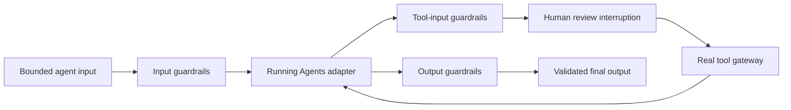

# Guardrails And Human Review Runtime

The Guardrails and Human Review runtime gives the existing agent stack one application-owned control boundary. Automatic checks validate or transform bounded values. Human review records a proposed sensitive action, pauses through Running Agents, and consumes one typed approve, reject, or edit decision before the same turn continues.

The cited OpenAI guide informs only the capability split between automatic validation and review-gated actions. Local APIs, state identities, bounds, result shapes, tests, and prose are independently authored. No external SDK implementation, sample, prompt, schema, fixture, test, or documentation text is imported or reproduced.

## Ownership Boundary

| Owner | Responsibility | Forbidden claim |
|---|---|---|
| Agent Definitions | Store source-verified guardrail references for `input`, `output`, `tool-input`, or `tool-output`. | A reference does not execute a check or grant approval. |
| Guardrails and Human Review runtime | Sequence application checks, return sanitized evidence, record review state, and consume one decision. | It does not execute a model, function, MCP call, shell command, payment, mutation, or deployment. |
| Agent Runtime Composition | Run referenced input checks before the adapter and output checks before definition validation and public return. | Composition does not move tool policy away from the tool owner. |
| Function tool or MCP gateway | Invoke tool-input checks before execution and tool-output checks before the result re-enters the model. | Agent-level input or output checks cannot substitute for a side-effect boundary. |
| Running Agents | Hold or durably restore bounded adapter pause state, expose interruptions, and resume the same turn under one atomic claim. | A new turn, conversation, or run id cannot impersonate or concurrently resume a paused action. |
| Application review surface | Show the proposed action and collect an authenticated operator or policy decision. | Model output, a semantic tag, or a guardrail pass is not human approval. |
| Review-state store | Put and consume one review record under a per-review Durable Object identity. | Durable storage does not authenticate a reviewer or grant tool authority. |

## Automatic Validation

The runtime accepts one exact run, conversation, agent revision, stage, ordered guardrail list, and bounded JSON value. Tool stages also require the exact call id, function name, and risk class.

| Stage | Placement | Valid result | Stop condition |
|---|---|---|---|
| `input` | Before the composed agent adapter begins. | Passed or transformed input becomes the only adapter input. | Missing evaluator, rejection, exception, malformed verdict, duplicate reference, or bound breach blocks before execution. |
| `output` | After the adapter settles and before Agent Definition output validation. | Passed or transformed output proceeds to the registered output contract. | Rejection or failed redaction prevents public completion. |
| `tool-input` | Beside the real function or MCP gateway, before side effects. | Validated arguments may continue to normal authorization and approval policy. | Agent input success never bypasses a tool-input failure. |
| `tool-output` | Beside the real gateway, before tool data re-enters the agent loop. | Validated or transformed result may become function-call output. | Unsafe or malformed tool output remains blocked. |

Checks run in declared order and are blocking. A later check sees only the value returned by the prior check. Compact evidence includes the check identity, pass state, and whether a transformation occurred; it excludes the checked value and evaluator-internal evidence from blocked public results.

The runtime intentionally does not start speculative model or tool work while validation is incomplete. An application may introduce concurrency only in a higher owner that can prove cancellation, cost, and side-effect safety.

## Human Review State

A review request binds the proposed action to a run, conversation, exact agent revision, action id, action kind, name, risk class, bounded payload, expiry, and SHA-256 action digest. The review store retains the full record. The adapter receives:

- one `approval` interruption containing the inspectable bounded action and expiry;
- one JSON-compatible resume-state packet containing only the review, run, conversation, and action-digest identities.

Running Agents keeps the resume state opaque to its public paused result and returns its own resume token. The application displays the interruption, gathers a decision, and resumes the same run and conversation. The adapter passes the internal state and external resolution to `resolveReview`.

| Decision | Runtime result | Execution rule |
|---|---|---|
| `approve` | Original action plus immutable audit event. | The owning gateway may continue only after its normal policy checks. |
| `reject` | Rejected status plus immutable audit event. | The action is never executed; the adapter returns a safe terminal or alternative result. |
| `edit` | Edited action, audit event, and `requiresValidation: true`. | Tool-input validation and gateway authorization must run again on the edited payload. |

Reviewer evidence is a purpose-separated signed token scoped to the exact review, run, conversation, and action digest. The runtime authenticates that evidence before it consumes state and records only reviewer subject, token identity, and assurance level in the audit event. A session token, caller-supplied reviewer name, raw approval array, or model output cannot substitute.

The store consumes a record before returning an authenticated decision. Replays, identity drift, digest mismatch, missing records, expired state, malformed decisions, and capacity exhaustion fail closed. A decision never authorizes another action, call id, run, conversation, or agent revision.

## Delayed Review Boundary

Delayed resumption uses two independent storage scopes:

1. one Durable Object per review identity atomically stores and consumes the proposed action;
2. one Durable Object per paused conversation stores bounded turn state and grants one expiring resume claim.

The Worker binding injects both adapters through `AGENT_STATE`. A resume claimant must match the original run, conversation, and opaque token. Completion commits the claim; another pause replaces it atomically; a bounded failure releases it for retry. Focused tests resume through a fresh runtime instance and prove competing claims cannot both win. These Dev proofs do not establish provider execution, multi-region policy, production retention, or deployment.

## Integration Flow

An adapter requesting review returns the runtime's paused packet directly to Running Agents. On resume it resolves the decision, revalidates any edited action, and only then calls the real gateway. Streaming uses the same pause state and settlement path; it does not create a second approval registry.

## Bounds And Readiness

| Bound | Default |
|---|---:|
| Serialized value or action payload | 200,000 characters |
| Guardrail references per stage | 64 |
| Pending in-memory reviews | 256 |
| Review lifetime | 24 hours |

`GET /api/ready` reports stage names, decision names, evaluator, reviewer authenticator, storage mode, atomicity, counters, and limits. It returns no checked values, proposed action payloads, reviewer evidence, reasons, credentials, or pending records. A Worker with `AGENT_STATE` and `AGENT_REVIEW_JWT_SECRET` reports durable atomic state and signed-review configuration while provider execution remains `unverified`.

## Acceptance Contract

- Given ordered input or output references, when every application check passes, then the composed adapter or final validator receives only the final checked value.
- Given a rejected or failed input check, when a composed run starts, then no agent adapter executes.
- Given a tool stage, when validation runs, then exact call identity and risk accompany the bounded value and no agent-level pass bypasses the gateway.
- Given a sensitive action, when review is requested, then Running Agents pauses with one inspectable interruption and opaque internal state.
- Given an exact approve, reject, or edit resolution, when the same run resumes, then the record is consumed once, an audit event is returned, and edited payloads require validation again.
- Given invalid reviewer evidence, when resolution is attempted, then review state remains available for one later valid exact-scoped reviewer token.
- Given a Worker isolate restart, when the exact paused turn is claimed, then one fresh controller resumes the same turn and commits or replaces the durable record atomically.
- Given a Function Calling review pause, when a fresh manager claims the exact per-run checkpoint, then the gateway resolves the stored review, persists execution authorization and a stable idempotency key before the call, and the provider continues from the stored response without replay.
- Given replay, expiry, identity drift, missing evaluator, malformed state, unknown fields, or capacity breach, when the controller runs, then it fails closed without model, tool, mutation, payment, Prod, or Cloudflare action.

VCC: run `npm run guardrails-human-review:check`, `npm run function-gateway:check`, `npm run agent-runtime-composition:check`, and the app and Worker readiness tests; require automatic and tool-adjacent checks, signed reviewer identity, atomic single consumption, cross-isolate paused-turn and Function Calling recovery, pre-side-effect receipt fencing, one reviewed concrete gateway call, replay and expiry rejection, sanitized readiness, zero paid calls, no Prod mirror mutation, and no Cloudflare action.
