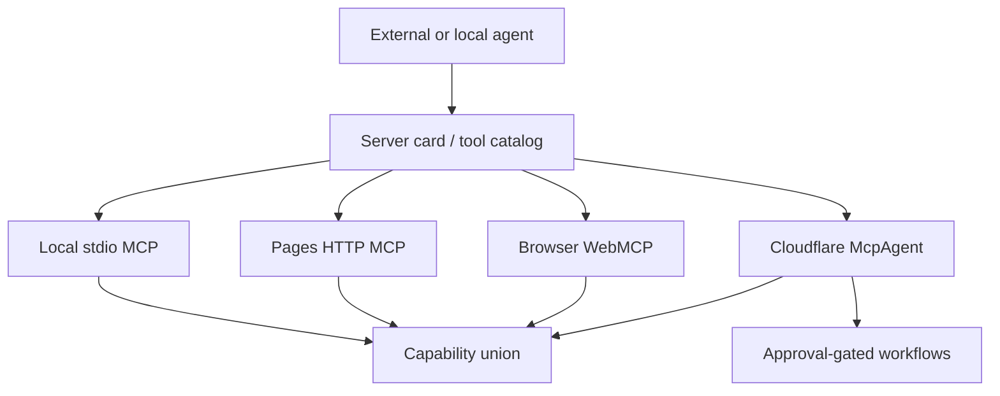

# MCP Gateway

The Agentic Canvas OS gateway is discovery-first federation over existing MCP surfaces. It is not a fifth monolithic proxy and must not duplicate dispatch logic already owned by local or control-plane servers.

## Federated Surfaces

| Surface | Role | Trust boundary | Token spend |
|---|---|---|---:|
| Local stdio MCP | Richest local/dev tool surface | Local workstation | 0 for discovery |
| Pages HTTP MCP | Read-only public discovery and source fetch | Cloudflare Pages | 0 for discovery |
| Browser WebMCP | In-page inspection and local browser surface | Browser session | 0 for discovery |
| MainPanel MCP | Browser-local readiness and non-secret setup view for Knowgrph-owned and external tool servers | Browser session | 0 for discovery |
| Cloudflare McpAgent | Approval-gated control-plane orchestration where deployed | Cloudflare Worker | 0 for discovery; spend only behind gates |

## Federation Rules

- Capabilities are deduplicated by `toolId`.
- Every capability lists `sourceCatalogs[]`.
- Each connection negotiates and persists its exact mutually supported MCP protocol revision and capability set before any tool is available; reconnect renegotiates, absent capabilities are unsupported, and this contract does not hard-code a future protocol revision.
- Optional unreachable catalogs are reported in `unreachableCatalogs[]`; they do not fail local discovery.
- Read-only discovery never invokes paid models.
- Spend-bearing orchestration routes through approval-gated control-plane owners.
- Browser-local surfaces never own provider secrets.
- MainPanel MCP renders Knowgrph-owned server templates, provider-neutral external-server templates, session-scoped allowlist rules, and deferred-tool bridge routes; it does not execute tools or store credentials.
- New remote proxies require an ADR with TCO, token, latency, and schema-drift comparison.

## Invocation Grammar Projection

| Consumer surface | Route owner | Source and boundary |
|---|---|---|
| Knowgrph Skills & Commands and shared composer menus | `knowgrph.agentic_canvas_os.docs.invoke` through the existing local or deployed `/knowgrph/control-plane/mcp` owner | Reads the three dictionary files from this canonical docs revision, returns metadata only, and never copies a downstream `/`, `#`, or `@` registry. Local Vite dev/preview may expose the same read-only route without granting mutation, spend, Prod, or Cloudflare authority. |

## Tool Gateway Capabilities

Tool capabilities expose callable functions and platform-scoped toolsets through existing `knowgrph` infrastructure. Gateway routing is one provider path for selected tools; it is not a fifth proxy, copied external registry, or Cloudflare deployment requirement for docs proof.

| Capability | MCP role | Default boundary |
|---|---|---|
| `knowgrph.tool.catalog` | List tool functions, toolsets, platform state, and per-tool gateway/direct/local/unavailable provider states. | Read-only; zero token discovery and no tool execution. |
| `knowgrph.tool.route` | Route one approved web, image, TTS, or browser tool call. | Schema, approval, egress, cost, and fallback checks run before execution. |
| `knowgrph.tool.provider.select` | Set non-secret provider preference per tool category. | Credentials stay server-managed; browser secrets are rejected. |
| `knowgrph.tool.gateway.audit` | Report routing, usage, cost, egress, approval, and deploy boundary state. | Read-only; no tool calls or deploy. |
| `knowgrph.toolset.enable` | Enable an existing logical toolset for one platform surface. | Requires tool policy, platform scope, and approval for risky toolsets. |
| `knowgrph.toolset.disable` | Disable a logical toolset for one platform surface. | Does not delete tool functions, credentials, history, or unrelated provider state. |
| `knowgrph.tool.search` | Search eligible deferred tool metadata from the current session catalog. | Opt-in bridge route; no schema disclosure, execution, or global registry scan. |
| `knowgrph.tool.describe` | Load one deferred tool schema on demand. | Schema must resolve from the current granted toolsets and policy. |
| `knowgrph.tool.call` | Invoke a selected deferred tool through a bridge. | Unwraps to real tool identity for schema validation, approval, hooks, audit, cost, and fallback. |

Tool Search capabilities are model-visible bridge routes for eligible MCP and non-core plugin tools only. Core direct tools remain exposed directly; deferred catalogs are rebuilt from session-scoped granted toolsets and cannot reveal disabled or out-of-scope tools.

## Voice Studio Capability

`/voice.studio` plus `#voice-clone`, `#speech-to-text`, or `#text-to-speech` and their route-specific bindings are host metadata, not MCP wire methods. Agentic Canvas OS owns the canonical operation and safety contract in `VOICE-STUDIO.md`; Knowgrph owns execution, media identity, persistence, and proof through one local stdio tool.

| Capability | MCP role | Default boundary |
|---|---|---|
| `knowgrph.voice.studio` | Validate and execute exactly one discriminated `clone`, `dictate`, or `create` request through an injected bounded voice adapter. | Consent, recording rights, permitted use, revocation, disclosure, approval, capability, source digest, bounds, idempotency, cost, provenance, and read-back must pass; missing live configuration fails before audio read, adapter work, spend, or persistence. |

## Soul Identity Capabilities

Soul identity tools are discoverable without model spend. Runtime prompt assembly remains gated behind scan, bounds, and typed fallback behavior.

| Capability | MCP role | Default boundary |
|---|---|---|
| `knowgrph.soul.load` | Read and validate durable identity from `SOUL.md` for prompt slot 1. | Read-only discovery is zero-token; prompt inclusion requires scan and bounds. |
| `knowgrph.personality.overlay` | Apply a temporary session-level voice or mode overlay. | Session-scoped; cannot mutate `SOUL.md` or bypass gates. |
| `knowgrph.soul.audit` | Check separation between identity, facts, agent rules, and memory. | Read-only; reports hardcoded identity or project-operation drift. |

## Learning Capabilities

Learning-loop tools are discoverable like other capabilities, but mutation remains approval-gated. Discovery must not call a model, optimize a prompt, write a skill, or persist identity facts.

| Capability | MCP role | Default boundary |
|---|---|---|
| `knowgrph.memory.write` | Add, replace, or remove bounded memory/profile entries. | Writes require scan, capacity check, target separation, and optional approval policy. |
| `knowgrph.memory.compact` | Consolidate bounded memory/profile targets before overflow. | Mutation is scoped; no silent drops. |
| `knowgrph.memory.search` | Read scoped memory and past conversation indexes. | Read-only; zero token discovery. |
| `knowgrph.session.search` | Search prior conversations on demand. | Read-only; results are not persisted automatically. |
| `knowgrph.user.profile` | Manage explicit user preferences, communication style, and expectations. | Writes require explicit evidence and reject unsupported inference. |
| `knowgrph.skill.discover` | List lightweight skill metadata without loading full skill bodies. | Read-only; zero token discovery. |
| `knowgrph.skill.load` | Load selected skill instructions and optional resources on demand. | Reads are bounded, scanned, and path-safe. |
| `knowgrph.skill.bundle` | Resolve grouped skills under one invocation. | Missing skills are reported; bundles do not install or bypass gates. |
| `knowgrph.skill.manage` | Create, patch, edit, delete, or update skill support files. | Writes require scan, validation, approval policy, and no-copy guard. |
| `knowgrph.context.discover` | Discover scoped project-local context files from working directory and touched paths. | Read-only; no model spend, no global scan, and no mutation. |
| `knowgrph.context.load` | Load one scanned and bounded context file. | Blocks injection, secrets, invisible controls, and over-budget content before inclusion. |
| `knowgrph.context.audit` | Report effective context precedence, skipped matches, blocks, truncation, and stale risks. | Read-only; context cannot override facts, identity, approval, or deploy gates. |
| `knowgrph.reference.expand` | Expand explicit inline `@` references into bounded attached context. | Supported surfaces only; sensitive paths, binary content, disallowed egress, and hard-limit overflow fail closed. |
| `knowgrph.reference.audit` | Report reference expansion source, size, warning, refusal, and truncation state. | Read-only; no extra fetch, mutation, memory write, or deploy. |
| `knowgrph.kanban.task` | Create or update one durable task row in `kanban.md`. | Uses shared table/Kanban utilities; no second board store. |
| `knowgrph.kanban.handoff` | Create one handoff row between named profiles. | Requires source profile, target profile, context refs, blockers, resume state, and acceptance. |
| `knowgrph.kanban.sync` | Reconcile board rows across full OS worker processes. | Read/write is conflict-aware and deploy-free. |
| `knowgrph.experience.capture` | Persist typed lessons from source-backed proof or operator correction. | Write requires explicit scope and no-copy validation. |
| `knowgrph.skill.propose` | Draft a new reusable skill contract from repeated experience. | Proposal-only until operator review. |
| `knowgrph.skill.evolve` | Run source-fenced `plan/start/step/status/cancel` skill-text optimization with epochs, mini-batches, learning-rate mutation budgets, and held-out gates. | Resumable revisions and explicit bounds are required; output stays review-pending with no apply, model-weight mutation, merge, or deploy. |
| `knowgrph.identity.reflect` | Persist stable non-secret operator and project facts. | Operator authority required; unsupported inference rejected. |

## Mixture Of Agents Capabilities

MoA capabilities are discoverable without model spend. Runtime execution can fan out to multiple reference calls, so paid calls require approval and cost bounds before execution.

| Capability | MCP role | Default boundary |
|---|---|---|
| `knowgrph.moa.run` | Resolve local MoA preset, run bounded no-tool references, and return aggregator-owned response. | Discovery is zero-token; execution is approval-gated when paid calls are possible. |
| `knowgrph.moa.presets` | List local neutral MoA preset metadata without provider secrets or copied external examples. | Read-only; provider ids and credentials are not exposed. |
| `knowgrph.moa.cost` | Report reference token caps, aggregator tokens, cache hits, failures, and estimated cost. | Read-only cost view; no model calls. |

## Stateful Orchestration Capabilities

Stateful orchestration tools are discoverable without model spend. Runtime execution, checkpoint writes, human review continuation, and deployment remain approval-gated. Reviewed mutations additionally require a durable gateway receipt before execution, one stable idempotency key on the MCP request, and a matching native tool receipt before local completion.

| Capability | MCP role | Default boundary |
|---|---|---|
| `knowgrph.orchestration.graph` | Validate source-backed state, node, edge, entry, exit, and stop-condition topology. | Discovery and dry validation are zero-token; mutation is gated. |
| `knowgrph.state.checkpoint` | Read or write scoped checkpoint and resume metadata. | Reads are scoped; writes require approval and recovery proof. |
| `knowgrph.human.review` | Surface interrupt payloads and accept approve, reject, or edit decisions. | Continuation remains blocked without operator result. |
| `knowgrph.stream.trace` | Stream ordered run, state, cost, and stop-condition events. | Trace is read-only, bounded, and secret-free. |
| `knowgrph.superagent.run` | Run bounded long-horizon research, coding, or creation over graph, workspace, message gateway, and artifact proof. | Discovery is zero-token; execution requires sandbox scope, checkpoint policy, stop condition, approval, and cost bounds. |
| `knowgrph.superagent.workspace` | Report sandbox workspace roots, allowed operations, artifact manifest, diff summary, scan state, and cleanup policy. | Read-only unless an approved run owns the workspace. |
| `knowgrph.superagent.messages` | Report typed user, agent, worker, tool, review, and artifact messages for a run. | Read-only ledger; cannot bypass tool, approval, cost, or deploy gates. |

## Agent Team Capabilities

Role-based Agent Team tools are local stdio MCP capabilities. `/agent.team #role-based-agent-team @agent-team` is the one host alias tuple, not an alternate wire protocol. Agentic Canvas OS owns invocation, source shape, exact revisions, routing semantics, owner policy, and hard bounds. Knowgrph owns durable supervision, checkpoints, replay fences, cancellation, review state, and projection; existing Agent Definitions, Progressive Agents, Agent Orchestration, models, tools, guardrails, and persistence owners retain their authority.

| Capability | MCP role | Default boundary |
|---|---|---|
| `knowgrph.agent_team.plan` | Resolve one exact team source, Agent Definition revisions, Agent Orchestration workflow and branches, review policy, task digest, and effective bounds into an immutable plan digest. | Read-only and model-free; no durable run, model/tool call, state mutation, spend, Agent Swarm fallback, or owner inference. |
| `knowgrph.agent_team.start` | Revalidate exact plan, team, source, agent, workflow, branch, policy, idempotency, and state-version fences; then create one durable bounded run. | Manager owns the initial conversation; start grants no model, tool, approval, provider, persistence, Prod, or Cloudflare authority. |
| `knowgrph.agent_team.list` | Return bounded sanitized run summaries, state versions, current and final-answer owners, budget use, blockers, review state, and evidence references. | Read-only and zero-model; private intermediate output, hidden instructions, secrets, and raw provider payloads are excluded. |
| `knowgrph.agent_team.control` | Serialize version-fenced pause, resume, cancel, retry, review request, or review receipt transitions with an exact checkpoint. | Cancellation is terminal; stale versions, replay conflicts, missing review receipts, drift, or exhausted turn/depth/fanout/retry/time/token/cost bounds fail before new work. |

Delegate output remains private to the source-agent synthesis and leaves ownership with the source. A successful handoff moves conversation and final-answer ownership to the target. Roles, goals, personas, membership, call order, and last response never override registered ownership.

## Application Composition Capabilities

Application composition is a local, provider-neutral compiler and bounded dependency sequencer. The `/`, `#`, and `@` tokens in `/application.compose #application-composition @application-manifest @component-catalog @integration-profile @runtime-proof` are host aliases, not MCP wire methods; `@operator` is added only for live or mutating execution. Existing agent, model, tool, integration, policy, persistence, lifecycle, and orchestration owners retain execution authority.

| Capability | MCP role | Default boundary |
|---|---|---|
| `knowgrph.application.catalog` | Return bounded immutable component, interface, schema, capability, owner, readiness, and opaque integration-profile metadata. | Read-only and zero-spend; no copied registry, transport configuration, endpoint, credential, command, or provider payload. |
| `knowgrph.application.plan` | Resolve exact revisions and digests, negotiate capabilities, compile a deterministic dependency DAG, and return an immutable `application-composition-plan/v1` digest. | Read-only; mutable references, drift, incompatibility, cycles, implicit fallback, install, upgrade, migration, connection, or execution fail closed. |
| `knowgrph.application.execute` | Revalidate one exact plan and sequence only dependency-ready steps through injected existing runtime owners. | Bounded and idempotency-fenced; no new agent loop or integration proxy, silent retry, automatic migration, provider fallback, continuation beyond bounds, deploy, or approval inference. |

## Managed Implementation Run Capabilities

Managed implementation runs are local stdio MCP capabilities backed by Knowgrph's durable run ledger and one supervisor per claimed run. Agentic Canvas OS remains the invocation, safe worktree, branch, lease, fence, and pull-request lifecycle owner through its stable JSON CLI; the MCP server never parses lifecycle prose or creates a second Git lock.

| Capability | MCP role | Default boundary |
|---|---|---|
| `knowgrph.implementation_run.plan` | Validate `/implementation.run`, `#managed-implementation-run`, `@work-item`, `@implementation-run`, repository state, configured runner, sandbox-policy preflight, and bounded verification without creating a run. | Read-only, zero model spend, no worktree, process, branch, lease, PR, merge, or deploy mutation. |
| `knowgrph.implementation_run.start` | Persist an idempotent run request, provision and claim one fenced task worktree through ACOS, and launch the configured supervisor. | New task lane and durable run state only; canonical main, arbitrary shell input, automatic merge, Prod, and Cloudflare remain forbidden. |
| `knowgrph.implementation_run.list` | Return bounded durable run state, work-item identity, blocker, evidence references, cost, and next team action. | Read-only and bounded; secrets, raw environment, and unbounded logs are excluded. |
| `knowgrph.implementation_run.control` | Apply a version-fenced pause, cancel, retry, review, or operator decision; retry performs ACOS resumption when needed. | Control must match current run version and allowed transition; `delivery_ready` maps to ACOS `review_ready` and grants no merge or deploy authority. |

## Capability Entry Shape

```yaml
capability:
  toolId: "knowgrph.os.status"
  title: "Knowgrph OS Status"
  owningHarness: "agentic-os"
  sourceCatalogs:
    - "local-stdio"
    - "cloudflare-mcpagent"
  trustBoundary: "read-only-discovery"
  schemaRef: "contracts or local tool descriptor"
  costPolicy:
    discoveryTokens: 0
    paidActionsRequireApproval: true
  availability:
    local: "available"
    pages: "read-only"
    browser: "optional"
    controlPlane: "where-deployed"
```

## Routing Matrix

| Need | Route | Reason |
|---|---|---|
| Discover all capabilities | Local `knowgrph.os.status view=capabilities` or remote tool list | Zero-spend, typed catalog. |
| Connect an external user to Knowgrph tools | MainPanel MCP readiness plus local stdio `mcp/server.js` config and `Client.connect` / `tools/list` proof | Lets outside MCP clients use source-derived tools that live inside Knowgrph without copying tool descriptors or browser-storing secrets. |
| Load durable identity | Local stdio MCP or approved prompt-assembly owner | Keeps identity source-backed, scanned, bounded, and separate from project operations. |
| Inspect local runtime | Local stdio MCP | Local filesystem and harness state are not public. |
| Read public docs/source | Pages HTTP MCP | Safe read-only route. |
| Invoke spend-bearing workflow | Cloudflare McpAgent where deployed | Holds approval and provider boundaries. |
| Discover tool routes | Local stdio MCP, Pages HTTP MCP, or existing control-plane catalog | Returns web, image, TTS, and browser provider states without executing tools. |
| Search deferred tool schemas | Local stdio MCP or approved tool-search harness | Keeps large eligible MCP/plugin schemas behind session-scoped search and describe routes. |
| Route web search/extract | Local stdio MCP or approved search harness | Keeps citations, source scope, egress, cache, and cost observable. |
| Route image, TTS, or voice-studio generation | Local stdio MCP or approved media harness | Requires consent or recording rights where applicable, approval, artifact/output manifest, provenance, and cost log. |
| Route cloud browser automation | Browser WebMCP or approved browser harness | Keeps session isolated, redacted, and approval-gated. |
| Run MoA deliberation | Local stdio MCP or approved control-plane harness | Keeps reference fan-out capped, aggregator-owned, and cost-logged. |
| Search prior memory | Local stdio MCP or approved local memory index | Keeps scoped conversation context local and cited. |
| Write memory/profile | Local stdio MCP with memory policy | Applies target separation, scan, duplicate handling, and capacity checks. |
| Search prior sessions | Local stdio MCP session index | Retrieves cited conversation matches without automatic persistence. |
| Discover or load skills | Local stdio MCP or approved skill registry owner | Keeps metadata-first discovery and on-demand resource loading bounded. |
| Discover project context | Local stdio MCP or approved context-file harness | Loads scoped working-directory context after scan and precedence checks. |
| Expand inline context references | Local stdio MCP or approved composer harness | Appends bounded `@attached-context` while preserving raw text on unsupported surfaces. |
| Coordinate profile Kanban | Local stdio MCP or approved table/Kanban harness | Writes task and handoff rows in `kanban.md` without in-process subagent swarms. |
| Manage skills | Local stdio MCP with skill policy | Scans and gates skill writes; no direct auto-commit when review is required. |
| Propose skill evolution | Local stdio MCP with approval gate | Produces review-pending diff and validation packet only. |
| Validate stateful graph | Local stdio MCP or source-backed KGC validation owner | Keeps topology source-backed and rejects hidden graph stores. |
| Resume checkpointed run | Local stdio MCP with approved state owner | Uses typed checkpoint and recovery proof before continuation. |
| Pause for human review | Local stdio MCP or control-plane gate where deployed | Blocks paid or mutating continuation until operator result. |
| Run long-horizon SuperAgent task | Local stdio MCP or approved control-plane harness | Composes graph, memory, skills, tools, workspace, messages, artifacts, and verification under one bounded run. |
| Orchestrate a role-based Agent Team | Local stdio MCP | Plans and supervises one revision-fenced team through existing agent owners, durable checkpoints, explicit review, and exact delegate or handoff answer ownership. |
| Compose a versioned agent or LLM application | Local stdio MCP | Catalogs and plans exact host-owned interfaces; bounded execution delegates ready DAG steps to existing owners without absorbing their loops or gateways. |
| Manage an autonomous implementation run | Local stdio MCP | Uses the durable work-item ledger and ACOS fenced task lifecycle; configured work stops `delivery_ready` with the PR ready for review. |
| Inspect browser page state | Browser WebMCP | Browser-owned session context stays local. |

## Gateway VCCs

| VCC | Check |
|---|---|
| Discovery is zero token | Cost log reports zero prompt and completion tokens for capability views. |
| Federation deduplicates | Tool ids are unique; duplicate declarations appear only in `sourceCatalogs[]`. |
| Optional remote failures are bounded | Unreachable remote catalogs appear in `unreachableCatalogs[]` without crashing local discovery. |
| No proxy duplication | No new server reimplements existing local or Worker dispatch without ADR. |
| Spend is gated | Any paid or mutating route requires the relevant approval gate. |
| Reviewed run-note mutation | `update_agent_run_note` maps only to `knowgrph.run_manifest.note.update`, cannot disable review, and completes only after exact native receipt echo. |
| Tool gateway is existing-infra | Tool routing uses local MCP, Pages HTTP MCP, Browser WebMCP, or approved control-plane owners; no new proxy is introduced. |
| Tool providers are per-category | Web, image, TTS, and browser categories each expose gateway, direct, local, or unavailable state. |
| Voice Studio ownership is singular | Three exact host metadata routes map to one `knowgrph.voice.studio` wire tool; consent never follows from a binding, and no copied runtime or provider dependency is required. |
| Tool Search is scoped | Bridge routes search, describe, and call only deferred tools granted to the current session and never bypass real tool approval. |
| Application plans are immutable | Equivalent manifests produce one digest over exact revisions, interface and schema digests, owners, edges, order, and bounds; drift or migration needs a new explicit plan and never mutates execution automatically. |
| Tool secrets stay server-managed | Provider keys and browser sessions never appear in docs, client state, tests, or fixtures. |
| Soul identity is source-backed | Prompt assembly rejects silent hardcoded defaults and returns typed fallback for missing, empty, unsafe, or unreadable soul source. |
| MoA fan-out is bounded | MoA capabilities reject missing preset, uncapped references, recursive aggregators, and copied external preset examples. |
| Persistent memory is bounded | Memory capabilities reject unsafe writes, overflowing writes, mixed targets, unsupported profile inference, and silent compaction. |
| Skill loading is progressive | Skill capabilities expose metadata before full source, load resources on demand, and reject unsafe deep references. |
| Skill writes are gated | Skill management requires scan, validation, compatibility check, approval policy, and no-copy guard. |
| Context files are scoped | Context discovery uses explicit working directory and touched paths, scans before load, and keeps `FACTS.md` stronger than CLAUDE-style context. |
| Context references are bounded | Reference expansion preserves ordinary `@` bindings, scans sources, enforces workspace and egress policy, and emits warnings or refusals before attachment. |
| Kanban rows are durable | Kanban capabilities parse `kanban.md`, validate row schemas, preserve handoff evidence, and reject hidden process-only coordination. |
| Learning mutation is gated | Skill and identity writes require operator approval; discovery and search remain zero-spend. |
| External copy is blocked | Learning capabilities reject copied external code, prompts, schemas, tests, fixtures, and prose. |
| Stateful orchestration is bounded | Graph capabilities reject orphaned nodes, missing stop conditions, missing checkpoint contracts, and unbounded cycles. |
| Agent Team ownership is fenced | The four Agent Team tools require exact source, agent, workflow, branch, plan-digest, idempotency, state-version, review, and budget evidence; roles and personas grant no authority, delegate intermediates stay private, and Agent Swarm remains unchanged. |
| Orchestration copy is blocked | Graph capabilities reject copied external runtime code, APIs, schemas, examples, tests, fixtures, and prose. |
| SuperAgent is bounded | SuperAgent capabilities reject missing sandbox scope, message gateway, checkpoint policy, stop condition, artifact manifest, and copied external runtime layouts. |
| Managed implementation is bounded | Plan is zero-mutation; start requires idempotency, configured argv runner, safe worktree, current lease fence, allowed paths, attempt/time limits, and verification; control is version-fenced; default completion is `delivery_ready`, not merge or deploy. |

## Mermaid Topology



## Anti-Patterns

- HTML scraping as the only agent onboarding path.
- A remote proxy that redefines local tool schemas.
- Discovery endpoints that call LLMs.
- Fail-open remote catalog errors.
- Cloud deploys performed to prove a documentation-only change.
