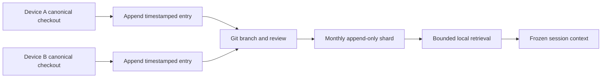

# GitHub SSOT Append-Only Memory Log

## Decision Context

For a solo-dev, AI-native startup, flat Markdown is the minimum-viable maximum-value memory layer. It minimizes time-to-value, keeps the harness inspectable, bounds orchestration, makes token economics visible, and holds 12-month marginal infrastructure TCO at zero when the existing Git remote and local compute are already available.

GitHub is the synchronization SSOT for three separate concerns:

| Concern | Source-controlled content | Excluded runtime state |
|---|---|---|
| Code sync | Source, tests, schemas, and repository scripts. | Build outputs, credentials, and machine-local caches. |
| AI tool config and rules sync | Agent instructions, dictionaries, tool policy, skill metadata, and non-secret config. | API keys, browser sessions, provider credentials, and approval state. |
| Agent memory and session sync | Curated decisions, facts, lessons, source references, and resumable session pointers. | Raw transcripts, hidden reasoning, secrets, generated media, and unbounded logs. |

`docs/MEMORY.md` remains the bounded Agentic OS memory contract loaded for routing and runtime-readiness context. `memory/YYYY-MM.md` is the durable append-only history. A retrieval pass selects entries from the history before context assembly; it does not load the entire archive by default.

## Canonical File Shape

Each shard is created once with immutable YAML frontmatter. New entries are appended after the final entry. The entry shape follows the existing KGC computing-flow conventions: frontmatter owns machine identity and routing, while sigil-tagged Markdown blocks remain human-readable, greppable, and parseable.

```markdown
---
schema: memory-log/v1
agent: knowgrph-harness
device: mbp-m3
timestamp_format: YYYYMMDDTHHmmssZ
---

## @mem-20260713T093000Z
type: decision
scope: mcp-server
summary: FastMCP 3.x confirmed primary; raw SDK reserved for control-plane only.
refs: [prd-mcp-service.md]

## @mem-20260713T114000Z
type: fact
scope: infra
summary: Oracle A1 allocation silently reduced June 2026; console audit pending.
```

The example above defines syntax only. Its summaries do not become project truth unless an independently sourced entry is appended to the active shard.

## Append-Only Contract

- Create frontmatter once; do not revise it after the first entry.
- Append every new record at end-of-file under a unique `## @mem-YYYYMMDDTHHmmssZ` heading.
- Use UTC second precision only. Local time, offsets, hyphenated dates, and minute-only sigils are non-compliant.
- Require each sigil to parse as a real UTC calendar instant whose `YYYY-MM` matches the containing monthly shard.
- Keep one independently meaningful fact, decision, lesson, or session pointer per record.
- Keep both records when concurrent appends disagree. Append a later superseding decision with references; never rewrite history.
- Never reorder, compact, delete, or silently normalize existing entries. A compacted view is a derived artifact, not the log.
- Reject secrets, credentials, hidden reasoning, raw transcripts, generated assets, and unsupported personal inference before write.

Pure YAML entry arrays, Markdown tables, bolded sigil headings, and fenced per-entry YAML are non-compliant source formats. Only file-level YAML frontmatter plus exact `## @mem-YYYYMMDDTHHmmssZ` blocks may own the log. Derived tables or indexes are allowed only when they are regenerated from the shard and never merged back as the SSOT.

Append-only storage reduces merge conflicts because Git's line-based merge normally sees distinct timestamped additions instead of competing edits to shared paragraphs. Simultaneous additions to the same final hunk can still produce a textual conflict; the deterministic resolution is to preserve both complete entries and order them by sigil timestamp. The log therefore makes conflicts cheap and lossless rather than claiming they are impossible.

## Compliance Gates

| Gate | Required evidence | Blocking condition |
|---|---|---|
| Session start | Every shard passes the structural command in `VALIDATION-RUNBOOK.md`; the Agentic Canvas OS checkout is clean at fetched `origin/main`. | Invalid frontmatter, non-UTC-second sigil format, duplicate or unordered sigil, missing field, or unsafe content. |
| Release | Structural validation passes and each pre-existing shard starts with the exact bytes stored at the recorded memory base ref. | Any deletion, rename, rewrite, reorder, compaction, insertion before EOF, or malformed appended record. |
| New shard | Filename and `period` agree; immutable frontmatter and at least one complete entry exist. | Empty shard, mismatched month, missing identity, or unsupported source format. |

Memory compliance is fail-closed. `START-WORKFLOW.md` must stop before build startup, and `RELEASE-WORKFLOW.md` must stop before integration, whenever the applicable check fails. Repair means restoring the historical bytes and appending a new superseding entry; rewriting prior history is never the repair path.

## Retrieval Escalation

| Phase | Trigger | Retrieval path | Added infrastructure |
|---|---|---|---|
| 0 | Current shard remains small. | Load the selected month or use `rg` for exact terms. | None. |
| 1 | Whole-history inclusion wastes tokens. | Select one or more `memory/YYYY-MM.md` shards by date or scope. | None. |
| 2 | Keyword recall needs ranking. | Run local BM25 or ripgrep-based ranking and inject only matching entries. | Local process only. |
| 3 | Measured keyword precision is inadequate. | Evaluate an embedding index such as mem0 behind the same typed retrieval contract. | Conditional service, storage, and re-index TCO. |

Embedding infrastructure is not a day-one dependency. It requires an evidence-backed precision gap, an explicit token/cost budget, a FOSS comparison, and an approved migration ADR. This is the same conditional-upgrade posture used for Supabase and TiDB: preserve a cheap escalation path without paying its complexity before the need is proven.

## Typed Harness

```yaml
harness:
  name: "memory-log-retrieval"
  dispatcher:
    input_schema: "{query: string, scopes?: string[], months?: string[], limit: integer}"
    output_schema: "validated retrieval request or typed validation error"
  executor:
    model_policy: "model-free local retrieval"
    input_schema: "validated retrieval request plus immutable Markdown shards"
    output_schema: "ordered memory entries with source file and sigil"
  observer:
    cost_log_fields: ["model", "prompt_tokens", "completion_tokens", "cache_hits", "estimated_cost_usd"]
  consumer:
    output_target: "bounded session context packet"
  fallback:
    mode: "typed empty result, malformed-entry warning, or narrower exact-match search"
  bounds:
    max_iterations: 1
    circuit_breaker: "stop on invalid schema, unreadable shard, result limit, or token budget breach"
```

The baseline executor is deterministic and model-free: `model` is `none`, token counts and cache hits are `0`, and `estimated_cost_usd` is `0`. Any later model or embedding stage must surface its own non-zero measurements rather than inheriting the baseline claim.

## Merge And Session Flow



Each branch has one writer. Session continuity uses committed memory entries and source references, not an implicit process-local state transfer. A handoff names the exact pushed commit SHA when another device or agent continues the same semantic scope.

## VCC

Given two devices with the same fetched base, when each appends a unique complete entry and the branches are reconciled, then the monthly shard contains both unchanged entries, every header matches the sigil pattern, and no existing entry was modified.

VCC: verify YAML frontmatter parses, `rg '^## @mem-[0-9]{8}T[0-9]{6}Z$' memory/*.md` finds every entry header, a diff shows additions only inside an existing shard, and retrieval returns at most the requested limit with source file and sigil; stop after one validation pass.

This contract is Dev-only. It performs no Prod mirror or Cloudflare mutation and grants no provider, paid-call, or secret-access authority.
