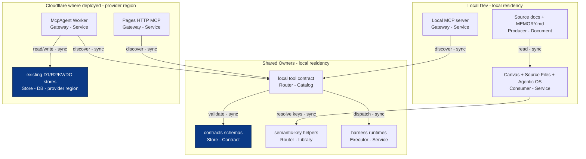

# Agentic Canvas OS PRD-TAD-ADR-MVP-GTM

## Scope

Planning writes consume the private workspace through [TODO](TODO.md) and [Kanban](kanban.md).
The retired website routes own no task rows; this revision changes routing contracts only.

PRD, TAD, ADR, MVP and GTM join `CANVAS-CONTROL-SURFACE-001@1.0.2`.
This combined specification records requirements, architecture and decisions. Its target is
runtime-ready; that target is not a whole-document runtime verdict. Prove each applicable criterion
with exact owner revisions and independent evidence before advancing its status.

## Codebase Grounding

The shared `huijoohwee.github.io/guidelines/prd-tad-adr-mvp-gtm-codebase-grounding.md` and its single
`schema/AgenticRAG/prd-tad-adr-mvp-gtm-grounding.json` snapshot own the seven-repository evidence map.
Consume their reviewed revisions before baseline; no local copy of the inventory or CID/RAO/SVO
grammar belongs here. One continuity ID joins each PRD criterion, TAD element, applicable ADR and
bounded RAO task. The SVO object is the scoped target; outcome is the result checked by its criterion.

| Concern | Source owner and validation boundary |
|---|---|
| Repository lifecycle | Pinned `agentic-os` start/release workflows and `npm run evals`; application docs never replace its controller |
| Deferred tools | `agent-api/src/tool-search.js`; `npm run tool-search:check` proves its bounded application contract |
| Commerce admission | `agent-api/src/commerce-admission-contract.js` provides the interface consumed by Commerce `src/core/acos-admission.ts`; use the shared source lock |
| Canvas and Graph release | `agentic-graph` browser sources and release workflow; generated `huijoohwee` artifacts are consumers |
| Commerce paid loop | `agentic-commerce-os/scripts/checks/browser.ts`; source/unit checks do not replace sandbox runtime proof |
| Spatial runtime | `GameXR` source and reviewed shared archives; its release checks remain separate from Commerce |

Select only the affected owner's code, schemas and checks. Do not load all tools or start a sandbox
for documentation or checks that do not use it. Missing required resources block only the affected
coverage and remain visible. Review source-grounding contradictions before execution; document status,
check success, provider proof, protected integration and deployment are distinct evidence.

## Product Target

Make `agentic-graph` a runtime-ready Agentic Canvas OS: a local-first and Cloudflare-ready control plane for discovering, orchestrating, observing, validating, and rendering AI harness work through Canvas.

This contract consolidates the native-in-repo direction: no new Vercel, AWS, Supabase, dashboard-only graph store, or browser-secret surface. Superseded connector topology remains reference material only.

## PRD

### Problem

`agentic-graph` already has multiple AI and automation harnesses, but runtime state, tool discovery, approvals, cost logs, and proof paths are distributed across local MCP tools, source documents, Canvas views, and Worker surfaces. A solo operator needs one Agentic Canvas OS contract that makes those capabilities discoverable, inspectable, and runnable without introducing a second runtime.

### Personas

| Persona | Need | Success |
|---|---|---|
| Operator | Know what can run, what is running, what costs money, and what needs approval | One discovery/readiness path answers before action. |
| External agent | Discover tools and constraints without scraping UI or spending tokens | MCP discovery returns typed capabilities and boundaries. |
| Solo founder | Turn source-backed goals into runnable artifacts, dashboards, and demos | A local dry-run can become runtime-ready with focused proof. |
| Maintainer | Avoid drift, hardcodes, and duplicate owners | Shared contracts own behavior; docs name owners and VCCs. |

### User Stories

| Story | Acceptance | Priority |
|---|---|---|
| Discover OS capabilities | Given an MCP client, when it calls the capabilities view, then it receives a deduplicated tool catalog with source catalogs and no model spend. | Must |
| Load durable identity | Given a prompt assembly path, when `/soul.load` runs, then prompt slot 1 uses scanned `SOUL.md` content or returns typed fallback without silent hardcoded identity. | Must |
| Persist bounded memory | Given a durable fact or explicit preference, when `/memory.write` or `/user.profile` runs, then the entry is target-scoped, scanned, capacity-checked, and persisted or rejected with a typed reason. | Must |
| Load procedural skills on demand | Given a task that matches a skill, when `/skill.discover` and `/skill.load` run, then metadata loads before selected instructions and referenced resources load only when required. | Must |
| Audit durable instructions | Given `AGENTS.md` and `SKILLS.md`, when `/instruction.audit` runs, then required intent, context budgets, duplicate guidance, owner leakage, zero model cost, and deploy state are returned without rewriting either source. | Must |
| Evaluate instruction task quality | Given a complete recorded or live candidate packet, when `/instruction.quality-evaluate` runs, then every final answer is scored against required concepts, unsafe claims, and concision with explicit provenance and no access to private reasoning. | Must |
| Load project context safely | Given a working directory or touched path, when `/context.discover` and `/context.load` run, then one effective project context is discovered, scanned, bounded, and kept subordinate to facts and identity. | Must |
| Inject inline context by reference | Given a message with approved `@` references, when `/reference.expand` runs on a supported surface, then bounded `@attached-context` is appended with warnings or refusals and raw text is preserved on unsupported surfaces. | Must |
| Coordinate named profiles by Kanban | Given several profiles or worker processes, when `/kanban.task`, `/kanban.handoff`, or `/kanban.sync` runs, then task and handoff updates produce owner-validated immutable Context records and regenerate the private workspace Kanban view. | Must |
| Configure platform toolsets | Given a platform surface, when `/toolset.enable` or `/toolset.disable` runs, then only existing tool functions change scoped availability and risky toolsets require approval. | Must |
| Discover deferred tools on demand | Given many eligible MCP or plugin tools, when `/tool.search`, `/tool.describe`, and `/tool.call` run, then schema disclosure is session-scoped, opt-in, and dispatched under real tool policy. | Must |
| Route tools through existing infrastructure | Given a web, image, TTS, or browser tool request, when `/tool.route` runs, then provider state, approval, egress, schema, cost, and fallback are checked before execution. | Must |
| Inspect runtime state | Given existing harness state, when the process view runs, then readable runs appear with normalized identity, native status, source reference, and unavailable sources listed. | Must |
| Observe spend and gates | Given AI or paid-capable harnesses, when cost and gate views run, then cost logs, approval gates, and coverage gaps are visible without mutation. | Must |
| Run approval-gated workflows | Given a supported Director or harness, when a run is requested without approval, then the run blocks with zero paid calls; with valid approval, it emits typed artifacts and cost logs. | Must |
| Run mixture-of-agents deliberation | Given a hard query, when `/moa` runs, then bounded reference agents advise privately and one aggregator returns the only user-visible answer with separated cost logs. | Must |
| Learn from experience | Given prior runs, failures, proof packets, or operator corrections, when the learning loop runs, then it searches scoped memory, captures source-backed experience, proposes skill changes, and reflects stable identity facts without copying external artifacts or direct self-modification. | Must |
| Orchestrate stateful agents | Given a long-running workflow, when `/orchestration.graph` is declared, then state, nodes, edges, checkpoints, human review, streaming trace, and stop conditions are typed without copying an external graph framework. | Must |
| Scale independent agent work horizontally | Given one resolved exact base agent and goal, when `/agent.swarm` runs, then runtime-generated tasks use session-owned durable atomic claims, bounded parallel workers, isolated contexts, recovery, verified receipts, and one base-agent synthesis without predefined roles or caller workflow topology. | Must |
| Observe and improve digest-bound agent teams | Given application-authorized caller-declared target, candidate, adapter, evaluator, dataset, and metric revision digests, when `/agent.toolkit` runs, existing owners retain execution while the Toolkit records metadata-only trust labels, evaluates unique opaque evidence, excludes remote-unverified samples, compares one bounded cohort, and emits at most a review-pending proposal. | Must |
| Run long-horizon SuperAgent work | Given a research, coding, or creation goal, when `/superagent.run` runs, then graph, memory, skills, tools, sandbox workspace, message gateway, artifacts, verification, stop condition, and cost ledger are typed before execution. | Must |
| Render Canvas dashboards | Given a typed run manifest or source-backed document, when Canvas opens it, then existing Source Files, frontmatter, Agentic OS, and Storyboard owners render the state without a dashboard-only renderer. | Should |
| Render this contract on Canvas | Given this document, when a declared 2D renderer surface opens it, then every diagram projects the node, edge, and cluster counts recorded in the Diagram Register, with every edge endpoint resolved and zero token spend. | Must |
| Prove runtime readiness | Given a capability marked runtime-ready, when validation runs, then its VCCs surface parse, route, execute, cost, bound, and deploy-boundary proof. | Must |

### Success Metrics

| Metric | Target |
|---|---:|
| Discovery token spend | 0 |
| New persistent OS datastore | 0 |
| Silent hardcoded default identity strings in runtime prompt assembly | 0 |
| Memory/profile writes without target, scan, capacity, and evidence | 0 |
| Skill loads that skip metadata-first progressive disclosure | 0 |
| Context loads without working-directory scope, scan, bounds, or precedence proof | 0 |
| Context reference expansions without policy, source, size, warning, or workspace proof | 0 |
| Sensitive, binary, outside-workspace, or disallowed-egress context injections | 0 |
| Profile handoffs without an immutable private Context record | 0 |
| In-process subagent swarms used as collaboration SSOT | 0 |
| Toolset changes without platform scope, policy, or required approval | 0 |
| Deferred schema exposure outside session scope, policy, or budget gates | 0 |
| Bridge tool calls that bypass real tool approval, hooks, audit, or cost | 0 |
| Tool calls without provider state, approval policy, schema validation, and cost log | 0 |
| Browser-stored provider secrets | 0 |
| Unapproved paid calls, payment actions, or deploys | 0 |
| Agentic loop without max iteration and circuit breaker | 0 |
| MoA run without reference caps, aggregator-only action, or no-recursion guard | 0 |
| Stateful graph without checkpoint, stop condition, or human-review gate where needed | 0 |
| Agent Swarm run accepting caller roles, tasks, or workflow topology | 0 |
| Agent Swarm task result admitted without a current lease or required execution receipt | 0 |
| Agent Toolkit record containing raw prompts, inputs, outputs, tool payloads, private reasoning, secrets, or duplicated nested cost | 0 |
| Agent Toolkit comparison using cross-cohort, reused, remote-unverified, or unreported evidence, or automatically applied proposal | 0 |
| SuperAgent run without sandbox scope, message gateway, artifacts, verification, and cost ledger | 0 |
| Unreviewed self-modifying skill changes | 0 |
| Copied external skill bodies, examples, layouts, prompt text, tests, fixtures, or prose | 0 |
| Copied external gateway code, provider tables, model lists, config examples, tests, fixtures, or prose | 0 |
| Copied external agent, MoA, or graph framework code, APIs, prompts, preset examples, provider names, schemas, examples, tests, fixtures, or prose | 0 |
| Unsupported identity-model personal inferences | 0 |
| Runtime-ready claims without surfaced VCC proof | 0 |
| Capability catalogs requiring duplicate manual lookup | 0 |
| Diagrams without a declared registry-resolvable render surface | 0 |
| Diagrams claiming canvas-renderability without recorded projection counts | 0 |
| Render or projection paths that spend model tokens | 0 |
| Files over local hygiene budget in this doc set | 0 |

### MoSCoW

| Tier | Scope |
|---|---|
| Must | Canvas-renderable diagram contract, MCP discovery, soul identity contract, bounded memory/profile contracts, on-demand skills system contracts, context-file contracts, context-reference contracts, Kanban collaboration contracts, tool/toolset contracts, Tool Gateway contracts, Tool Search contracts, OS status read views, local harness contracts, MoA contracts, dynamic Agent Swarm runtime, metadata-only Agent Toolkit runtime, stateful orchestration contracts, long-horizon SuperAgent contracts, learning-loop contracts, cost logs, approval gates, VCCs, Dev-only deploy guard. |
| Should | Canvas dashboard projection, live control-plane Worker parity where already deployed, demo pack assembly, operator-friendly validation runbook. |
| Could | Additional provider adapters, richer run history, dashboard comparison, deploy proof after explicit approval. |
| Won't | New dashboard datastore, Vercel/AWS product tier, browser-owned secrets, compatibility aliases, unbounded loops, direct downstream patches. |

## TAD

### Architecture

**Diagram ACOS-TOP-1** - Class: Runtime topology - Notation: `flowchart TB` - Surface: `2D Renderer: Storyboard` (primary), `2D Renderer: D3 Graph` (secondary) - Version: 2 - 2026-08-20
**Caption**: Local Dev owns authoring and read-time aggregation; Shared Owners hold every contract and catalog; the Cloudflare lane is reachable only where already deployed and never mutated from a developer checkout.

### Diagram Register

Projected counts are the Evidence Reference for each canvas-renderable claim. A non-projecting class records zero rather than omitting the row, and an empty recorded column is an unproven render claim rather than a pass.

**Named check**: `node scripts/check-diagram-canvas-render.mjs docs/PRD-TAD-ADR-MVP-GTM.md` (guideline-owned; parse-only, zero model calls)
**Recorded result**: exit 0, no findings, 2 diagrams projecting, 15 nodes / 12 edges / 3 clusters total, cost 0 prompt + 0 completion tokens
**Surface**: authoring

| Diagram | Class | Notation | Surface | Projects | Expected n/e/c | Recorded n/e/c | Version |
|---|---|---|---|---|---|---|---|
| ACOS-TOP-1 | Runtime topology | `flowchart TB` | Storyboard, D3 Graph | yes | 10 / 8 / 3 | 10 / 8 / 3 | 2 |
| ACOS-FLOW-1 | Lane & deploy boundary | frontmatter graph envelope | Storyboard | yes | 5 / 4 / 0 | 5 / 4 / 0 | 1 |

`ACOS-FLOW-1` is the frontmatter `flow:` envelope in this document: problem and value, requirements, architecture contract, runtime proof, and deploy boundary, connected by typed requirement, architecture, and proof sockets. It is authored in the envelope rather than the body because the Storyboard surface projects lanes and typed ports only from frontmatter.

**Diagram contract** *(this document)*:
- Every diagram declares its ID, class, notation, target surface, version, and caption; surfaces resolve in the Canvas 2D renderer registry
- Every node label carries `role - type`; every edge carries a connection type in the canonical inline form; every boundary is a named subgraph so it projects as a cluster element
- Non-cluster nodes use rectangular or diamond shapes only, because the circle shape projects as a cluster primitive and the hex shape projects as an edge primitive
- Every connection is authored in source; the renderer projects the connections it is given and never infers one
- Render and projection paths stay parse-only at zero token cost

### Component Inventory

| Component | Responsibility | Owner direction |
|---|---|---|
| Diagram render contract | Declare render surfaces, keep diagram source portable across the static and Canvas consumers, and record projection counts | This document's Diagram Register, Canvas 2D renderer registry owners, and Markdown/frontmatter ingest owners |
| Soul identity | Durable agent identity, voice, prompt slot 1 source, and temporary overlay boundary | `docs/SOUL.md`, `FACTS.md`, dictionaries, and prompt-assembly owners |
| Agentic OS memory | Bounded agent notes, frozen snapshot, memory writes, compaction, and session search | `docs/MEMORY.md`, dictionaries, and memory harness owners |
| User profile | Explicit operator preferences, communication style, and expectations | `docs/USER.md`, dictionaries, and memory harness owners |
| Skills system | On-demand procedural knowledge, progressive disclosure, bundles, managed writes, and open-standard-compatible skill sources | `docs/SKILLS.md`, dictionaries, and skill harness owners |
| Instruction audit | Model-free context budgets, intent preservation, duplicate detection, baseline reduction, and canonical-owner checks | `docs/INSTRUCTION-AUDIT.md`, `scripts/instruction-audit-lib.mjs`, and focused tests |
| Instruction task-quality evaluation | Model-agnostic final-answer scenarios, typed rubric findings, provenance, and human-review boundary | `docs/INSTRUCTION-QUALITY-EVALUATION.md`, `evals/instruction-task-quality-cases.json`, evaluator library, and focused tests |
| Context files | Working-directory and subdirectory project context discovery, scan, truncation, and audit | `FACTS.md`, `AGENTS.md`, dictionaries, `SKILLS.md`, `HARNESS-CONTRACTS.md`, and context harness owners |
| Context references | Explicit `@` message references expanded into bounded attached context | `FACTS.md`, dictionaries, `SKILLS.md`, `HARNESS-CONTRACTS.md`, `MCP-GATEWAY.md`, and approved composer or local harness owners |
| Kanban collaboration | Durable task and handoff rows for named profiles and full OS worker processes | `huijoohwee/.workspace/.todo/docs/kanban.md`, `FACTS.md`, dictionaries, `SKILLS.md`, `HARNESS-CONTRACTS.md`, and shared table/Kanban owners |
| Tools and toolsets | Callable tool functions plus logical bundles enabled or disabled per platform surface | `FACTS.md`, dictionaries, `SKILLS.md`, `HARNESS-CONTRACTS.md`, and `MCP-GATEWAY.md` |
| Tool Gateway | Per-tool routing for web search, image generation, TTS, and cloud browser automation through existing infrastructure | `docs/FACTS.md`, dictionaries, `SKILLS.md`, `HARNESS-CONTRACTS.md`, and `MCP-GATEWAY.md` |
| Tool Search | Opt-in deferred schema search, describe, and bridge call for eligible MCP and non-core plugin tools | `FACTS.md`, dictionaries, `SKILLS.md`, `HARNESS-CONTRACTS.md`, `MCP-GATEWAY.md`, and tool catalog owners |
| Agent instructions | Editing and validation rules for this folder | `docs/AGENTS.md` |
| OS status tool | Read-only process, capability, cost, gate, and circuit-breaker views | Existing `agentic-graph` MCP/runtime owners |
| Capability registry | Deduplicate tool catalogs and report unreachable optional catalogs | Shared MCP catalog owners |
| Harness catalog | Define typed input/output/cost/fallback/bound contracts | Existing harness runtimes and contracts |
| Mixture of Agents | Run bounded reference-agent deliberation before one aggregator-owned response | `FACTS.md`, dictionaries, `SKILLS.md`, `HARNESS-CONTRACTS.md`, and approved local harness owners |
| Learning loop | Search memory, capture experience, propose skills, evolve skills, and reflect identity facts | `FACTS.md`, `MEMORY.md`, `SKILLS.md`, and approval-gated runtime owners |
| Stateful orchestration | Define graph state, nodes, edges, checkpoints, human review, and streaming trace | `FACTS.md`, dictionaries, `SKILLS.md`, `HARNESS-CONTRACTS.md`, and existing Agentic OS/Canvas owners |
| Agent Swarm | Generate one bounded task DAG, coordinate durable atomic worker claims, recover interrupted work, and synthesize through the base agent | `agent-api/src/agent-swarm*.js`, `AGENT-SWARM.md`, `AGENT_STATE`, dictionaries, Worker routes, and focused tests |
| Agent Toolkit | Observe application-authorized digest-bound agent/team revisions, evaluate unique opaque evidence, compare one trusted target/adapter/operation/profile cohort, and persist review-pending proposals without owning execution | `agent-api/src/agent-toolkit*.js`, `AGENT-TOOLKIT.md`, `AGENT_STATE`, dictionaries, authenticated Worker routes, and the combined Toolkit integration suite |
| SuperAgent harness | Run long-horizon research, coding, and creation with workspace, message, artifact, verification, and cost proof | `FACTS.md`, dictionaries, `SKILLS.md`, `HARNESS-CONTRACTS.md`, `MCP-GATEWAY.md`, and approved local harness owners |
| Canvas dashboard | Render source-backed runtime state | Source Files, Agentic OS/frontmatter, Storyboard owners |
| Control-plane MCP | Remote approval-gated orchestration where deployed | Cloudflare McpAgent Worker owners |

### Runtime Gates

| Gate | Runtime-ready condition |
|---|---|
| Parse | Frontmatter parses without repair fallback. |
| Soul | `/soul.load` sources prompt slot 1 from scanned `SOUL.md` or returns typed fallback; `/personality.overlay` is temporary. |
| Memory | `/memory.write`, `/memory.compact`, `/session.search`, and `/user.profile` enforce target separation, scan, capacity, frozen snapshots, and typed results. |
| Skills | `/skill.discover`, `/skill.load`, `/skill.bundle`, and `/skill.manage` enforce metadata-first discovery, on-demand resources, scan, validation, and write approval policy. |
| Context | `/context.discover`, `/context.load`, and `/context.audit` enforce working-directory scope, first-match precedence, progressive discovery, scan, truncation, and stronger facts/identity boundaries. |
| References | `/reference.expand` and `/reference.audit` enforce approved forms, workspace or egress policy, sensitive path and binary blocks, size limits, warning packets, and unsupported-surface raw text preservation. |
| Kanban | `/kanban.task`, `/kanban.handoff`, and `/kanban.sync` enforce row schema, named profiles, OS worker processes, handoff fields, conflict awareness, and shared table/Kanban utility ownership. |
| Tools | `/tool.catalog`, `/toolset.enable`, `/toolset.disable`, `/tool.search`, `/tool.describe`, `/tool.call`, `/tool.route`, `/tool.provider.select`, and `/tool.gateway.audit` enforce function schemas, platform-scoped toolsets, session-scoped schema deferral, existing-infrastructure routing, provider state, approval, egress, cost, and fallback. |
| Route | `/`, `#`, and `@` resolve through existing utilities or return structured errors. |
| Execute | Harness input and output schemas validate. |
| Cost | Every model-bearing path emits cost logs. |
| Bound | Every loop has max iterations and a circuit breaker. |
| Mixture | `/moa` resolves a local preset, caps reference calls, blocks recursive aggregators, preserves normal tool gates, and logs reference plus aggregator cost. |
| Orchestrate | Stateful graph contracts name typed state, nodes, edges, entry, exit, checkpoint, human-review gate when needed, and stream trace VCCs. |
| Swarm | `/agent.swarm` rejects caller roles/tasks/workflows/principals/signals; validates a dynamic bounded DAG; proves atomic claims, observed overlap, recovery, stable idempotency, verified receipts, cost, cancellation, and base-agent-only synthesis. |
| Toolkit | `/agent.toolkit` fixes caller-declared target, candidate, adapter, evaluator, dataset, and metric revision digests for application authorization; stores trust-labelled metadata only; fences evaluator spend with a stable idempotency key; excludes reused and remote-unverified evidence; and can persist only `review_pending`, never applied, proposals. |
| SuperAgent | `/superagent.run` names goal, graph, sandbox workspace, message gateway, checkpoints, stop condition, artifacts, verification, approvals, and cost ledger. |
| Learn | Experience capture, memory search, skill proposal, skill evolution, and identity reflection stay source-backed, bounded, no-copy, and review-gated. |
| Approval | Paid, mutating, payment, and deploy actions require `@operator` approval. |
| Render | Every diagram declares a registry-resolvable surface, sits in an ingest surface that surface parses, and projects the expected node, edge, and cluster counts at zero token cost. |
| Proof | Focused tests or checks are surfaced in the agent output. |

## ADR

| ADR | Decision | Rationale |
|---|---|---|
| ADR-AOS-1 | Native-in-repo Agentic Canvas OS | Existing `agentic-graph` owners already carry Canvas, MCP, source docs, and Cloudflare control plane. |
| ADR-AOS-2 | Discovery-first MCP gateway, no fifth proxy | Avoid duplicated dispatch, latency, schema drift, and cost-accounting split. |
| ADR-AOS-3 | Read-time OS aggregation, no new datastore | Avoids a duplicate datastore and stale copies; measure runtime and operating costs separately. |
| ADR-AOS-4 | Dev-only until explicit deploy approval | Prevents accidental Prod mirror or Cloudflare mutation. |
| ADR-AOS-5 | Soul identity is source-backed | Replaces hardcoded default identity with a scanned durable identity contract while keeping project operations in `AGENTS.md`. |
| ADR-AOS-6 | Persistent memory is bounded and curated | Keeps always-available context useful while avoiding raw transcript dumps, silent compaction, unsupported profile inference, and secrets. |
| ADR-AOS-7 | Skills load on demand | Keeps procedures reusable while minimizing token use through metadata-first discovery, selected source loading, and resource-level disclosure. |
| ADR-AOS-8 | Context files are scoped and subordinate | Enables project-local behavior without letting CLAUDE-style or editor context override `FACTS.md`, `SOUL.md`, approval gates, or deploy boundaries. |
| ADR-AOS-9 | Context references are explicit attached context | Enables per-message file, folder, diff, staged, git, and URL context without turning normal `@` bindings into expansion targets or mutating unsupported surfaces. |
| ADR-AOS-10 | Kanban is row-based collaboration | Enables multiple named profiles to coordinate through durable task and handoff rows without fragile in-process subagent swarms. |
| ADR-AOS-11 | Toolsets are platform-scoped | Keeps tools useful while preventing global capability leakage, copied registries, and implicit cross-surface access. |
| ADR-AOS-12 | Tool Gateway uses existing infrastructure | Routes useful tools through current `agentic-graph` surfaces while avoiding another proxy, browser secrets, and deploy assumptions. |
| ADR-AOS-13 | Tool Search is opt-in progressive disclosure | Keeps large eligible MCP/plugin schemas out of model-visible context while preserving session scope, real tool policy, and direct exposure for core required tools. |
| ADR-AOS-14 | MoA is one-shot and aggregator-owned | Enables multiple perspectives while avoiding copied provider presets, recursive routers, and uncapped fan-out. |
| ADR-AOS-15 | Learning loop is proposal-first | Enables self-improvement from experience while forbidding copied external artifacts, unreviewed self-modification, and unsupported identity inference. |
| ADR-AOS-16 | Stateful orchestration is source-backed | Enables long-running agents while forbidding external runtime copying, hidden graph stores, unbounded loops, and stale state recomputation. |
| ADR-AOS-17 | SuperAgent is a bounded harness | Enables long-horizon research, code, and creation while forbidding copied DeerFlow runtime layouts, hidden sandboxes, message side channels, and unbounded loops. |
| ADR-AOS-18 | Agent Swarm is dynamic, durable, and base-agent-owned | Enables horizontal scaling without predefined roles or handcrafted workflows while forbidding hidden coordination state, recursive fan-out, copied external runtime artifacts, and worker-owned public answers. |
| ADR-AOS-19 | Agent Toolkit observes but does not execute or apply | Adds framework-neutral trust-labelled metadata, evaluation, and comparison across existing runtimes while requiring application verification of caller-declared digests and forbidding remote evidence promotion, raw payload retention, duplicated orchestration, fabricated improvement, copied external artifacts, and autonomous learning mutation. |
| ADR-AOS-20 | Diagrams are authored once to the portable intersection | One diagram source must satisfy both the static document renderer and the Canvas projection; a static variant plus a canvas variant of one diagram guarantees drift, and renderability asserted from a visual check is an unproven claim. Projection is proven by recorded element counts at zero token cost. |

## VCCs

| VCC | Proof |
|---|---|
| Discovery is zero-spend | Capability view returns cost log fields all `0`; no model call traces are emitted. |
| Soul identity is source-backed | `/soul.load` reports scanned identity packet or typed fallback and no runtime hardcoded identity string. |
| Persistent memory is bounded | `/memory.write` or `/user.profile` reports target, scan, capacity, evidence, and typed result; overflow requires `/memory.compact`. |
| Skills load progressively | `/skill.discover` returns metadata only; `/skill.load` loads selected source and required resources with scan, validation, and no external copy. |
| Context files are scoped | `/context.discover`, `/context.load`, and `/context.audit` name `@working-directory`, first-match context, scan/truncation state, skipped matches, and stronger facts/identity boundaries. |
| Context references are bounded | `/reference.expand` and `/reference.audit` report `@reference-policy`, `@attached-context`, warning/refusal packets, size bounds, and unsupported-surface behavior. |
| Kanban collaboration is durable | `/kanban.task`, `/kanban.handoff`, and `/kanban.sync` validate immutable Context records, generated private board parity, named profiles, handoff evidence, and OS worker boundaries. |
| Toolsets are scoped | `/toolset.enable` or `/toolset.disable` names existing functions, `@toolset`, `@platform-surface`, `@tool-policy`, and approval state before changing availability. |
| Tool Search is scoped | `/tool.search`, `/tool.describe`, and `/tool.call` use `@deferred-tool-catalog`, `@bridge-tool`, and `@tool-policy` without global registry discovery or bridge approval bypass. |
| Tool routing is gated | `/tool.catalog` reports provider states; `/tool.route` validates schema, approval, egress, cost, and fallback before web, image, TTS, or browser execution. |
| Runtime state is read-only | Before/after diff of harness state sources is empty after status calls. |
| Approval gate blocks spend | Run without approval returns blocked or approval-required state with estimated cost `0`. |
| MoA is bounded | `/moa` returns usage, blocked, or aggregator response with capped references, no recursive aggregator, separated cost log, and no copied external preset. |
| Learning loop is review-gated | Skill proposal or evolution returns review-pending diff and validation evidence; no direct commit, deploy, or external copy occurs. |
| Stateful orchestration compiles | Graph contract rejects orphaned nodes, missing stop conditions, missing checkpoints for long runs, and hidden mutation. |
| Agent Swarm scales safely | Independent generated tasks overlap within `maxParallel`; stale claims fence late output; idempotent effects carry receipt-owner-verified stable keys; recovery preserves the session-owned durable ledger; and only the resolved original base agent exposes synthesis. |
| Agent Toolkit improves only through evidence and review | Two runtime instances share principal-derived atomic run/cohort state; one stable-idempotency evaluator fence wins; persisted traces contain no raw payload; reused, remote-unverified, missing-quality, or missing-cost evidence holds; passing trusted cohort thresholds yield only an immutable `review_pending` proposal; no apply method or external dependency exists. |
| SuperAgent run is bounded | `/superagent.run` reports sandbox workspace, message gateway, checkpoint policy, artifact manifest, verification state, cost log, stop condition, and no-copy boundary. |
| Canvas dashboard is source-backed | Dashboard opens from Markdown/frontmatter/Agentic OS owners; no dashboard-only graph store exists. |
| Diagrams are canvas-renderable | Projecting this document reports node, edge, and cluster counts equal to the Diagram Register expectations, resolves every declared surface in the renderer registry, resolves every edge endpoint to a declared node, and records cost fields all `0`. |
| Deploy boundary is clean | Canonical checkout shows no Prod mirror mutation and no Cloudflare deploy command was run. |

## MVP - reference implementation

The smallest slice consumes the PRD's discovery, invocation and proof requirements: open the native
workspace, discover one source-owned command, invoke it within its existing bounds, and inspect the
returned artifact and evidence. Reuse the TAD's dictionaries, validating client and native Graph runtime;
no new renderer, provider proxy or planning store is required. ADR-AOS-1 through ADR-AOS-4 govern this slice.

Verify the document contract with `npm run docs:check`; verify actual invocation and its failure path
with the focused owner checks in `VALIDATION-RUNBOOK.md`. Record check, exact source, result and surface
in `RUNTIME-PROOF.md`. A documentation pass cannot satisfy the runtime VCCs above. Demo target: one
entry-to-readback walkthrough in five minutes, with zero paid calls for discovery; elapsed time remains
unmeasured. Cancelled or rejected invocation must produce a visible result without unauthorized effects.

For `CANVAS-CONTROL-SURFACE-001@1.0.2`, all four experience criteria are **unassessed** in the authoring
environment: Core Requirements & Functionality; Innovation & Theme Alignment; Technical Execution &
Integration; Usefulness & Agentic Experience. No timed user study is attached. The document owner must
capture one pilot walkthrough and criterion-specific observations using the shared maturity rubric.

## GTM - reference implementation

The reachable payer hypothesis is a solo builder who repeatedly loses time finding the right source,
command and proof. First test a guided setup and one accepted outcome in that builder's existing
workspace. Reuse the MVP before offering hosted or team infrastructure. Rank that service against the
free self-serve workflow using observed rework, offered price and support minutes; there is no commercial
winner until those inputs exist. Demand, priced acceptance, collected payment and repeat use remain
unvalidated. Agent usage and hosting costs require separate measurements; zero-spend discovery does
not imply zero total cost or collected revenue. A pilot result belongs in a successor Context record.

## Offline learning proposal - reference implementation

This proposed increment joins PRD, TAD, ADR, MVP and GTM at `CANVAS-CONTROL-SURFACE-001@1.0.2`.
It consumes the Graph learning proposal at `PLAN-AGENTIC-GRAPH-GAME-FLIGHT-SIM-PRD-TAD-ADR-MVP-GTM@1.5.2`,
in `$AGENTIC_GRAPH_ROOT/docs/documents/agentic-graph-game-flight-sim-prd-tad-adr-mvp-gtm.md#offline-learning-proposal---reference-implementation`.
Language/display scope awaits a decision; these criteria have no runtime or deployment evidence.

**PRD / C-L01.** A learner needs useful assistance while practising a short offline program; an
assistant must explain the actual local run instead of inventing a grade. Given a selected lesson,
when an agent inspects its latest run, then its explanation cites the same lesson revision, program
identity and deterministic result visible to the learner. Missing or stale evidence stays unavailable.
Core lessons require no account, model or paid service.

**TAD / C-L01.** Graph owns lesson content, bounded execution, grading, browser-local WebMCP and
WorkspaceFs Decisions. Canvas documents discovery, tool policy and evidence presentation using existing
`TOOL-SEARCH.md`, `HARNESS-CONTRACTS.md` and dictionary owners after Graph settles its
contract. Inspect before proposing a change; explicit learner action starts a run or save. Assistance
cannot overwrite a program, promote an attempted run to success, silently save, or trigger a provider.
Discovery reuses Flight inspection; control additions use its existing invocation register.

**ADR / C-L01, proposed.** Reuse browser-local evidence and deterministic authored hints. A second
interpreter, grader, lesson registry, student database, remote proxy or orchestration controller in
Canvas is rejected. The first slice teaches native bounded sequences and repetition; general Python
execution and desktop GUI/database packaging are deferred pending an explicit scope decision.
Recovery disables the new projection and preserves saved Decisions.

**Grounding.** At Canvas `997ecfe8ed4e779eba3bd3d6a0b70b7254a2d4a0`, `FACTS.md` confirms Graph owns
runtime and workspace seeds; the existing PRD's ADR-AOS-2/3/13/15 establishes routing, bounded disclosure
and proposal-first learning. At Graph `b242ab5d82c49155808a86b45565c797f8e04f61`, Flight inspection
already returns training state; a bounded programming lesson runner was absent in the inspected
Flight/agent-ready/parser owners. Runtime parity, classroom efficacy and offline caching are unverified.
Authoring reference: shared guidelines v3.1.0 at `993eb0e28a6d2e9427364df98c39c8a5e10910b4`,
SHA-256 `cc49896776a70e372a34d54fb81582ae1a46d46e2f527e2dfd3108cc07a0b1ef`.

**MVP / C-L01.** After scope acceptance, integrate the Graph contract first, then adjust only affected
Canvas owner text and invocation references. Verify `npm run docs:check`; Graph's exact-candidate
source/browser evidence must show identical UI/WebMCP grading, stale-result refusal, cancellation,
offline completion and explicit-save readback. A docs pass satisfies only document structure.
Planning cap: this existing file, 4 KiB added, no runtime modules or dependency changes; always-load
delta zero. Follow-on Canvas estimate: one 30-minute sprint, at most three existing owner documents
and 8 KiB added; refresh after Graph's actual contract is known. External CI waits have no ETA.

**GTM / C-L01.** Hypothesis: a tutor or workshop facilitator spends time reproducing a learner's
failure. Rank a guided session using the free native lesson loop before paid hosting or an LMS.
Measure completion, retries, hint usefulness and facilitator minutes before selecting an offer.
Demand, revenue and cash are unvalidated; outreach/payment is not authorized. Runtime spend target
is zero; development cost and savings are unmeasured. Use the existing pilot evidence owner.

**Delivery.** Use the pinned ADLC START/RELEASE path and Graph's product deploy/rollback owner.
This proposal grants no integration/deploy/cleanup effect. Preserve work and reference restrictions.
