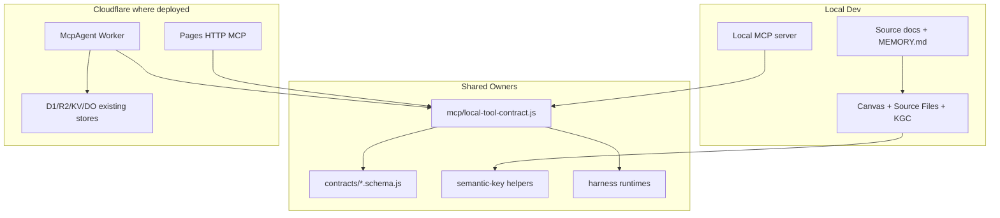

# Knowgrph Runtime-Ready Agentic Canvas OS PRD/TAD

## Scope

Make `knowgrph` a runtime-ready Agentic Canvas OS: a local-first and Cloudflare-ready control plane for discovering, orchestrating, observing, validating, and rendering AI harness work through Canvas.

This contract consolidates the native-in-repo direction: no new Vercel, AWS, Supabase, dashboard-only graph store, or browser-secret surface. Superseded connector topology remains reference material only.

## PRD

### Problem

`knowgrph` already has multiple AI and automation harnesses, but runtime state, tool discovery, approvals, cost logs, and proof paths are distributed across local MCP tools, source documents, Canvas views, and Worker surfaces. A solo operator needs one Agentic Canvas OS contract that makes those capabilities discoverable, inspectable, and runnable without introducing a second runtime.

### Personas

| Persona | Need | Success |
|---|---|---|
| Operator | Know what can run, what is running, what costs money, and what needs approval | One discovery/readiness path answers before action. |
| External agent | Discover tools and constraints without scraping UI or spending tokens | MCP discovery returns typed capabilities and boundaries. |
| Solo founder | Turn source-backed goals into runnable artifacts, dashboards, and demos | A local dry-run can become runtime-ready with focused proof. |
| Maintainer | Avoid drift, hardcodes, and duplicate owners | Shared contracts own behavior; docs name owners and VCCs. |

### User Stories

| Story | Acceptance | Priority |
|---|---|---|
| Discover OS capabilities | Given an MCP client, when it calls the capabilities view, then it receives a deduplicated tool catalog with source catalogs and no model spend. | Must |
| Load durable identity | Given a prompt assembly path, when `/soul.load` runs, then prompt slot 1 uses scanned `SOUL.md` content or returns typed fallback without silent hardcoded identity. | Must |
| Persist bounded memory | Given a durable fact or explicit preference, when `/memory.write` or `/user.profile` runs, then the entry is target-scoped, scanned, capacity-checked, and persisted or rejected with a typed reason. | Must |
| Load procedural skills on demand | Given a task that matches a skill, when `/skill.discover` and `/skill.load` run, then metadata loads before selected instructions and referenced resources load only when required. | Must |
| Load project context safely | Given a working directory or touched path, when `/context.discover` and `/context.load` run, then one effective project context is discovered, scanned, bounded, and kept subordinate to facts and identity. | Must |
| Inject inline context by reference | Given a message with approved `@` references, when `/reference.expand` runs on a supported surface, then bounded `@attached-context` is appended with warnings or refusals and raw text is preserved on unsupported surfaces. | Must |
| Coordinate named profiles by Kanban | Given several profiles or worker processes, when `/kanban.task`, `/kanban.handoff`, or `/kanban.sync` runs, then all coordination state is stored as validated `kanban.md` rows. | Must |
| Configure platform toolsets | Given a platform surface, when `/toolset.enable` or `/toolset.disable` runs, then only existing tool functions change scoped availability and risky toolsets require approval. | Must |
| Discover deferred tools on demand | Given many eligible MCP or plugin tools, when `/tool.search`, `/tool.describe`, and `/tool.call` run, then schema disclosure is session-scoped, opt-in, and dispatched under real tool policy. | Must |
| Route tools through existing infrastructure | Given a web, image, TTS, or browser tool request, when `/tool.route` runs, then provider state, approval, egress, schema, cost, and fallback are checked before execution. | Must |
| Inspect runtime state | Given existing harness state, when the process view runs, then readable runs appear with normalized identity, native status, source reference, and unavailable sources listed. | Must |
| Observe spend and gates | Given AI or paid-capable harnesses, when cost and gate views run, then cost logs, approval gates, and coverage gaps are visible without mutation. | Must |
| Run approval-gated workflows | Given a supported Director or harness, when a run is requested without approval, then the run blocks with zero paid calls; with valid approval, it emits typed artifacts and cost logs. | Must |
| Run mixture-of-agents deliberation | Given a hard query, when `/moa` runs, then bounded reference agents advise privately and one aggregator returns the only user-visible answer with separated cost logs. | Must |
| Learn from experience | Given prior runs, failures, proof packets, or operator corrections, when the learning loop runs, then it searches scoped memory, captures source-backed experience, proposes skill changes, and reflects stable identity facts without copying external artifacts or direct self-modification. | Must |
| Orchestrate stateful agents | Given a long-running workflow, when `/orchestration.graph` is declared, then state, nodes, edges, checkpoints, human review, streaming trace, and stop conditions are typed without copying an external graph framework. | Must |
| Run long-horizon SuperAgent work | Given a research, coding, or creation goal, when `/superagent.run` runs, then graph, memory, skills, tools, sandbox workspace, message gateway, artifacts, verification, stop condition, and cost ledger are typed before execution. | Must |
| Render Canvas dashboards | Given a typed run manifest or source-backed document, when Canvas opens it, then existing Source Files, frontmatter, KGC, and Storyboard owners render the state without a dashboard-only renderer. | Should |
| Prove runtime readiness | Given a capability marked runtime-ready, when validation runs, then its VCCs surface parse, route, execute, cost, bound, and deploy-boundary proof. | Must |

### Success Metrics

| Metric | Target |
|---|---:|
| Discovery token spend | 0 |
| New persistent OS datastore | 0 |
| Silent hardcoded default identity strings in runtime prompt assembly | 0 |
| Memory/profile writes without target, scan, capacity, and evidence | 0 |
| Skill loads that skip metadata-first progressive disclosure | 0 |
| Context loads without working-directory scope, scan, bounds, or precedence proof | 0 |
| Context reference expansions without policy, source, size, warning, or workspace proof | 0 |
| Sensitive, binary, outside-workspace, or disallowed-egress context injections | 0 |
| Profile handoffs outside durable `kanban.md` rows | 0 |
| In-process subagent swarms used as collaboration SSOT | 0 |
| Toolset changes without platform scope, policy, or required approval | 0 |
| Deferred schema exposure outside session scope, policy, or budget gates | 0 |
| Bridge tool calls that bypass real tool approval, hooks, audit, or cost | 0 |
| Tool calls without provider state, approval policy, schema validation, and cost log | 0 |
| Browser-stored provider secrets | 0 |
| Unapproved paid calls, payment actions, or deploys | 0 |
| Agentic loop without max iteration and circuit breaker | 0 |
| MoA run without reference caps, aggregator-only action, or no-recursion guard | 0 |
| Stateful graph without checkpoint, stop condition, or human-review gate where needed | 0 |
| SuperAgent run without sandbox scope, message gateway, artifacts, verification, and cost ledger | 0 |
| Unreviewed self-modifying skill changes | 0 |
| Copied external skill bodies, examples, layouts, prompt text, tests, fixtures, or prose | 0 |
| Copied external gateway code, provider tables, model lists, config examples, tests, fixtures, or prose | 0 |
| Copied external agent, MoA, or graph framework code, APIs, prompts, preset examples, provider names, schemas, examples, tests, fixtures, or prose | 0 |
| Unsupported identity-model personal inferences | 0 |
| Runtime-ready claims without surfaced VCC proof | 0 |
| Capability catalogs requiring duplicate manual lookup | 0 |
| Files over local hygiene budget in this doc set | 0 |

### MoSCoW

| Tier | Scope |
|---|---|
| Must | MCP discovery, soul identity contract, bounded memory/profile contracts, on-demand skills system contracts, context-file contracts, context-reference contracts, Kanban collaboration contracts, tool/toolset contracts, Tool Gateway contracts, Tool Search contracts, OS status read views, local harness contracts, MoA contracts, stateful orchestration contracts, long-horizon SuperAgent contracts, learning-loop contracts, cost logs, approval gates, VCCs, Dev-only deploy guard. |
| Should | Canvas dashboard projection, live control-plane Worker parity where already deployed, demo pack assembly, operator-friendly validation runbook. |
| Could | Additional provider adapters, richer run history, dashboard comparison, deploy proof after explicit approval. |
| Won't | New dashboard datastore, Vercel/AWS product tier, browser-owned secrets, compatibility aliases, unbounded loops, direct downstream patches. |

## TAD

### Architecture

### Component Inventory

| Component | Responsibility | Owner direction |
|---|---|---|
| Soul identity | Durable agent identity, voice, prompt slot 1 source, and temporary overlay boundary | `docs/SOUL.md`, `FACTS.md`, dictionaries, and prompt-assembly owners |
| Agentic OS memory | Bounded agent notes, frozen snapshot, memory writes, compaction, and session search | `docs/MEMORY.md`, dictionaries, and memory harness owners |
| User profile | Explicit operator preferences, communication style, and expectations | `docs/USER.md`, dictionaries, and memory harness owners |
| Skills system | On-demand procedural knowledge, progressive disclosure, bundles, managed writes, and open-standard-compatible skill sources | `docs/SKILLS.md`, dictionaries, and skill harness owners |
| Context files | Working-directory and subdirectory project context discovery, scan, truncation, and audit | `FACTS.md`, `AGENTS.md`, dictionaries, `SKILLS.md`, `HARNESS-CONTRACTS.md`, and context harness owners |
| Context references | Explicit `@` message references expanded into bounded attached context | `FACTS.md`, dictionaries, `SKILLS.md`, `HARNESS-CONTRACTS.md`, `MCP-GATEWAY.md`, and approved composer or local harness owners |
| Kanban collaboration | Durable task and handoff rows for named profiles and full OS worker processes | `kanban.md`, `FACTS.md`, dictionaries, `SKILLS.md`, `HARNESS-CONTRACTS.md`, and shared table/Kanban owners |
| Tools and toolsets | Callable tool functions plus logical bundles enabled or disabled per platform surface | `FACTS.md`, dictionaries, `SKILLS.md`, `HARNESS-CONTRACTS.md`, and `MCP-GATEWAY.md` |
| Tool Gateway | Per-tool routing for web search, image generation, TTS, and cloud browser automation through existing infrastructure | `docs/FACTS.md`, dictionaries, `SKILLS.md`, `HARNESS-CONTRACTS.md`, and `MCP-GATEWAY.md` |
| Tool Search | Opt-in deferred schema search, describe, and bridge call for eligible MCP and non-core plugin tools | `FACTS.md`, dictionaries, `SKILLS.md`, `HARNESS-CONTRACTS.md`, `MCP-GATEWAY.md`, and tool catalog owners |
| Agent instructions | Editing and validation rules for this folder | `docs/AGENTS.md` |
| OS status tool | Read-only process, capability, cost, gate, and circuit-breaker views | Existing `knowgrph` MCP/runtime owners |
| Capability registry | Deduplicate tool catalogs and report unreachable optional catalogs | Shared MCP catalog owners |
| Harness catalog | Define typed input/output/cost/fallback/bound contracts | Existing harness runtimes and contracts |
| Mixture of Agents | Run bounded reference-agent deliberation before one aggregator-owned response | `FACTS.md`, dictionaries, `SKILLS.md`, `HARNESS-CONTRACTS.md`, and approved local harness owners |
| Learning loop | Search memory, capture experience, propose skills, evolve skills, and reflect identity facts | `FACTS.md`, `MEMORY.md`, `SKILLS.md`, and approval-gated runtime owners |
| Stateful orchestration | Define graph state, nodes, edges, checkpoints, human review, and streaming trace | `FACTS.md`, dictionaries, `SKILLS.md`, `HARNESS-CONTRACTS.md`, and existing KGC/Canvas owners |
| SuperAgent harness | Run long-horizon research, coding, and creation with workspace, message, artifact, verification, and cost proof | `FACTS.md`, dictionaries, `SKILLS.md`, `HARNESS-CONTRACTS.md`, `MCP-GATEWAY.md`, and approved local harness owners |
| Canvas dashboard | Render source-backed runtime state | Source Files, KGC/frontmatter, Storyboard owners |
| Control-plane MCP | Remote approval-gated orchestration where deployed | Cloudflare McpAgent Worker owners |

### Runtime Gates

| Gate | Runtime-ready condition |
|---|---|
| Parse | Frontmatter parses without repair fallback. |
| Soul | `/soul.load` sources prompt slot 1 from scanned `SOUL.md` or returns typed fallback; `/personality.overlay` is temporary. |
| Memory | `/memory.write`, `/memory.compact`, `/session.search`, and `/user.profile` enforce target separation, scan, capacity, frozen snapshots, and typed results. |
| Skills | `/skill.discover`, `/skill.load`, `/skill.bundle`, and `/skill.manage` enforce metadata-first discovery, on-demand resources, scan, validation, and write approval policy. |
| Context | `/context.discover`, `/context.load`, and `/context.audit` enforce working-directory scope, first-match precedence, progressive discovery, scan, truncation, and stronger facts/identity boundaries. |
| References | `/reference.expand` and `/reference.audit` enforce approved forms, workspace or egress policy, sensitive path and binary blocks, size limits, warning packets, and unsupported-surface raw text preservation. |
| Kanban | `/kanban.task`, `/kanban.handoff`, and `/kanban.sync` enforce row schema, named profiles, OS worker processes, handoff fields, conflict awareness, and shared table/Kanban utility ownership. |
| Tools | `/tool.catalog`, `/toolset.enable`, `/toolset.disable`, `/tool.search`, `/tool.describe`, `/tool.call`, `/tool.route`, `/tool.provider.select`, and `/tool.gateway.audit` enforce function schemas, platform-scoped toolsets, session-scoped schema deferral, existing-infrastructure routing, provider state, approval, egress, cost, and fallback. |
| Route | `/`, `#`, and `@` resolve through existing utilities or return structured errors. |
| Execute | Harness input and output schemas validate. |
| Cost | Every model-bearing path emits cost logs. |
| Bound | Every loop has max iterations and a circuit breaker. |
| Mixture | `/moa` resolves a local preset, caps reference calls, blocks recursive aggregators, preserves normal tool gates, and logs reference plus aggregator cost. |
| Orchestrate | Stateful graph contracts name typed state, nodes, edges, entry, exit, checkpoint, human-review gate when needed, and stream trace VCCs. |
| SuperAgent | `/superagent.run` names goal, graph, sandbox workspace, message gateway, checkpoints, stop condition, artifacts, verification, approvals, and cost ledger. |
| Learn | Experience capture, memory search, skill proposal, skill evolution, and identity reflection stay source-backed, bounded, no-copy, and review-gated. |
| Approval | Paid, mutating, payment, and deploy actions require `@operator` approval. |
| Proof | Focused tests or checks are surfaced in the agent output. |

### ADRs

| ADR | Decision | Rationale |
|---|---|---|
| ADR-AOS-1 | Native-in-repo Agentic Canvas OS | Existing `knowgrph` owners already carry Canvas, MCP, source docs, and Cloudflare control plane. |
| ADR-AOS-2 | Discovery-first MCP gateway, no fifth proxy | Avoid duplicated dispatch, latency, schema drift, and cost-accounting split. |
| ADR-AOS-3 | Read-time OS aggregation, no new datastore | Keeps TCO at zero and avoids stale OS-level copies. |
| ADR-AOS-4 | Dev-only until explicit deploy approval | Prevents accidental Prod mirror or Cloudflare mutation. |
| ADR-AOS-5 | Soul identity is source-backed | Replaces hardcoded default identity with a scanned durable identity contract while keeping project operations in `AGENTS.md`. |
| ADR-AOS-6 | Persistent memory is bounded and curated | Keeps always-available context useful while avoiding raw transcript dumps, silent compaction, unsupported profile inference, and secrets. |
| ADR-AOS-7 | Skills load on demand | Keeps procedures reusable while minimizing token use through metadata-first discovery, selected source loading, and resource-level disclosure. |
| ADR-AOS-8 | Context files are scoped and subordinate | Enables project-local behavior without letting CLAUDE-style or editor context override `FACTS.md`, `SOUL.md`, approval gates, or deploy boundaries. |
| ADR-AOS-9 | Context references are explicit attached context | Enables per-message file, folder, diff, staged, git, and URL context without turning normal `@` bindings into expansion targets or mutating unsupported surfaces. |
| ADR-AOS-10 | Kanban is row-based collaboration | Enables multiple named profiles to coordinate through durable task and handoff rows without fragile in-process subagent swarms. |
| ADR-AOS-11 | Toolsets are platform-scoped | Keeps tools useful while preventing global capability leakage, copied registries, and implicit cross-surface access. |
| ADR-AOS-12 | Tool Gateway uses existing infrastructure | Routes useful tools through current `knowgrph` surfaces while avoiding another proxy, browser secrets, and deploy assumptions. |
| ADR-AOS-13 | Tool Search is opt-in progressive disclosure | Keeps large eligible MCP/plugin schemas out of model-visible context while preserving session scope, real tool policy, and direct exposure for core required tools. |
| ADR-AOS-14 | MoA is one-shot and aggregator-owned | Enables multiple perspectives while avoiding copied provider presets, recursive routers, and uncapped fan-out. |
| ADR-AOS-15 | Learning loop is proposal-first | Enables self-improvement from experience while forbidding copied external artifacts, unreviewed self-modification, and unsupported identity inference. |
| ADR-AOS-16 | Stateful orchestration is source-backed | Enables long-running agents while forbidding external runtime copying, hidden graph stores, unbounded loops, and stale state recomputation. |
| ADR-AOS-17 | SuperAgent is a bounded harness | Enables long-horizon research, code, and creation while forbidding copied DeerFlow runtime layouts, hidden sandboxes, message side channels, and unbounded loops. |

## VCCs

| VCC | Proof |
|---|---|
| Discovery is zero-spend | Capability view returns cost log fields all `0`; no model call traces are emitted. |
| Soul identity is source-backed | `/soul.load` reports scanned identity packet or typed fallback and no runtime hardcoded identity string. |
| Persistent memory is bounded | `/memory.write` or `/user.profile` reports target, scan, capacity, evidence, and typed result; overflow requires `/memory.compact`. |
| Skills load progressively | `/skill.discover` returns metadata only; `/skill.load` loads selected source and required resources with scan, validation, and no external copy. |
| Context files are scoped | `/context.discover`, `/context.load`, and `/context.audit` name `@working-directory`, first-match context, scan/truncation state, skipped matches, and stronger facts/identity boundaries. |
| Context references are bounded | `/reference.expand` and `/reference.audit` report `@reference-policy`, `@attached-context`, warning/refusal packets, size bounds, and unsupported-surface behavior. |
| Kanban collaboration is durable | `/kanban.task`, `/kanban.handoff`, and `/kanban.sync` validate `kanban.md` rows, named profiles, handoff evidence, and OS worker boundaries. |
| Toolsets are scoped | `/toolset.enable` or `/toolset.disable` names existing functions, `@toolset`, `@platform-surface`, `@tool-policy`, and approval state before changing availability. |
| Tool Search is scoped | `/tool.search`, `/tool.describe`, and `/tool.call` use `@deferred-tool-catalog`, `@bridge-tool`, and `@tool-policy` without global registry discovery or bridge approval bypass. |
| Tool routing is gated | `/tool.catalog` reports provider states; `/tool.route` validates schema, approval, egress, cost, and fallback before web, image, TTS, or browser execution. |
| Runtime state is read-only | Before/after diff of harness state sources is empty after status calls. |
| Approval gate blocks spend | Run without approval returns blocked or approval-required state with estimated cost `0`. |
| MoA is bounded | `/moa` returns usage, blocked, or aggregator response with capped references, no recursive aggregator, separated cost log, and no copied external preset. |
| Learning loop is review-gated | Skill proposal or evolution returns review-pending diff and validation evidence; no direct commit, deploy, or external copy occurs. |
| Stateful orchestration compiles | Graph contract rejects orphaned nodes, missing stop conditions, missing checkpoints for long runs, and hidden mutation. |
| SuperAgent run is bounded | `/superagent.run` reports sandbox workspace, message gateway, checkpoint policy, artifact manifest, verification state, cost log, stop condition, and no-copy boundary. |
| Canvas dashboard is source-backed | Dashboard opens from Markdown/frontmatter/KGC owners; no dashboard-only graph store exists. |
| Deploy boundary is clean | Worktree shows no Prod mirror mutation and no Cloudflare deploy command was run. |
