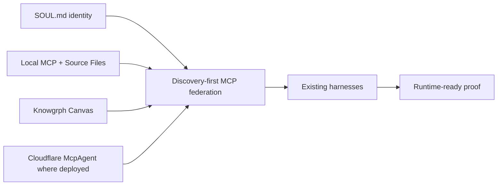

# Knowgrph Agentic Canvas OS Docs

This folder is the local documentation control surface for making `knowgrph` a runtime-ready Agentic Canvas OS. It is not a deploy artifact and does not authorize Prod or Cloudflare mutation.

## Start Here

This folder is optimized for agent reliability, not casual browsing. Humans
should usually enter through [`README.md`](../README.md) first, then read only
the smallest set of docs needed for the task.

Recommended reading order:

1. [`PROJECT-RULES.md`](./PROJECT-RULES.md) for project-wide engineering and session-closeout rules.
2. [`START-WORKFLOW.md`](./START-WORKFLOW.md) for session start, ownership, and the registered multi-worktree rule.
3. [`VALIDATION-RUNBOOK.md`](./VALIDATION-RUNBOOK.md) for focused checks and release gates.
4. [`RUNTIME-READINESS.md`](./RUNTIME-READINESS.md) for the current spec-complete to runtime-ready state.
5. [`AGENTS.md`](./AGENTS.md) only when changing the docs control surface itself.
6. The three dictionary files only when changing invocation grammar or routing meaning.

Human-friendly rule: speak in task intent, then translate into the strict
contracts only when the work touches planning, workflow, or invocation grammar.

## Document Map

| File | Role | Use |
|---|---|---|
| `PROJECT-RULES.md` | Repository-wide engineering rules | Neutral code hygiene, validation, and session-end behavior shared across devices and tools. |
| `SOUL.md` | Durable identity layer | Agent identity, voice, prompt slot 1 contract, personality overlay boundary, and hardcoded-default replacement rules. |
| `FACTS.md` | Shared truth layer | Stable facts, precedence, direct `/`, `#`, and `@` definitions, deploy boundary truth, context-file and context-reference facts, tool/toolset facts, Tool Gateway and Tool Search facts, MoA facts, learning-loop facts, stateful orchestration facts, and long-horizon SuperAgent facts. |
| `MEMORY.md` | Agent memory seed | Bounded agent notes, persistence, routing memory, MoA memory, stateful orchestration memory, reusable runtime-readiness context, and local operating lenses. |
| `MEMORY-LOG.md` | Append-only memory contract | GitHub-as-SSOT sync boundaries, `memory-log/v1` monthly shards, sigil entries, merge rules, bounded retrieval, and the BM25-to-embedding escalation path. |
| `TODO.md` | Bounded planning index | Cross-repository `todo-log/v1` monthly shards, append-only lifecycle, exact-first retrieval, size caps, and release compliance. |
| `USER.md` | User profile contract | Explicit operator preferences, communication style, expectations, profile write boundaries, and unsupported-inference rejection. |
| `AGENTS.md` | Durable project guidance | Small always-on rules plus routing to canonical workflow, skill, proof, and validation owners. |
| `INSTRUCTION-AUDIT.md` | Instruction audit runtime | Model-free context budgets, intent preservation, duplication checks, owner-boundary checks, baseline reduction, and zero-cost proof. |
| `INSTRUCTION-QUALITY-EVALUATION.md` | Instruction task-quality evaluation | Provenance-bound final-answer scenarios, deterministic rubric findings, model-agnostic execution, and human-review promotion boundaries. |
| `CACHE-CONTEXT.md` | Stable prompt-prefix contract | Revision-bound registration, exact prefix-first assembly, bounded reuse, invalidation, telemetry, and live-provider proof boundaries. |
| `REASONING-CONTINUITY.md` | Cross-turn reasoning contract | Stable invariant matching, previous-response chaining, drift reset, capability gates, bounded concurrency, and provider-effective context proof. |
| `FUNCTION-CALLING.md` | Direct function-call runtime | Strict schemas, exact call identity, durable reviewed-call continuation, pre-side-effect receipts, stable idempotency, guarded Knowgrph execution, costs, and live-provider proof gates. |
| `AGENT-DEFINITIONS.md` | Agent definition registry | Model and ordered instruction ownership, reference-only optional behavior, revision fencing, handoff verification, structured-output validation, and provider-proof boundaries. |
| `MODELS-AND-PROVIDERS.md` | Model and transport selection runtime | Revision-fenced provider registration, explicit defaults, feature matching, transport strategy, sanitized environment readiness, and live-provider proof boundaries. |
| `RUNNING-AGENTS.md` | Application-turn lifecycle contract | Bounded loops, exclusive continuation, same-loop streaming, durable paused-turn claims, settlement, cost evidence, and provider-proof boundaries. |
| `AGENT-ORCHESTRATION.md` | Multi-agent ownership runtime | Revision-fenced manager and specialist topology, delegation, handoff, current-conversation ownership, final-answer ownership, handback, costs, and provider-proof boundaries. |
| `AGENT-RUNTIME-COMPOSITION.md` | Integrated agent runtime adapter | Source verification, model selection, Running Agents lifecycle, output validation, orchestration interfaces, continuation, costs, and live-proof boundaries. |
| `LIVE-AGENT-PROVIDER-PROOF.md` | Bounded live agent proof | Explicit OpenAI Responses configuration, three-call ceiling, delegation and handoff ownership, stored continuation, redacted usage, and no-deploy boundaries. |
| `SANDBOX-AGENTS.md` | Container workspace control plane | Provider-neutral orchestration plus the Node-only Docker adapter, deny-first authorizer, atomic file state, independent local verifier, snapshots, resume, loopback previews, cleanup, and proof boundaries. |
| `PROGRAMMATIC-TOOL-CALLING.md` | Hosted-program orchestration contract | Provider-neutral capability gates, hosted-sandbox attestation, caller lineage, direct-call boundaries, bounded tool execution, cost evidence, and live-provider proof gates. |
| `TOOL-SEARCH.md` | Deferred-definition loading contract | Session catalogs, metadata-only initial exposure, bounded client and hosted resolution, exact definition validation, authorization, and provider-proof boundaries. |
| `PROMPT-PRESETS.md` | Shared prompt preset catalog | Source-backed selection aliases, runtime commands, Chat response modes, and read-only MCP invocation metadata. |
| `PROBE-TREE.md` | Probe-Tree semantic clarification contract | Case-insensitive semantic topic families, 2-4 card bounds, selected-child continuation ownership, active Chat routing, and fail-closed fallback policy. |
| `DICTIONARY-COMMAND.md` | Slash dictionary | `/` command-route intents, bindings, filters, and VCC signals. |
| `DICTIONARY-SEMANTIC.md` | Hash dictionary | `#` semantic filters for routing, proof, cost, and cleanup. |
| `DICTIONARY-BINDING.md` | At dictionary | `@` actor, source, runtime, proof, and boundary bindings. |
| `SKILLS.md` | Metadata-first skill catalog | Lightweight ids, families, selection rules, and links to progressively disclosed workflow owners. |
| `kanban.md` | Durable task board | Shared task and handoff rows for named profiles and full OS worker processes using existing table/Kanban utilities. |
| `PRD-TAD.md` | Combined product and architecture contract | What `knowgrph` must provide and how the runtime is shaped. |
| `RUNTIME-READINESS.md` | Readiness matrix | Tracks spec-complete to runtime-ready gates by capability. |
| `RUNTIME-PROOF.md` | Runtime proof ledger | Current parse, route, scan, validation, and deploy-boundary proof for this docs control surface. |
| `HARNESS-CONTRACTS.md` | Harness contract catalog | Typed AI harness contracts, cost logs, fallback paths, and loop bounds. |
| `MCP-GATEWAY.md` | MCP federation contract | Discovery-first gateway rules across local, Pages, browser, and control-plane surfaces. |
| `VALIDATION-RUNBOOK.md` | Focused proof lane | Commands and checks for documentation, local runtime, and deploy guards. |
| `START-WORKFLOW.md` | Conflict-safe session-start contract | Fetch-first inspection, one canonical `main` runtime owner, registered task worktrees, branch-bound session leases, scope-aware draft PRs, fencing SHAs, and exact-SHA proof. |
| `RELEASE-WORKFLOW.md` | Runtime-ready release contract | Conflict-safe Dev integration, Prod promotion, Cloudflare deployment, production verification, and evidence reporting. |

## Runtime Position

`knowgrph` is the Agentic Canvas OS when these contracts are true:

- A caller can discover capabilities without paid model calls.
- A caller can load durable agent identity from `SOUL.md` into prompt slot 1 without silent hardcoded defaults.
- A caller can compile stable prompt prefixes once, reuse an opaque revision-bound handle for dynamic request tails, and keep local reuse distinct from provider cache-hit proof.
- A caller can preserve compatible reasoning across stable turns, reset rendered reasoning on invariant drift, and keep request intent distinct from provider-effective confirmation.
- A caller can register manager and specialist branches that either keep a specialist behind the current manager or explicitly transfer conversation and final-answer ownership to the target.
- A caller can route approved file, command, package, and preview-port work through an injected container provider, snapshot the workspace, and resume exact state without exposing credentials or provider state.
- A caller can expose strict application functions, enforce explicit selection and parallel policy, continue with same-id outputs and active reasoning items, and keep execution under the real tool gateway.
- A caller can reduce predictable read-only tool stages through a provider-attested hosted program while keeping local JavaScript execution forbidden and all writes, approvals, citations, and semantic judgment on the direct path.
- A caller can keep optional schemas deferred, search only the active session catalog, append exact selected definitions, and require top-level loading before a hosted program uses them.
- A caller can audit durable guidance and the skill catalog for intent preservation, context budgets, duplicate instructions, and owner leakage with zero model calls.
- A caller can use bounded `MEMORY.md` and `USER.md` targets with write, compact, search, frozen snapshot, and session-search contracts.
- A caller can discover skill metadata, load selected skills and resources on demand, resolve bundles, and gate managed skill writes without a duplicate registry.
- A caller can discover and load project-local context files from scoped working directories without letting them override facts, identity, safety, approval, or deploy gates.
- A caller can expand explicit `@` context references into bounded attached context while preserving raw text on unsupported surfaces.
- A caller can coordinate named profiles through durable `kanban.md` task and handoff rows instead of hidden in-process subagent swarms.
- A caller can load one bounded TODO index and the relevant `todo/YYYY-MM.md` shard without sending the full planning history to every model call.
- A task can preserve planning history through one base-ref-anchored row in the active `todo/YYYY-MM.md` shard whose declared Context passes the 11-cell, non-empty, 50-word directive, and dated-section release gate.
- A caller can discover callable tool functions and enable or disable logical toolsets per platform without copying a registry or granting global access.
- A caller can route web search, image generation, TTS, and cloud browser tools through existing `knowgrph` infrastructure with per-tool provider state, approval gates, and cost logs.
- A caller can opt into Tool Search so eligible MCP and non-core plugin schemas stay behind session-scoped metadata search and exact definition loading while the real tool gateway retains execution policy.
- A caller can inspect process, cost, gate, and circuit-breaker state through typed read views.
- A caller can run approval-gated agent workflows through shared local or control-plane MCP owners.
- A caller can invoke `/moa` for bounded reference-agent deliberation where one aggregator owns the final answer and normal tool gates.
- A caller can declare stateful orchestration graphs with typed state, nodes, edges, checkpoints, human review, streaming trace, and bounded stop conditions.
- A caller can invoke `/superagent.run` for long-horizon research, coding, or creation only when sandbox workspace, message gateway, checkpoints, artifacts, verification, cost, and stop conditions are typed.
- AI stages are harnessed with typed inputs, typed outputs, cost logs, fallback paths, and bounded loops.
- Canvas renders source-backed dashboards through existing Markdown, frontmatter, KGC, Source Files, and Storyboard owners.
- Dev, Prod mirror, and Cloudflare state remain separate unless the operator explicitly opens the deploy gate.

## Topology Boundary

The current native-in-repo target is:

Superseded Vercel/AWS connector lanes are historical reference only unless a later ADR reopens them with a separate TCO and deployment-model comparison. The active runtime-ready path is `knowgrph` local + Cloudflare control-plane owners.

## Operating Rule

Use the smallest doc or runtime change that makes the capability truthful. If a claim cannot be proven by a VCC, keep it as `spec-complete` rather than `runtime-ready`.
