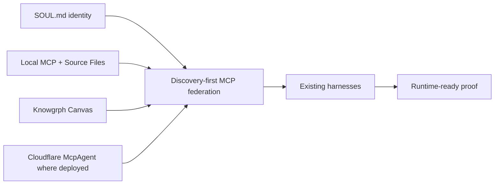

# Knowgrph Agentic Canvas OS Docs

This folder is the local documentation control surface for making `knowgrph` a runtime-ready Agentic Canvas OS. It is not a deploy artifact and does not authorize Prod or Cloudflare mutation.

## Document Map

| File | Role | Use |
|---|---|---|
| `SOUL.md` | Durable identity layer | Agent identity, voice, prompt slot 1 contract, personality overlay boundary, and hardcoded-default replacement rules. |
| `FACTS.md` | Shared truth layer | Stable facts, precedence, direct `/`, `#`, and `@` definitions, deploy boundary truth, context-file and context-reference facts, tool/toolset facts, Tool Gateway and Tool Search facts, MoA facts, learning-loop facts, stateful orchestration facts, and long-horizon SuperAgent facts. |
| `MEMORY.md` | Agent memory seed | Bounded agent notes, persistence, routing memory, MoA memory, stateful orchestration memory, reusable runtime-readiness context, and local operating lenses. |
| `USER.md` | User profile contract | Explicit operator preferences, communication style, expectations, profile write boundaries, and unsupported-inference rejection. |
| `AGENTS.md` | Agent instructions | Agent roles, editing rules, MoA rules, stateful orchestration rules, forbidden patterns, and validation behavior for this folder. |
| `DICTIONARY-COMMAND.md` | Slash dictionary | `/` command-route intents, bindings, filters, and VCC signals. |
| `DICTIONARY-SEMANTIC.md` | Hash dictionary | `#` semantic filters for routing, proof, cost, and cleanup. |
| `DICTIONARY-BINDING.md` | At dictionary | `@` actor, source, runtime, proof, and boundary bindings. |
| `SKILLS.md` | Skill contract catalog | On-demand skill system, context files, context references, tools, platform-scoped toolsets, Tool Gateway routing, Tool Search schema deferral, progressive disclosure, bundles, managed writes, source normalization, harnessing, orchestration, computing-flow, learning, runtime proof, cost, deploy guard, and docs sync. |
| `kanban.md` | Durable task board | Shared task and handoff rows for named profiles and full OS worker processes using existing table/Kanban utilities. |
| `PRD-TAD.md` | Combined product and architecture contract | What `knowgrph` must provide and how the runtime is shaped. |
| `RUNTIME-READINESS.md` | Readiness matrix | Tracks spec-complete to runtime-ready gates by capability. |
| `RUNTIME-PROOF.md` | Runtime proof ledger | Current parse, route, scan, validation, and deploy-boundary proof for this docs control surface. |
| `HARNESS-CONTRACTS.md` | Harness contract catalog | Typed AI harness contracts, cost logs, fallback paths, and loop bounds. |
| `MCP-GATEWAY.md` | MCP federation contract | Discovery-first gateway rules across local, Pages, browser, and control-plane surfaces. |
| `VALIDATION-RUNBOOK.md` | Focused proof lane | Commands and checks for documentation, local runtime, and deploy guards. |
| `RELEASE-WORKFLOW.md` | Runtime-ready release contract | Conflict-safe Dev integration, Prod promotion, Cloudflare deployment, production verification, and evidence reporting. |

## Runtime Position

`knowgrph` is the Agentic Canvas OS when these contracts are true:

- A caller can discover capabilities without paid model calls.
- A caller can load durable agent identity from `SOUL.md` into prompt slot 1 without silent hardcoded defaults.
- A caller can use bounded `MEMORY.md` and `USER.md` targets with write, compact, search, frozen snapshot, and session-search contracts.
- A caller can discover skill metadata, load selected skills and resources on demand, resolve bundles, and gate managed skill writes without a duplicate registry.
- A caller can discover and load project-local context files from scoped working directories without letting them override facts, identity, safety, approval, or deploy gates.
- A caller can expand explicit `@` context references into bounded attached context while preserving raw text on unsupported surfaces.
- A caller can coordinate named profiles through durable `kanban.md` task and handoff rows instead of hidden in-process subagent swarms.
- A caller can discover callable tool functions and enable or disable logical toolsets per platform without copying a registry or granting global access.
- A caller can route web search, image generation, TTS, and cloud browser tools through existing `knowgrph` infrastructure with per-tool provider state, approval gates, and cost logs.
- A caller can opt into Tool Search so eligible MCP and non-core plugin tool schemas stay behind session-scoped bridge search, describe, and call routes.
- A caller can inspect process, cost, gate, and circuit-breaker state through typed read views.
- A caller can run approval-gated agent workflows through shared local or control-plane MCP owners.
- A caller can invoke `/moa` for bounded reference-agent deliberation where one aggregator owns the final answer and normal tool gates.
- A caller can declare stateful orchestration graphs with typed state, nodes, edges, checkpoints, human review, streaming trace, and bounded stop conditions.
- A caller can invoke `/superagent.run` for long-horizon research, coding, or creation only when sandbox workspace, message gateway, checkpoints, artifacts, verification, cost, and stop conditions are typed.
- AI stages are harnessed with typed inputs, typed outputs, cost logs, fallback paths, and bounded loops.
- Canvas renders source-backed dashboards through existing Markdown, frontmatter, KGC, Source Files, and Storyboard owners.
- Dev, Prod mirror, and Cloudflare state remain separate unless the operator explicitly opens the deploy gate.

## Topology Boundary

The current native-in-repo target is:

Superseded Vercel/AWS connector lanes are historical reference only unless a later ADR reopens them with a separate TCO and deployment-model comparison. The active runtime-ready path is `knowgrph` local + Cloudflare control-plane owners.

## Operating Rule

Use the smallest doc or runtime change that makes the capability truthful. If a claim cannot be proven by a VCC, keep it as `spec-complete` rather than `runtime-ready`.
