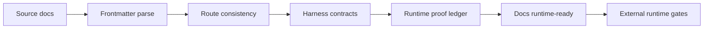

# Runtime Readiness

Runtime-ready means the claim can be proven from surfaced output. This file marks the Agentic Canvas OS docs control surface runtime-ready. It does not claim that every external `knowgrph`, Prod mirror, or Cloudflare runtime is already executed.

## Readiness Matrix

| Capability | Current target | Runtime-ready proof | Status |
|---|---|---|---|
| Documentation control surface | Local docs parse, route, validate, and preserve deploy boundaries. | `RUNTIME-PROOF.md` records frontmatter, line-count, ASCII, artifact, route, diff, and deploy-guard checks. | Runtime-ready |
| Soul identity layer | Durable identity, prompt slot 1, and personality overlay contracts are source-backed. | `SOUL.md`, `FACTS.md`, dictionaries, `MEMORY.md`, `SKILLS.md`, `HARNESS-CONTRACTS.md`, `MCP-GATEWAY.md`, and `PRD-TAD.md` expose matching routes, tags, bindings, guards, and VCCs. | Runtime-ready for docs |
| Persistent memory contracts | Bounded agent notes, explicit user profile, append-only monthly history, frozen snapshots, writes, compaction, and session search are documented as no-copy contracts. | `MEMORY.md`, `MEMORY-LOG.md`, `memory/YYYY-MM.md`, `START-WORKFLOW.md`, `RELEASE-WORKFLOW.md`, and `VALIDATION-RUNBOOK.md` enforce hybrid structure at startup and byte-prefix preservation before release. | Runtime-ready for docs |
| Skills system contracts | Skill discovery, on-demand load, progressive disclosure, bundles, managed writes, and open-standard compatibility are documented as no-copy contracts. | `FACTS.md`, dictionaries, `SKILLS.md`, `MEMORY.md`, `AGENTS.md`, `HARNESS-CONTRACTS.md`, `MCP-GATEWAY.md`, and `PRD-TAD.md` expose matching routes, tags, bindings, guards, and VCCs. | Runtime-ready for docs |
| Context files contracts | Working-directory project context discovery, progressive subdirectory hints, scan, truncation, and audit are documented as no-copy contracts. | `FACTS.md`, dictionaries, `SKILLS.md`, `MEMORY.md`, `AGENTS.md`, `HARNESS-CONTRACTS.md`, `MCP-GATEWAY.md`, and `PRD-TAD.md` expose matching routes, tags, bindings, guards, and VCCs. | Runtime-ready for docs |
| Context references contracts | Explicit file, folder, diff, staged, git, and URL references expand into bounded attached context on supported surfaces. | `FACTS.md`, dictionaries, `SKILLS.md`, `MEMORY.md`, `AGENTS.md`, `HARNESS-CONTRACTS.md`, `MCP-GATEWAY.md`, and `PRD-TAD.md` expose matching routes, tags, bindings, guards, and VCCs. | Runtime-ready for docs |
| Kanban collaboration contracts | Durable task and handoff rows coordinate named profiles and full OS worker processes. | `kanban.md`, `FACTS.md`, dictionaries, `SKILLS.md`, `MEMORY.md`, `AGENTS.md`, `HARNESS-CONTRACTS.md`, `MCP-GATEWAY.md`, and `PRD-TAD.md` expose matching routes, tags, bindings, guards, and VCCs. | Runtime-ready for docs |
| Todo planning-ledger compliance | Every release carries one attributable planning update without rewriting historical baseline rows. | `START-WORKFLOW.md` records the exact todo base and context; `RELEASE-WORKFLOW.md` plus `VALIDATION-RUNBOOK.md` require one changed 11-cell, non-empty, dated row with a directive of at most 50 words and byte-identical non-target baseline rows. | Runtime-ready for docs |
| Tools and toolsets contracts | Callable tool functions and logical toolsets are documented with platform-scoped enable/disable state. | `FACTS.md`, dictionaries, `SKILLS.md`, `MEMORY.md`, `AGENTS.md`, `HARNESS-CONTRACTS.md`, `MCP-GATEWAY.md`, and `PRD-TAD.md` expose matching routes, tags, bindings, guards, and VCCs. | Runtime-ready for docs |
| Tool Gateway contracts | Web search, image generation, TTS, and cloud browser tools route through existing infrastructure with per-tool provider state and approval policy. | `FACTS.md`, dictionaries, `SKILLS.md`, `MEMORY.md`, `AGENTS.md`, `HARNESS-CONTRACTS.md`, `MCP-GATEWAY.md`, and `PRD-TAD.md` expose matching routes, tags, bindings, guards, and VCCs. | Runtime-ready for docs |
| Tool Search contracts | Eligible MCP and non-core plugin schemas defer behind opt-in bridge search, describe, and call routes. | `FACTS.md`, dictionaries, `SKILLS.md`, `MEMORY.md`, `AGENTS.md`, `HARNESS-CONTRACTS.md`, `MCP-GATEWAY.md`, and `PRD-TAD.md` expose matching routes, tags, bindings, guards, and VCCs. | Runtime-ready for docs |
| Facts layer | Shared truth precedes memory and role instructions. | `FACTS.md` parses and directly resolves `/query`, `#truth`, and `@agent` through the dictionaries. | Runtime-ready |
| Agent instructions | Local docs obey `FACTS.md`, `AGENTS.md`, and `MEMORY.md`. | `AGENTS.md` parses, points to facts and memory, and preserves Dev-only boundaries. | Runtime-ready |
| Invocation dictionaries | `/`, `#`, and `@` dictionaries are source-backed. | `DICTIONARY-COMMAND.md`, `DICTIONARY-SEMANTIC.md`, and `DICTIONARY-BINDING.md` parse and expose dictionary entries. | Runtime-ready |
| Skill catalog | Core skills, on-demand skill-system routes, and FloatingPanel Chat variants are discoverable without a chat-local registry. | `SKILLS.md` parses, lists `skill_contracts` and `skill_variants`, and keeps every row spec-backed with bindings and harness requirements. | Runtime-ready |
| Mixture-of-agents contracts | `/moa` is documented as one-shot, bounded reference fan-out plus aggregator-owned response. | `FACTS.md`, dictionaries, `MEMORY.md`, `SKILLS.md`, `HARNESS-CONTRACTS.md`, `MCP-GATEWAY.md`, and `PRD-TAD.md` expose matching routes, tags, bindings, guards, and VCCs. | Runtime-ready for docs |
| Learning-loop contracts | Experience capture, memory search, skill proposal, skill evolution, and identity reflection are documented as no-copy, review-gated contracts. | `FACTS.md`, dictionaries, `MEMORY.md`, `SKILLS.md`, `HARNESS-CONTRACTS.md`, and `MCP-GATEWAY.md` expose matching routes, tags, bindings, guards, and VCCs. | Runtime-ready for docs |
| Stateful orchestration contracts | Graph state, nodes, edges, checkpoints, human review, and streaming traces are documented as no-copy, bounded contracts. | `FACTS.md`, dictionaries, `MEMORY.md`, `SKILLS.md`, `HARNESS-CONTRACTS.md`, `MCP-GATEWAY.md`, and `PRD-TAD.md` expose matching routes, tags, bindings, guards, and VCCs. | Runtime-ready for docs |
| Long-horizon SuperAgent contracts | Research, coding, and creation runs compose graph, memory, skills, tools, sandbox workspace, message gateway, artifacts, verification, and cost proof. | `/superagent.run`, `#long-horizon-harness`, `#sandboxed-workspace`, `#message-gateway`, `@sandbox-workspace`, and `@message-gateway` resolve through the docs contracts. | Runtime-ready for docs |
| Computing-flow contract | `/computing-flow` routes to KGC/frontmatter, not a separate flow engine. | `/computing-flow`, `#computing-flow`, and `flow.computing` are present; focused KGC computing-flow tests provide external supporting proof. | Runtime-ready for docs |
| Harness contracts | AI-capable components have typed input, output, fallback, cost, and bounds. | `HARNESS-CONTRACTS.md` parses and defines universal harness shape, cost log fields, gates, and VCC templates. | Runtime-ready |
| Validation runbook | Operators can reproduce focused docs checks. | `VALIDATION-RUNBOOK.md` requires frontmatter for every Markdown file, avoids self-matching artifact patterns, and names route consistency checks. | Runtime-ready |
| Deploy boundary | Docs do not mutate Prod mirror or Cloudflare. | Git scoped status confirms `content/knowgrph` is untouched; no deploy command is required or run. | Runtime-ready |

## External Runtime Gates

These capabilities remain outside the docs-only runtime-ready claim. Promote them only after current focused proof from `$KNOWGRPH_ROOT` or an explicitly approved deploy lane.

| Capability | Required proof | Status |
|---|---|---|
| Capability discovery | MCP/local catalog check exits 0; response includes deduplicated tool ids and zero cost. | Gated by focused `knowgrph` proof |
| OS process view | Status call returns normalized entries and `unavailableSources[]` without mutation. | Gated by focused `knowgrph` proof |
| Cost summary | Cost logs validate against schema; model-free views report exact zero. | Gated by focused `knowgrph` proof |
| Gate catalog | Canonical gates are listed; reads do not issue or consume tokens. | Gated by focused `knowgrph` proof |
| Circuit breakers | Registry returns each bounded loop; no loop lacks max iteration and circuit breaker. | Gated by focused `knowgrph` proof |
| Soul prompt runtime | Prompt assembly loads scanned `SOUL.md` into slot 1 or returns typed fallback with no silent hardcoded default identity. | Gated by focused `knowgrph` proof |
| Persistent memory runtime | Memory/profile write, compact, frozen snapshot, and session search return typed outputs with scan, capacity, and target-separation proof. | Gated by focused `knowgrph` proof |
| Skills system runtime | Skill discovery, selected source loading, resource loading, bundle resolution, and managed writes return typed outputs with scan, validation, and approval policy proof. | Gated by focused `knowgrph` proof |
| Context files runtime | Context discovery, scanned load, truncation, progressive hints, and audit return typed outputs with stronger facts/identity boundaries. | Gated by focused `knowgrph` proof |
| Context references runtime | Reference expansion and audit return typed attached-context packets, warnings, refusals, source metadata, and unsupported-surface behavior. | Gated by focused `knowgrph` proof |
| Kanban collaboration runtime | Task, handoff, and sync commands return typed row writes, conflict ledgers, profile bindings, and worker-process proof. | Gated by focused `knowgrph` proof |
| Tools and toolsets runtime | Tool catalog reports functions, schemas, risk classes, toolsets, and platform-scoped enable/disable state with approval proof. | Gated by focused `knowgrph` proof |
| Tool Gateway runtime | Tool catalog, provider selection, web search, image generation, TTS, and cloud browser route through existing infrastructure with typed outputs, approval, egress, and cost proof. | Gated by focused `knowgrph` proof |
| Tool Search runtime | Tool search, describe, and bridge call return session-scoped deferred catalog outputs with real tool policy, approval, hooks, audit, and cost proof. | Gated by focused `knowgrph` proof |
| Mixture-of-agents runtime | `/moa` preset resolution, reference fan-out, aggregator action, cost separation, and no-recursion guard return typed outputs. | Gated by focused `knowgrph` proof |
| Stateful orchestration runtime | Graph validation, checkpoint resume, human review, and stream trace return typed outputs, cost logs, and no-copy validation. | Gated by focused `knowgrph` proof |
| Learning-loop runtime | Memory search, experience capture, skill proposal, skill evolution, and identity reflection return typed outputs, cost logs, review gates, and no-copy validation. | Gated by focused `knowgrph` proof |
| Long-horizon SuperAgent runtime | `/superagent.run` returns typed plan, workspace scope, message ledger, checkpoints, artifacts, verification state, cost log, and stop condition without copied external runtime layout. | Gated by focused `knowgrph` proof |
| Video Remix Director | Native live planning returns exact-span long-script units, audience-conditioned cinematography, scene camera rigs, stable blocking/backgrounds, intelligent first-frame character/environment/prior-timeline references, automatically generated spatial image prompts, bounded parallel image candidates, deterministic VLM consistency selection, dependency-aware same-camera parallel shot batches, story hierarchy, temporal continuity, bounded specialist negotiation, multimodal review, and one inspectable nine-stage agent DAG with typed handoffs, semantic asset indexing, resource accounting, checkpoint reuse, and dependency-propagated status; gates, Cost Logs, budgets, and retries fail closed. | Runtime-ready in Dev from focused `knowgrph` proof; Prod mirror and Cloudflare gated |
| Canvas dashboard | Markdown/frontmatter/KGC document renders without dashboard-only graph store. | Gated by local Canvas proof |
| Cloudflare control-plane MCP | Worker tool list and run endpoints pass focused checks after explicit deploy approval. | Gated by operator approval |

## Docs Runtime-Ready Checklist

- [x] Parse proof surfaced.
- [x] Route proof surfaced.
- [x] Schema validation proof surfaced for every Markdown file in this folder.
- [x] Cost policy surfaced; docs validation and discovery paths are zero model spend.
- [x] Circuit-breaker policy surfaced for every agentic or feedback loop contract.
- [x] Approval-gate policy surfaced for paid, mutating, browser-auth, Prod, and Cloudflare actions.
- [x] Focused docs checks exited 0.
- [x] Focused external supporting checks for slash and computing-flow contracts exited 0 when run.
- [x] No unintended state mutation occurred.
- [x] No Prod mirror or Cloudflare deploy occurred.

## Runtime-Ready Flow

## Status Rules

| Label | Meaning |
|---|---|
| `draft` | Authored but incomplete. |
| `spec-complete` | Contract is complete enough to implement or verify. |
| `runtime-ready` | Focused VCC proof was surfaced in the current runtime. |
| `gated` | Requires operator approval, credentials, paid call, Prod mirror, or Cloudflare action. |
| `blocked` | Cannot advance without missing source, owner, or approval. |

Never promote external capabilities to `runtime-ready` from prose alone.
